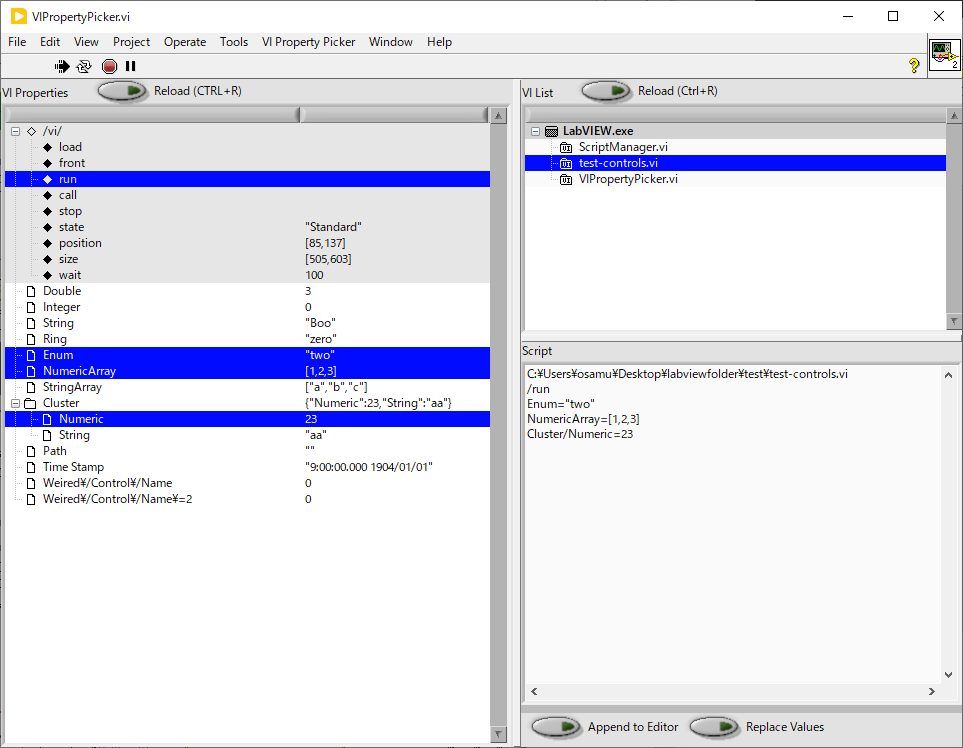

個人的に使っている LabView 用のワーキングフォルダーです
==

公開可能なものをここに公開します。

内容一覧
--

- `applications/` この git に含めない個別のアプリケーションを置く
- [`hardware/`](hardware/) ハードウェア関連ライブラリ
  - `ADCDataRecorder.vi` : ADC 入力を一定サンプリングレートで記録、ディスクへ保存する
  - `DACSinglePoint.vi` : DAC 出力値を変更する
  - `NFCorpLI5640Lock-inAmp.vi` : ロックインアンプ LI5640 の設定を行う（シリアル接続）
  - `SignalRecovery7280Lock-inAmp.vi` : ロックインアンプ 7280 の設定を行う（シリアル接続）
  - `StanfordSysResDG645DelayGenerator.vi` : ディレイジェネレータ DG645 の制御を行う（LAN 接続）
  - `TectronixDPO4000OscilloScope.vi` : オシロスコープ DPO4000 シリーズの制御を行う（LAN 接続）
- [`lib/`](lib/) 汎用のサブ VI ライブラリ
  - [`lib/File/`](lib/File) ファイル関連
    - `FileMultipleBackup.vi` : 複数世代にわたるバックアップファイルを管理
    - `SequentialFileName.vi` : 連番付きファイル名の番号を1増やす
  - [`lib/Hardware/`](lib/Hardware) ハードウェア関連
    - `TextControlledInstrum` : テキストコマンドで読取・設定可能なハードウェアを制御する [→チュートリアル](lib/Hardware/TextControlledInstrum-Tutorial.md)
    - `SerialPortSetup.vi` : シリアルポートの設定を行う
  - [`lib/SetGetControlValue/`](lib/SetGetControlValue) コントロール値の読み書きを行う
    - `SetControlValue.vi` : 名前を指定してコントロールに値を書き込む
    - `GetControlValue.vi` : 名前を指定してコントロールの値を読み出す
    - `SetControlValues.vi` : リストで与えたコントローにの値を一度に書き込む
    - `GetControlValues.vi` : リストで与えたコントロールの値を一度に読み出す
    - `ControlValueToJSON.vi` : 任意の値を JSON 文字列にエンコードする
    - `VINameToVI.vi` : VI 名からリファレンスを得る (別アプリやリモートも対応)
  - [`lib/String/`](lib/String) 文字列関連
    - [`lib/String/JSON/`](lib/String/JSON) JSON 関連
      - `JSONObjectToMap.vi` : JSON オブジェクトをキー文字列から JSON 値へのマップに変換
      - `ParseJSON.vi` : JSON 文字列から要素を１つ読み出す
      - `ParseJSONString.vi` : JSON の文字列要素を LabVIEW 文字列に変換
      - `StringToJSON.vi` : LabVIEW 文字列をJSON の文字列要素に変換
    - `AssertSubTexts.vi` : 文字列の指定位置に候補文字列のうちどれかが現れることを確認
    - `StringArrayIntersection.vi` : ２つの文字列配列に共通して現れる文字列だけを含めた配列を返す
    - `StringArrayToSet.vi` : 文字列配列を文字列Setに変換
    - `StringBeginWith.vi` : 文字列が指定の文字列から開始することを確かめる
    - `StringToComplexNumber.vi` : `"1.23+13i"` のような文字列を複素数値(CEXT)に変換する
  - [`lib/UI/`](lib/UI) UI 関連
    - `DeferPanelUpdate.vi` : コントロールの値を変更する間 VI の表示更新を止める
    - `InsertMenuItemsWithShortcut.vi` : メニューにショートカット付きの項目を追加する
    - `LogToStringControl.vi` : ログテキストを文字列コントロールに追加する
    - `SetFrontPanelSize.vi` : VI のフロントパネルサイズ・位置を変更する
    - `TreeView` : `TreeView` の操作を行う
  - [`lib/Variant/`](lib/Variant) `Variant` 関連
    - `CoerseNumericType.vi` : 数値を `Variant` で指定された型に変換する
    - `VariantArrayAccess.vi` : `Variant` に格納された配列の要素を読み書きする
    - `VariantClusterAccess.vi` : `Variant` に格納されたクラスタの要素を読み書きする
    - `VariantClusterAccessMulti.vi` : `Variant` に格納されたクラスタの複数の要素を一度に読み書きする
    - `VariantClusterToArrayOfValues.vi` : `Variant` に格納されたクラスターの要素名と値の配列を得る
  - `RaiseErrorIf.vi` : `true` が入力されるとエラーを発生する
- [`utilities/`](utilities/) 単独で利用するVIアプリ
  - `ParameterSweeper.vi` : 任意の VI の任意のコントロールの値をゆっくりと掃引する
  - `ScriptManager.vi` : コントロール値や VI 属性を設定するスクリプトを編集・保管・実行するプログラム
  - `VIPropertyPicker.vi` : コントロール値や VI 属性を設定するスクリプトの作成を助けるプログラム

GitHub アドレス
--
https://github.com/osamutake/labviewfolder

このドキュメントは GitHub 上で参照すると見やすいです。

- [個人的に使っている LabView 用のワーキングフォルダーです](#個人的に使っている-labview-用のワーキングフォルダーです)
  - [内容一覧](#内容一覧)
  - [GitHub アドレス](#github-アドレス)
  - [ライセンス](#ライセンス)
  - [LabVIEW メタプログラミングの勧め](#labview-メタプログラミングの勧め)
  - [改訂履歴](#改訂履歴)
  - [TODO](#todo)

古い LabView 用に保存したバージョンも用意しました

- LabView 19 用ブランチ https://github.com/osamutake/labviewfolder/tree/labview19
- LabView 20 用ブランチ https://github.com/osamutake/labviewfolder/tree/labview20

最新版のコードが適宜取り込まれます

ライセンス
--
MIT ライセンスとしますので自由にご利用ください。

LabVIEW メタプログラミングの勧め
--
このライブラリには [`SetControlValue.vi`](lib/SetGetControlValue/#setcontrolvaluevi) / [`GetControlValue.vi`](lib/SetGetControlValue/#getcontrolvaluevi) という「異なるVI上のコントロールの値を読み書きするためのサブVI」が含まれています。

これを使って「LabVIEW のコントロールの値を制御するプログラム」を LabVIEW で作ることを、ここでは「LabVIEW メタプログラミング」と呼ぼうと思います。

なぜこれを勧めるのか？

複数の機器を組み合わせた測定を LabVIEW で制御しようとするとき、普通にやるとすべての機器の制御器や制御コードが１つの VI に乗るため、VI のパネルには非常にたくさんの制御器、表示器が並び、ブロックダイアグラムは画面からはみ出すくらいに大きくなってしまいます。

１つの装置を動かすのに１０個のパラメータを使うとして、３個の装置を動かすなら３０個。通常の LabVIEW プログラムだと３０本の信号線が複雑に入り組んだ VI が出来上がります。

コードを機能別に分離するには個々の装置の制御を別々の VI に分けるのがいいのですが、そうすると

- 初期化時にすべての VI の制御器に決まった順序で値を設定する
- 測定時に特定の順序で制御器の値を変更する
- データ保存時にすべての VI の制御器から値を読んで、測定データと一緒にファイルに保存する

などをどのように実現するか、迷ってしまうことが多いです。

こんなときに、

- VI 名とコントロール名と設定値を文字列で指定して値を書き込める [`SetControlValue.vi`](lib/SetGetControlValue/#setcontrolvaluevi)
- VI 名とコントロール名を文字列で指定して、その値を文字列として得られる [`GetControlValue.vi`](lib/SetGetControlValue/#getcontrolvaluevi)

があると、個々の装置の制御を行うだけの単機能の VI を組み合わせて複雑な測定を行うことが容易にできるようになります。

例として、、、

このライブラリに含まれる [`DACSinglePoint.vi`](hardware/#dacsinglepointvi--dac-の電圧値を制御するアプリ) は DAC の出力電圧を変更するための制御器が並ぶ、非常に単純な VI です。

`Physical channels` に DAC チャンネルを指定して、対応する `Value` 欄を書き換えると電圧が出ます。

これだけだと何の面白みもないのですが、[`ParameterSweeper.vi`](utilities/#parametersweepervi) と組み合わせると、急に利用価値のあるものになってきます。

このアプリは、`vi` と `ctrl` で指定する制御器の値を `start` から `stop` まで `step` 間隔で `Interval (s)` ごとに値を変更することを繰り返すプログラムです。例えば `DACSinglePoint.vi` が出力する電圧を 0V から 5V まで 0.5 秒おきに 0.1 V ずつ増やすことを繰り返すことができます。

`ParameterSweeper.vi` はどの制御器の値を変更するかを `vi` と `ctrl` で変更可能なので、どんな機器のどんなパラメータでも周期的に掃引できます。これが１つあれば「値を掃引する」というプロブラムを作る必要がなくなります。このように、メタプログラミング的なやり方により、制御アルゴリズムを制御される VI と完全に独立させて開発できるようになります。

制御するだけでなく測定も行いたいので [`ADCDataRecorder.vi`](hardware/#adcdatarecordervi--adc-の電圧値を記録するアプリ) を使います。

このプログラムは ADC で周期的に電圧を測定して表示したり、データファイルに保存したりできます。

`ParameterSweeper.vi` の `Record Sync` を `on` にしておくと、パラメータの掃引開始と同期してデータの記録を開始できます。時間の同期は精度が低いですが、100 ms 以上の時定数を指定したロックインアンプの出力を記録するというような用途では十分な同期が得られます。

注目すべきは `Parameters to Save` の欄です。ここに VI 名とコントロール名を列挙するとデータ保存の開始時にコントロールから値を読み出してデータファイルのヘッダーに追加できます。「このデータを測定したときの設定値があやふや」という事態を防ぐには VI のコントロールの値をデータファイルに保存しておくのが一番ですが、普通にそれをしようと思うとデータ書き込みロジックのところで数十個のコントロールから値を読みだして、すべてを文字列に直さなければならず、新しい測定用に VI を作るたびにそれを書くのはものすごくおっくうです。

このリポジトリに含まれるライブラリはコントロールからの値を文字列として読み出せるため、そのままファイルに保存できます。また、複数のVIにある複数のコントロールの値をまとめて読み書きするための [`SetControlValues.vi`](lib/SetGetControlValue/#setcontrolvaluesvi) / [`GetControlValues.vi`](lib/SetGetControlValue/#getcontrolvaluesvi) も提供されています（分かりにくいですが Value's' と s が付いています）。

これで、任意の機器制御 VI の任意の制御器の値を掃引して ADC でデータを測定し、測定パラメータと共にファイルに保存する、という難しいタスクを、「制御器の値が変わったら機器の設定を変更する」という単機能 VI を作成するだけで行えるようになりました。

あとは複数のの機器制御 VI の上にある制御器の値を測定の種類ごとに初期化することができれば言うことがありません？

[ScriptManager.vi](utilities/#scriptmanagervi) は、複数の VI にまたがって多数の制御器の値を書き換えるスクリプトを複数保存しておき、ダブルクリック一発で値を復元することが可能なアプリケーションです。

画面右下のスクリプトには、`C:\path\to\some.vi` という VI の `Control1` というコントロールに `123` を、`Control2` というコントロールに `"abc"` を設定し、`500 ms` 待ってから `VI` を実行、`C:\path\to\other.vi` という VI の `Control3` というコントロールに `456` を、`Control4` というコントロールに `"def"` を設定し `VI` を実行、という手順が書かれています。

このようなスクリプトは `SetControlValues.vi` へそのまま渡すだけでも実行できます。いよいよ「メタプログラミング」らしくなってきました！

スクリプトを手で書くのも難しくはありませんが、VI 名やコントロール名を一字一句間違わずに記述するのは少し骨が折れます。

[`VIPropertyPicker.vi`](utilities/#VIPropertyPicker) はスクリプトの作成を手助けします。

右上の VI 一覧の１つを選択すると左側にその上の制御器の一覧が出ます。設定したいものを選ぶと右下に対応するスクリプトが自動生成されます。

上部の ◆ のついた項目は VI の表示や動作状態を変更するためのコマンドです。これらも選択するだけでスクリプトに組み込まれます。

出来上がったスクリプトはコピー＆ペーストして使っても良いですし、`Append to editor in ScriptManager` ボタンで `ScriptManager` のスクリプトエディタへ直接追加することもできます。

上記の `ParameterSweeper.vi` や `ADCDataRecorder.vi` は非常に汎用性の高いプログラムなので、異なる測定には異なる設定で利用したくなるのですが、それぞれに対する設定を `ScriptManager.vi` で保存しておけば簡単に測定を開始できます。

ということで、LabVIEW メタプログラミングをお勧めしています。

改訂履歴
--
- 2023-10-13 初出
- 2023-10-16
  - [`lib/SetGetControlValue`](lib/SetGetControlValue) や [`utilities/SettingManager.vi`](utilities/#settingmanagervi) でコントロール名に含まれる改行やタブ文字をエスケープするように/できるようにした
  - [`lib/#技術的な話`](lib/#技術的な話)　で LabVIEW 標準の VI の関数 GetControlIndexByName からはコントロールのリファレンスを得られないことを追記した
  - 未保存の `Untitled 1.vi` のような VI に対しては VI のリファレンスを取れない。これが原因で [`utilities/SettingManager.vi`](utilities/#settingmanagervi) がエラーを吐くのを抑制した。エラーの生じた VI の下にはコントロールが表示されず空になる。
  - [lib/SetGetControlValue/#クローン V Iについて](lib/SetGetControlValue/#クローン-VI-について) にてクローン VI に対しては VI リファレンスを取る手段が提供されていないという記載を LabVIEW ヘルプに発見したので追記した
  - [`utilities/SettingManager.vi`](utilities/#settingmanagervi) コントロールのリロードボタンにショートカットキー F5 を割り当てた
  - [`GetControlValues.vi`](lib/SetGetControlValue#getcontrolvaluesvi) に `As List` オプションを追加した
- 2023-10-17
  - [`InsertMenubarItem.vi`](lib/UI/#insertmenubaritemvi) を追加した
- 2023-10-20
  - [`GetControlValue.vi`](lib/SetGetControlValue#getcontrolvaluevi), [`SetControlValue.vi`](lib/SetGetControlValue#setcontrolvaluevi) に `control ref` 端子を追加し、アクセスするコントロールを直接指定できるようにした。
- 2023-10-21
  - [lib/Hardware](lib/Hardware) に以下の２つを追加した
    - `ParamClusterControl.vi` ハードウェアの設定をテキストコマンドで読み書きするプログラムを作成するのに用いる
    - `SerialPortSetup.vi` シリアルポートの設定を行う UI を提供する
- 2023-10-23
  - 複数の `ParamClusterControlCore.vi` クローンで `IO Queue` を共有できるようにし、その使用例を追加した `example2-ParamClusterControlCore.vi`
- 2023-10-24
  - `CoerseNumericType.vi` の `Fixed Point` 値の扱いを改善した
  - それに合わせて `lib/Variant` のドキュメントを拡充した
  - `ControlValueToJSON.vi` のドキュメントを追加した
- 2023-10-25
  - `SettingManager.vi` の改造
    - `Read From INI` で `Encode` をしくじっていたのを直した
    - 設定にオプションを追加した
      - VI ロードの確認なし
      - VI の自動実行
      - サブ設定の自動実行
      - 実行後のウェイト
    - メッセージ処理を見直して `Reload` が複数回呼ばれる問題を解消
    - `Update Modified State` で `DeferPanelUpdate` を効かせた
- 2023-10-27
  - `lib/Hardware/ParamClusterControl.vi` を削除して、代わりに `lib/Hsardware/TextControlledInstrum` ライブラリを作成した
    - １つのクラスタを制御するだけでなく、クラスタを含む多数のコントロールを簡単に制御できるようになった
  - 同ライブラリを使って `hardware/SignalRecovery7280Lock-inAmp.vi` を作成した
  - 同ライブラリを使って `hardware/TectronixDPO4000OscilloScope.vi` を作成した
- 2023-10-28
  - `hardware/StanfordSysResDG645DelayGenerator.vi` を作成した
- 2023-10-29
  - `lib/UI/SetFrontPanelSize.vi` を作成した
  - それを使って `hardware/StanfordSysResDG645DelayGenerator.vi` を書き換えた
- 2023-10-30
  - [`lib/Hardware/TextControlledInstrum` ライブラリにチュートリアルを書いた](lib/Hardware/TextControlledInstrum-Tutorial.md)
- 2023-10-31
  - `TextControlledInstrum` の `ReadCommand.vi`, `WriteCommands.vi` を複数の VI で使うと Queue の共有に失敗してエラーになるため毎回 Queue を作り直すようにした
  - `SignalRecovery7280Lock-inAmp.vi` に Connect ボタンを追加した
    - `ParameterManager` でこの値を保存しておくと自動で接続できる
  - `SettingManager` 関連
    - `EnumOpenedVIs.vi` サブVIとして動作中のもの、壊れているものを表示しないようにした
    - `CtrlTreeReload.vi` でエラーが生じても止まらないようにした
    - `CtrlTreeAddControls.vi` が Disable なコントロールをスキップするようにした
    - `CtrlTreeAddDummyNodes.vi` の正規表現を単純化してエラーが出ないようにした
    - `SavedSettingsOpenAllVIs.vi` にブレークポイントが含まれていたのを除去した
  - `SetGetControlValue` で `VISA Refnum` コントロールの読み書きをサポートした
  - `NFCorpLI5640Lock-inAmp.vi` を追加した
  - `TextControlledInstrum` の数値パラメータの読み書きコマンドにスケールとオフセットを指定できるようにした（未テスト）
  - `ADCDataRecorder.vi` を手直し
    - `Waveform` チャートの見た目を変更
    - `Clear` ボタンを追加
    - `Parameters to Save` で VI 名が `DataRecorder.vi` のままになっておりエラーが出てたのを直した
    - データファイルに書き込むヘッダー情報のターミネーターを null 文字に変更した
  - `ParameterSweeper.vi` 関連
    - `Record Sync` で Sweep を止めるときも連動するようにした
    - VI とコントロールの選択肢を改善
      - VI のリストに動作中のサブ VI が入らないようにした
      - 配列コントロールを適切に追加するようにした
  - `DACSinglePoint.vi` の値を制御する配列コントロールの名前を Values に改名した
  	- 長いと `ParameterSweeper.vi` で指定しづらいため
- 2023-11-07
  - `SetControlValues.vi` で疑似コントロールを使った VI 操作を行えるようにした
  - VI のコントロール値を読取り、保存・復帰する `SettingManager.vi` を削除した
    - 代わりにコントロール値を読取る `VIPropertyPicker.vi` と 
    - 保存・復帰を行う`ScriptManager.vi` を追加した
  - `TreeView` の操作を行う `lib/UI/TreeView` ライブラリを追加した
  - `lib/String/StringBeginWith.vi` を追加した
  - `lib/SetGetControlValue` の `ControlValueToJSON.vi`, `JSONtoControlValueCore.vi` で
    - `IOName` の読み書きに対応した
    - `VISA Refnum` の読み書きを改良した
  - `lib/SetGetControlValue` で `VIName` の `Escape` は `@` と `|` だけにした
  - `InsertMenubarItem.vi` は `InsertMenuItemsWithShortcut.vi` として１段だけの動作にした
  - `SetFrontPanelSize.vi` で位置も設定できるようにした

TODO
--

`TextControlledInstrum` を `.lvlib` 化して VI 名を短くしよう。
