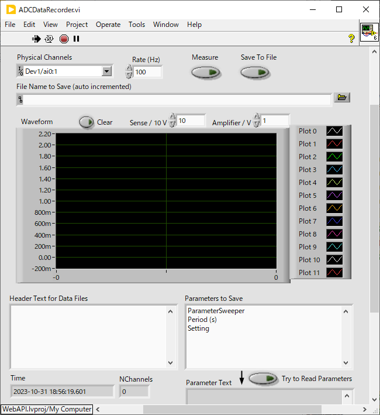

hardware/
==

ハードウェア制御用の VI をここに置く

- [hardware/](#hardware)
  - [ADCDataRecorder.vi = ADC の電圧値を記録するアプリ](#adcdatarecordervi--adc-の電圧値を記録するアプリ)
  - [DACSinglePoint.vi = DAC の電圧値を制御するアプリ](#dacsinglepointvi--dac-の電圧値を制御するアプリ)

ADCDataRecorder.vi = ADC の電圧値を記録するアプリ
--

- `Rate (Hz)` に指定されたサンプリングレートで ADC からデータを入力してグラフ表示する
  - 主にロックインアンプの `X, Y` を入力する用途で使っている
  - プリアンプの倍率とロックインアンプのセンシティビティとを指定して、グラフ表示の縦軸を物理量と合わせられるようになっている
- `Physical Channels` を指定して `Measure` を押すと表示の更新が始まる
  - もう一度押すと止まる
- トグルスイッチ `Save To File` を `ON` にした状態で `Measure` を押すと、もう一度 `Measure` を押して止めるまでの測定データがファイルに保存される
  - `File Name to Save (auto incremented)` にファイル名を指定する
  - `Measure` で測定を止めるごとにファイルの連番部分が自動的に更新される
  - ファイル名に番号部分（`0000` など）がなければ自動的に追加される
  - `Header Text for Data Files` に入れた内容がデータファイルのヘッダー部分にコメントとして保存される
  - `Parameters To Save` に VI 名とコントロール名のリストを指定することで、ファイル保存開始時にそれらのコントロールの値を読み取り、コメント等と共にデータファイルのヘッダー部分に保存される
  - 計測パラメータを保存しておくのに便利なはず
  - VI 名とコントロール名のリストの指定の仕方は [GetControlValues.vi の説明](../lib/SetGetControlValue/Readme.md#getcontrolvaluesvi) を参照のこと
  - `Time` と `NChannels` はそれぞれ現在時刻とチャンネル数で、これらの値もデータファイルのヘッダーに保存される

データファイルの構造は、測定情報を含めたヘッダー部に測定結果のバイナリデータが続く形になる。

ヘッダー部は1行の JSON オブジェクトなので、データ読み取り時には改行文字まで1行を読むことでヘッダーを読み取り、残りをバイナリデータとして解釈すればいい。

TODO: 改行文字はプラットフォーム依存とされているのだけれど、CRLF だと CR までが改行文字か CRLF までを含めて改行文字か、区別がつかないことになるのでまずい。`Write to Text File` を使うのは止めた方が良いかも？

DACSinglePoint.vi = DAC の電圧値を制御するアプリ
--
コントロールの値を変更すると DAC の電圧値を変更するというだけのアプリケーション

[`ParameterSweeper.vi`](../utilities/Readme.md#parametersweepervi) と組み合わせると周期的に値の掃引を行える。

- `Physical channels` にデバイス名と AO チャンネルを（複数）指定する
  - `Dev1/ao0:1` や `Dev1/ao0,Dev1/ao2` のような指定が可能
  - 指定されたチャンネル数分だけ `Label &Value & Coefficient` が有効になる
- `Enable` を押すと `Value` と `Coefficient` を掛けた値が DAC へ出力される
  - `Enable` が `on` の状態で値を変更すると即座に DAC の値も変更される
  - 電圧と物理量の間の係数を `Coefficient` に入れると設定が楽になる
  - `Label` は人が入力する際に分かりやすい名前を入れておくための欄で、機能上の意味はない
- このアプリだけだと人がちまちま値を入れて電圧を変えることしかできない
- [`ParameterSweeper.vi`](../utilities/Readme.md#parametersweepervi) と組み合わせて使うのがこのアプリの主な用途
  - VI 名 `DaACSinglePoint`
  - コントロール名 `Label & Value & Coefficient[0]/Value`
  - などとして [`ParameterSweeper.vi`](../utilities/Readme.md#parametersweepervi) で値を掃引可能
- 異なる測定ごとに [`SettingManager.vi`](../utilities/Readme.md#settingmanagervi) で `Physical channels`, `Label & Value & Coefficient` の値を設定すると使い勝手が良いはず
