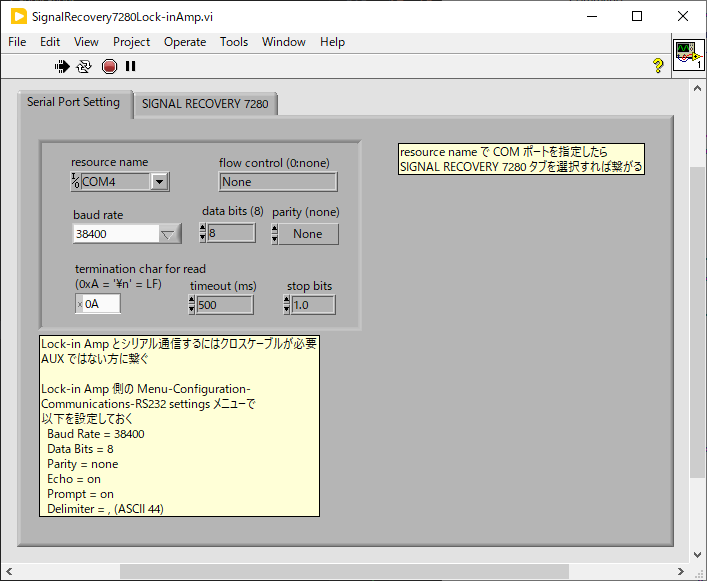
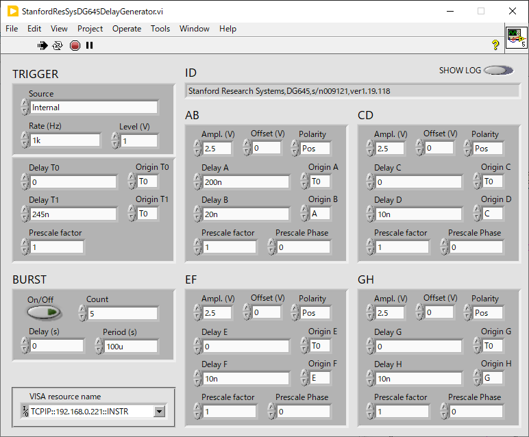

hardware/
==

ハードウェア制御用の VI をここに置く

- [hardware/](#hardware)
  - [ADCDataRecorder.vi = ADC の電圧値を記録するアプリ](#adcdatarecordervi--adc-の電圧値を記録するアプリ)
  - [DACSinglePoint.vi = DAC の電圧値を制御するアプリ](#dacsinglepointvi--dac-の電圧値を制御するアプリ)
  - [SignalRecovery7280Lock-inAmp.vi](#signalrecovery7280lock-inampvi)
    - [このプログラム実装の技術的なポイント](#このプログラム実装の技術的なポイント)
  - [TectronixDPO4000OscilloScope.vi](#tectronixdpo4000oscilloscopevi)
  - [StanfordResSysDG645DelayGenerator.vi](#stanfordressysdg645delaygeneratorvi)

ADCDataRecorder.vi = ADC の電圧値を記録するアプリ
--

- `Rate (Hz)` に指定されたサンプリングレートで ADC からデータを入力してグラフ表示する
  - 主にロックインアンプの `X, Y` を入力する用途で使っている
  - プリアンプの倍率とロックインアンプのセンシティビティとを指定して、グラフ表示の縦軸を物理量と合わせられるようになっている
- `Physical Channels` を指定して `Measure` を押すと表示の更新が始まる
  - もう一度押すと止まる
- トグルスイッチ `Save To File` を `ON` にした状態で `Measure` を押すと、もう一度 `Measure` を押して止めるまでの測定データがファイルに保存される
  - `File Name to Save (auto incremented)` にファイル名を指定する
  - `Measure` で測定を止めるごとにファイルの連番部分が自動的に更新される
  - ファイル名に番号部分（`0000` など）がなければ自動的に追加される
  - `Header Text for Data Files` に入れた内容がデータファイルのヘッダー部分にコメントとして保存される
  - `Parameters To Save` に VI 名とコントロール名のリストを指定することで、ファイル保存開始時にそれらのコントロールの値を読み取り、コメント等と共にデータファイルのヘッダー部分に保存される
  - 計測パラメータを保存しておくのに便利なはず
  - VI 名とコントロール名のリストの指定の仕方は [GetControlValues.vi の説明](../lib/SetGetControlValue/#getcontrolvaluesvi) を参照のこと
  - `Time` と `NChannels` はそれぞれ現在時刻とチャンネル数で、これらの値もデータファイルのヘッダーに保存される

データファイルの構造は、測定情報を含めたヘッダー部に測定結果のバイナリデータが続く形になる。

ヘッダー部は1行の JSON オブジェクトなので、データ読み取り時には改行文字まで1行を読むことでヘッダーを読み取り、残りをバイナリデータとして解釈すればいい。

TODO: 改行文字はプラットフォーム依存とされているのだけれど、CRLF だと CR までが改行文字か CRLF までを含めて改行文字か、区別がつかないことになるのでまずい。`Write to Text File` を使うのは止めた方が良いかも？

DACSinglePoint.vi = DAC の電圧値を制御するアプリ
--
コントロールの値を変更すると DAC の電圧値を変更するというだけのアプリケーション

[`ParameterSweeper.vi`](../utilities/#parametersweepervi) と組み合わせると周期的に値の掃引を行える。

- `Physical channels` にデバイス名と AO チャンネルを（複数）指定する
  - `Dev1/ao0:1` や `Dev1/ao0,Dev1/ao2` のような指定が可能
  - 指定されたチャンネル数分だけ `Label &Value & Coefficient` が有効になる
  - チャンネルの指定順と `Label &Value & Coefficient` の順が対応するので
    - `Physical channels` が `Dev1/ao1,Dev1/ao0` なら 
    - 1行目が `Dev1/ao1` に、
    - 2行目が `Dev4/ao0` に対応する
- `Enable` を押すと `Value` と `Coefficient` を掛けた値が DAC へ出力される
  - `Enable` が `on` の状態で値を変更すると即座に DAC の値も変更される
  - `Enable` が `off` だといくら値を変更しても DAC に出力されないので注意
  - 電圧と物理量の間の係数を `Coefficient` に入れると設定が楽になる
  - `Label` は人が入力する際に分かりやすい名前を入れておくための欄で、機能上の意味はない
- このアプリだけだと人がちまちま値を入れて電圧を変えることしかできない
- [`ParameterSweeper.vi`](../utilities/#parametersweepervi) と組み合わせて使うのがこのアプリの主な用途
  - VI 名 `DaACSinglePoint`
  - コントロール名 `Label & Value & Coefficient[0]/Value`
  - などとして [`ParameterSweeper.vi`](../utilities/#parametersweepervi) で値を掃引可能
- 異なる測定ごとに [`SettingManager.vi`](../utilities/#settingmanagervi) で `Physical channels`, `Label & Value & Coefficient` の値を設定すると使い勝手が良いはず

SignalRecovery7280Lock-inAmp.vi
--

Signal Recovery 製のロックインアンプ 7280 を制御するプログラム

電圧入力で使う上で良く使うパラメータは一通り画面上で確認、変更することが可能になっている。

- 定期的に機器側の設定を読みに行くので、ロックインアンプ側で値を変更した場合にも数秒後には VI 上に反映される
- 画面上でパラメータを変更すれば即座にロックインへ変更が反映される

起動直後は次のような画面になる。

- 画面上の注意書きの通り、PC と 7280 とを接続し、また、7280 の RS232 設定を行う
- シリアル通信の設定は `resource name` 以外は初期値のままで使う
- `resource name` に 7280 との通信に利用するシリアルポートを指定する
- 指定したら上部のタブで `SIGNAL RECOVERY 7280` ページを選ぶと上の制御画面が現れる
- `X Scaled`, `Y Scaled` は `X`, `Y` の値にユーザーが任意に指定可能な `Scale` を掛けた値を表示する

### このプログラム実装の技術的なポイント

- この VI では制御項目の数が非常に多いので `TextControlledInstrum` の `UpdateControls.vi` にかなり時間がかかる
  - イベント処理ループ内に置くとイベント処理が滞るため別にコマンド処理ループを作りそちらで実行するようにした
  - コマンド `Queue` に `"UpdateCommands"` の文字列を送ると実行される
  - `Timeout` 時のみでなくシリアルポートの初期化直後にもこれを実行することで、最初の `Timeout` までコントロールの値が古いままになるのを防止できている
  - `ControlChanged.vi` の方は基本的に一度に１つのパラメータしか変更しないため比較的速やかに処理が終わる
  - 引数をメッセージで送るのが面倒なこともあってイベント処理ループから直接呼ぶ形のままになっている
- 非表示にした `Serial Port` 表示器をローカル変数のようにして使っている
  - シリアルポートが初期化済みで `SIGNAL RECOVERY 7280` ページが開かれていれば値が入る
  - 初期化に失敗したりあるいは `Serial Port Setting` ページが開かれていれば無効値が入る
  - 無効値が入っているときは通信を行わない
- `Serial Port Setting` ページから `SIGNAL RECOVERY 7280` ページへのページ切替時にポートを初期化している
  - 設定には [`lib/Hardware/SerialPortSetup.vi`](`lib/Hardware#serialportsetupvi`) を使っている
  - この VI の　`Serial Port Setting` 端子の右クリックから「制御器を作成」すればすぐに使える制御器を VI に載せられる
  - 初期化に成功すれば初期化を実行する
    - 上記の非表示 `Serial Port` 表示器に値を入れる
    - 複数行文字列として与えられた初期化コマンドを `TextControlledInstrumWriteCommands.vi` に渡して送信する
    - 自身のコマンド `Queue` に `"UpdateControls"` を入れてパラメータ値を機器から読みだす
  - 初期化に失敗すれば非表示 `Serial Port` 表示器は無効値のままになり通信は行われない
  - `SIGNAL RECOVERY 7280` ページから `Serial Port Setting` ページへのページ切替時にも非表示 `Serial Port` 表示器に無効値を入れている
- コマンドリストは１つの文字列にしてしまうと長大になり見づらいため、区切りの良いところで区切って文字列配列として記述し `ControlToCommand.vi` に渡す前に `Concat` で繋げた
- パラメータに紐づけされるコントロールは中央のクラスタの他に、下部の `X`, `Y`, `Frequency`, `Auto Phase`, `Status` も含まれる
  - すべてを配列にして `ControlToCommand.vi` に渡している
    - コマンドリストはこの配列の順番に合わせて記述する
    - クラスタについてはサブコントロールごとのコマンドを列挙する
    - ここではクラスタ内に１８個それ以外に５個で合計２１個のコントロールに対応するコマンドを与えている
  - 中央のクラスタは読み書きできるパラメータ
    - 書き込みコマンドと読み出しコマンドの両方を記述している
  - `X`, `Y`, `Frequency`, `Status` は読み出し専用パラメータ
    - 書き込みコマンドを空にしてある
  - `Auto Phase` はボタンを押したときにコマンドを送信する
    - 読み出しコマンドを空にしてある
    - 書き込みコマンドの `false` 側も空にしてある
    - 書き込みコマンドの `true` 側にコマンドを記述する
    - ボタンの機械動作は「押している間のみ `true`」にしてある
- `IO Queue` への通信要求を処理する通信ループについて
  - `TextControlledInstrumIOQueuePacket.ctl` を VI にドロップして `IO Queue Packet` 構造体定数を作成し、これを与えて `Obtain Queue` を呼ぶことで `IO Queue` を作成している
  - この機器ではエコーバックを `ON` にして１文字ずつ書き込みを確かめながら送らないとバッファーオーバーフローを起こして送信した文字が消失するケースが生じる
  - そこでコマンド送信には１文字１文字エコーバックを確認しながら送るため `VISAWriteWithEchoback.vi` を使っている
  - また、コマンド送信時に `CR+LF` を改行文字として付加している
  - この機器ではプロンプトを `ON` にしておくと書き込み完了あるいは読み出し完了時に１文字 `"*"` が送り返される（エラーの時は `"?"` なのか？）
  - そこで `write` 処理も `read` 処理もこのプロンプト文字を確認してから `Queue` に文字列を返している
- コマンド処理ループ内で `UpdateControls.vi` を呼んだ後、パラメータ項目に従属する表示器を更新している
  - `X`, `Y`, `Scale` の値を読んで `X Scaled`, `Y Scaled` を更新
  - `Status` の値を読んで `Unlock` と `Overload` を更新
  - 読み出した値そのままではなく、値を加工して表示したいときには同様のテクニックが使える
  - `Status` 表示器は必要なければ非表示にしておいても構わない
  - このような計算はローカル変数を使って行っても良いが、それだとサブVI化することが難しい
  - ここではコントロールリファレンスだけを使って計算を行うために `MakeControlMap.vi` を使っている
    - パラメータコントロールのリストに、機器パラメータと直接対応が付かないコントロールを加えたものを `MakeControlMap.vi` に入れる
    - `Names`, `Controls` にサブ項目を含めた一覧が出力されるのでそれで `For` ループを回すとすべてのコントロールを巡れる
    - 更新が必要なものだけを `Case` ストラクチャで処理する
    - `ValueMap` を使うとコントロール名から値を得られるので適切な型に直して用いる
    - コントロールの `Value` プロパティへ代入することでコントロールの値を更新する

TectronixDPO4000OscilloScope.vi
--

手持ちの DPO4054 のために作成した。

背面の LAN ポートで接続して使うことを想定している。

StanfordResSysDG645DelayGenerator.vi
--

手持ちの DG645 のために作成した。

背面の LAN ポートで接続して使うことを想定している。

