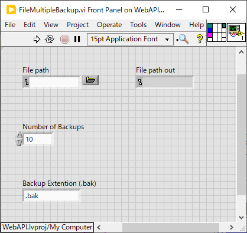

FileMultipleBackup.vi
==
概要
--
複数世代のバックアップを残すための vi

例えば `SettingsManager.ini` を5世代バックアップしたら

```
SettingsManager.ini
SettingsManager.bak1
SettingsManager.bak2
SettingsManager.bak3
SettingsManager.bak4
SettingsManager.bak5
```

のようにバックアップファイルができる。

端子構成
--


- `File path` にバックアップ対象のファイル名を指定する
- `File path out` は `File path` の内容がそのまま出る
- `Number of Backups` に作成されるバックアップファイルの数を入力
- `Backup Extention (.bak)` に拡張子を入力（後ろに数字が付く）

動作
--
- `File path` に指定されたファイルの拡張子を `.bak1` に変更する
- 古いバックアップファイルが存在すれば、それらもそれぞれ１つずつ大きな番号に変更する
- `File path` にデータを保存する前に `FileMultipleBackup.vi` を呼ぶことを期待している
- `File path` に指定されたファイルが存在しなくてもエラーにならないので、初めて保存する際にも呼んで大丈夫

改訂履歴
--
