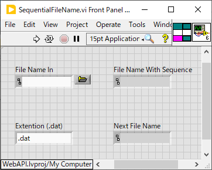
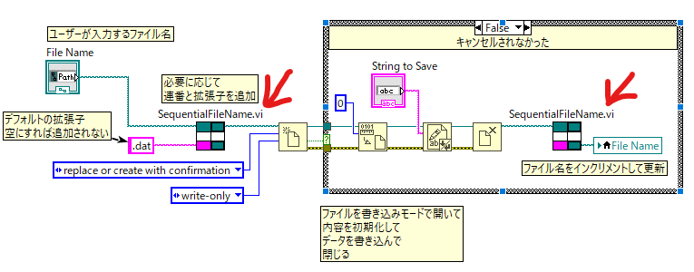

SequentialFileName.vi
==

概要
--
`"test0000.dat"` のような連番付きのファイル名を入れると番号を１増やしたファイル名を生成する

端子構成
--



動作
--
- `File Name In` に `"test0000.dat"` のような連番付きのファイル名を入れると番号を１増やして `Next File Name` に出力する
- 元のファイル名に連番がない場合には拡張子の直前に 0000 を追加する
- 拡張子がない場合には後ろに `Extention (.dat)` からの入力を追加する
  - デフォルトでは `.dat` が追加される
  - 空文字劣を入力すれば拡張子の自動追加は行われなくなる
- 連番や拡張子が追加された1増やす前のファイル名が `File Name With Sequence` へ出力される
  - もともと連番や拡張子が付いていれば `File Name In` からの入力がそのまま出力される


利用例
--

[example/example-SequentialFileName.vi](example/example-SequentialFileName.vi)



- ファイル名入力欄(文字列ではなくPath)から読み取った値を `SequentialFileName.vi` へ `File Name In` として入れて `File Name With Sequence` から出た値をファイル名として使う
- ファイルへデータを保存する
- `Close File Function` から得られる `Path` 出力を `SequentialFileName.vi` へ `File Name In` として入れて `Next File Name` から出た値で `File Name` 欄を更新する

実行例
--

[test/test-SequentialFileName.vi](test/test-SequentialFileName.vi) にある動作確認スクリプト：

- `File Name In` 入力
- `File Name With Sequence` 出力
- `Next File Name` 出力

の順に並べてある。

```
# 連番部分を1増やすのが基本動作
test0000.dat
test0000.dat
test0001.dat

# 連番部分を1増やすのが基本動作
test0309.dat
test0309.dat
test0310.dat

# 桁数は自動的に増える
test99.dat
test99.dat
test100.dat

# 連番がなければ勝手につける
test.dat
test0000.dat
test0001.dat

# 拡張子も勝手につける(付けないことも可能)
test0000
test0000.dat
test0001.dat

# 連番と拡張子両方を追加
test
test0000.dat
test0001.dat

# もちろんパスが付いていてもOK
C:\path\to\the\file\test
C:\path\to\the\file\test0000.dat
C:\path\to\the\file\test0001.dat
```

改訂履歴
--
