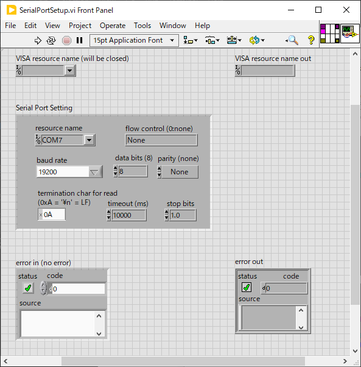

lib/Hardware
==

ハードウェア制御関連の汎用ライブラリをここに置く。

- [lib/Hardware](#libhardware)
  - [SerialPortSetup.vi](#serialportsetupvi)
  - [TextControlledInstrum](#textcontrolledinstrum)

SerialPortSetup.vi
--

シリアルポートの設定を行う VI

設定項目が多いので同じ目的に何度もコントロールを並べなくて済むように作った

`Serial Port Setting` 端子を右クリックして `Create Control` すれば設定用 UI をすぐ出せる

- `Serial Port Setting` に値を入れると `VISA resource name out` へ設定済みのリソース名を返す。
- `VISA resource name (will be closed)` へ入力があればそのポートは閉じられる
  - 異なるポートが選択されたら元のポートは閉じたくなるのでその際に使える
- `baud rate` はドロップダウンから `<Other>` を選べば任意の非標準値も設定可能

TextControlledInstrum
--

シリアル通信やGPIB通信のような行単位のテキストコマンドのやり取りで読取・設定可能なハードウェアを制御するプログラムを作成するのを助けるライブラリ

例えば下図の Signal Recovery 製のロックインアンプ 7280 をシリアル通信で制御するプログラムはこのライブラリで作成した。

- 機器の設定項目に対応する多数のコントロールが VI 上に並ぶ
- 定期的に機器から最新の値が読みだされてコントロールの値が更新される
- コントロールの値を変更すると機器に変更が反映される

本ライブラリを使うことでこのような制御プログラムの作成を楽に行える。

詳細は別ページに記述した：[TextControlledInstrum.md](TextControlledInstrum.md)

