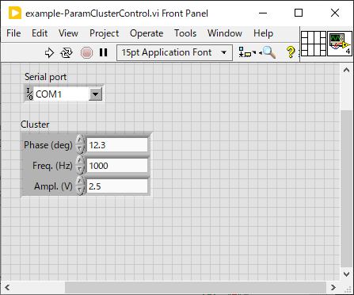
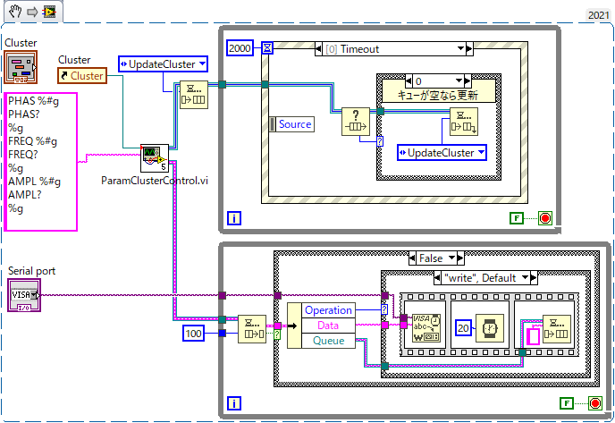
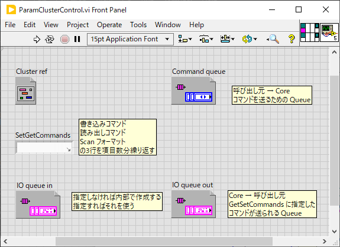
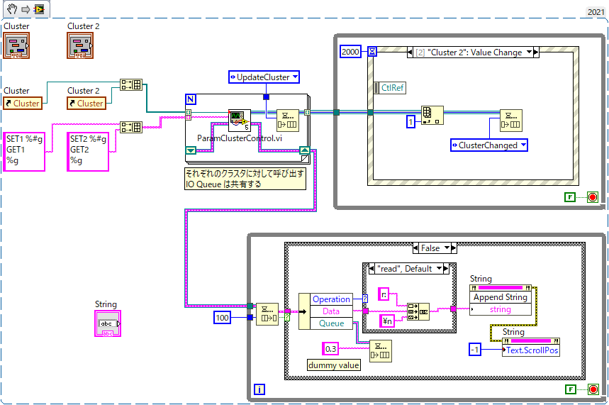

lib/Hardware
==

ハードウェア制御関連の汎用ライブラリをここに置く。

- [lib/Hardware](#libhardware)
  - [ParamClusterControl.vi](#paramclustercontrolvi)
    - [技術メモ：Queue を介してメッセージを投げ合う VI の動作について](#技術メモqueue-を介してメッセージを投げ合う-vi-の動作について)
  - [SerialPortSetup.vi](#serialportsetupvi)

ParamClusterControl.vi
--

シリアル通信のようなテキストコマンドのやり取りで読取・設定可能なハードウェア項目を制御するプログラムを作成する際に用いる VI

使用例： [image4md/example-ParamClusterControl.vi](image4md/example-ParamClusterControl.vi)

- `COM1` に接続された機器の `Phase`, `Frequency`, `Amplitude` を設定するプログラム
- フロントパネルには、これらのパラメータが１つのクラスタにまとめられて配置されている
- パラメータの値は定期的にハードウェア機器から読み出され更新される
- フロントパネル上で値を設定すればそれがハードウェアに送られる

`ParamClusterControl.vi`　を使うとこのようなプログラムを最小限の手間で実現できる。

上記 VI のブロックダイアグラム：

- ブロックダイアグラムから `ParamClusterControl.vi` が呼び出されている
- `ParamClusterControl.vi` には２つの入力がある
  - `Cluster ref` には、パラメータを含む `Cluster` のリファレンスを入力する
  - `SetGetCommands` には、それぞれのパラメータを設定・読取するためのテキストコマンドを列挙した文字列を入力する
    - 書き込みコマンド、読み出しコマンド、`scanf` テンプレート からなる３行を、設定項目の数だけ繰り返す
    - 設定項目の記述順は `Cluster` 内のコントロール番号順に合わせる
      - この例であれば始めの３行が `Phase` の書込、読出、`scanf`テンプレートであり、次の３行が `Freq` のそれらである
      - ３行×３項目で９行ある
    - 書き込みコマンドの `%g, %f, %d, %x, %s` などの `printf` プレースホルダには設定値が入る
      - `Cluster` 内のサブコントロールの型に合わせて適切なプレースホルダを置く必要がある
    - 読み出しコマンドは置き換えなどなくそのまま用いられる
    - `scanf` テンプレートはハードウェアから送り返されたテキストに適用され、得られた値が対応する項目に代入される
      - `Cluster` 内のサブコントロールの型に合わせて適切なプレースホルダを置く必要がある
    - これらのコマンド文字列は直接シリアルポート等へ出力されるわけではなく下記 `IO Queue` へメッセージとして送られる
- `ParamClusterControl.vi` からは２つの Queue リファレンスが出力される
  - １つはコマンド Queue
    - 呼び出し元から `ParamClusterControl.vi` へコマンド（２種類）を送るのに使う
    - `UpdateCluster` を送るとハードウェアから値を読み取って `Cluster` を更新する
      - `Cluster` のいずれかの項目にキーフォーカスが当たっている場合、その項目は更新されない（編集中に変わるとややこしいため）
      - サンプルコードでは初期化時の他、`Timeout` 時に定期的に呼んでいる
      - 定期的に読むことでハードウェア上のキー操作等で値が変更された場合にも同期がとれる
    - `ClusterChanged` を送ると、変更された項目をハードウェアに書き込む
      - どの項目が変更されたかは `ParamClusterControl.vi` が直前の値と比較して判断する
      - `Cluster` の `Value Change` イベントで使うことを想定している
  - もう１つは IO Queue
    - `ParamClusterControl.vi` から呼び出し元へコマンドの送受信を依頼するために用いられる
    - この `Queue` には `Operation`, `Data`, `Queue` を含む構造体が送られてくる
      - `Operation` は読み出しなのか書き込みなのかを表す
      - `Data` は `SetGetCommands` のコマンドのいずれかが入る（`printf` プレースホルダへは代入済み）
      - `Queue` は文字列を入れられる `Queue` のリファレンス
        - ハードウェアから値を読み取る時にはここに読み取った文字情報を返す
        - ハードウェアへ値を設定する時には設定完了を通知するため何でも良いので文字列を返す
    - 例示のコードでは
      - 読み出しには `Data` の文字列をそのままシリアル通信でハードウェアへ送り、１行読み取って `Queue` に返している
        - `ParamClusterControl.vi` は返された文字列に `%g` をテンプレートに `scanf` して値を読み取り、対応する `Cluster` 項目に値を書き込む
      - 書き込みには `Data` の文字列をそのままシリアル通信でハードウェアへ送り、20 ms だけ待ってから、空文字列を `Queue` に返している
        - `ParamClusterControl.vi` は次の動作を行う前に何か送り返されるのを待つ
      - 書き込み完了時に `ok` などの文字列を１行返すハードウェアならば、書き込み後も１行読み取ってその値を返せばよいので、読み取りと書き込みとを `case` ストラクチャで分ける必要がなくなる

始めに `ParamClusterControl.vi` へ渡す設定・読取コマンドリストはあくまで `ParamClusterControl.vi` が `IO Queue` へ入れる文字列を決めるためのものなので、呼び出し元でそれをそのままハードウェアへ送る必要はない。

標準の機能では対応しきれないような特殊な処理が必要となるような項目については、それが分かるような文字列をコマンドリストに与えておけば、`IO Queue` から読み出した文字列を見て特殊処理が必要な場合のみを別処理にするような使い方をしても構わない。

この `Cluster` の読取・設定以外にもハードウェアとのやり取りが必要な場合には、その処理も `IO Queue` を用いて行うと良い。逆に、`IO Queue` を使うだけでは実現できない処理（例えばハードウェア側から不定期にデータが届くような使い方？）とこの VI とは両立して使うことが難しい。

- `Cluster ref` : 値を読み書きするクラスタのリファレンス
- `SetGetCommands` : 書き込みコマンド、読み出しコマンド、`scanf` テンプレート の３行を項目数だけ繰り返した文字列を与える
- `Command queue` : 呼び出し元から VI へコマンドを送るための Queue
  - コマンドは次の２つのどちらか
  - `UpdateCluster` : ハードウェアから値を読み取って `Cluster` を更新する
  - `ClusterChanged` : `Cluster` の変更された項目をハードウェアに書き込む
- `IO queue in` : VI から呼び出し元へデータ通信要求を送るための Queue
  - 指定しなければ内部で作成される
  - 送られる構造体のメンバー
  - `Operation` : `read` / `write` のどちらか（ハードウェアからの読取・ハードウェアへの書込）
  - `Data` : `SetGetCommands` で指定したコマンド文字列（`printf` プレースホルダは代入済み）
  - `Queue` : 結果を送り返すための `Queue`
- `IO queue out` : VI から呼び出し元へデータ通信要求を送るための Queue
  - `IO queue in` に指定した値あるいは内部で作成された値が出力される
- 詳しい使い方は上記の例を参照のこと

複数の Cluster を制御する例： [image4md/example2-ParamClusterControl.vi](image4md/example2-ParamClusterControl.vi)

- VI 上にはパラメータを含むクラスターが２つある
- ここでは実際の通信は行わず仮想の通信ログを String 表示器に表示する

- `ParamClusterControl.vi` をクラスタの個数だけ別途呼び出す
- その際、同じ機器のパラメータであれば `IO Queue` は共通にしておくと通信部分を共有できる
  - 1つ目の `ParamClusterControl.vi` の `IO Queue in` に無効な `Queue` リファレンスを渡すと新たな `IO Queue` が作成されて `IO Queue out` に出てくる
  - 2つ目の `ParamClusterControl.vi` の `IO Queue in` にをの `Queue` リファレンスを渡せば同じ `IO Queue` に対して通信要求が送られることになる
- 両者とも初期化のため `Command Queue` に `UpdateCluster` を入れておく
- `Cluster` および `Cluster 2` の `Value Change` イベントでそれぞれ対応する `Command Queue` に `ClusterChanged` コマンドを送る
- `IO Queue` の出口を監視して、通信要求に応じて機器と通信し、結果を要求に含まれる `Queue` に返す
  - 値を返す際にはどちらから送られた通信要求かを気にせず、渡された `Queue` に返せば正しい送り先に届く
  - この例では実際には通信を行わず、読み出しなら `r:` を、書き込みなら `w:` を付けて仮想通信ログに書き加えている
  - 読み取られる値は常に `0.3` になっている

### 技術メモ：Queue を介してメッセージを投げ合う VI の動作について

- 呼び出し元と Queue を使ってやり取りする VI は、呼び出し元と並列に実行されていなければならない
- そのため `ParamClusterControl.vi` は `ParamClusterControlCore.vi` を `Start Asynchronous Call` を使って起動し、その終了を待たずに呼び出し元へ戻る
- `ParamClusterControlCore.vi` は `ParamClusterControl.vi` の呼び出し終了後も動作を続け、Queue を介して呼び出し元とメッセージのやり取りを行う
- そのままだと呼び出し元 VI の終了後も `ParamClusterControlCore.vi`が動き続けてしまうため、`ParamClusterControlCore.vi` は `Cluster ref` に与えられたクラスタの `Owning VI` から得られる呼び出し元の状態を定期的に確認して、呼び出し元が `Run Top Level` あるいは `Running` でなくなれば、すなわち呼び出し元の実行が止まれば自ら終了する

SerialPortSetup.vi
--

シリアルポートの設定を行う VI

設定項目が多いので同じ目的に何度もコントロールを並べなくて済むように作った

`Serial Port Setting` 端子を右クリックして `Create Control` すれば設定用 UI をすぐ出せる

- `Serial Port Setting` に値を入れると `VISA resource name out` へ設定済みのリソース名を返す。
- `VISA resource name (will be closed)` へ入力があればそのポートは閉じられる
  - 異なるポートが選択されたら元のポートは閉じたくなるのでその際に使える
- `baud rate` はドロップダウンから `<Other>` を選べば任意の非標準値も設定可能
