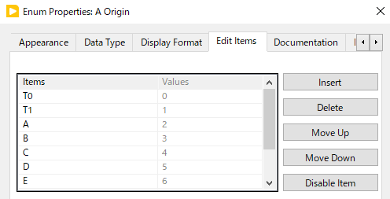
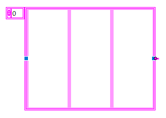

Tutorial of TextControlledInstrum
==

このフォルダに含まれるライブラリ [`TextControlledInstrum`](./#textcontrolledinstrum) を使うとテキストコマンドで制御可能な機器のための制御プログラムを手軽に作れます。

ここでは Stanford Research Systems のパルスジェネレータ DG645 の制御プログラムを作る手順を示すことでこのライブラリのチュートリアルとします。

- [Tutorial of TextControlledInstrum](#tutorial-of-textcontrolledinstrum)
  - [LAN 接続による制御の基本](#lan-接続による制御の基本)
    - [パラメータの読み出し](#パラメータの読み出し)
    - [パラメータの書き込み](#パラメータの書き込み)
  - [TextControlledInstrum ライブラリを使う](#textcontrolledinstrum-ライブラリを使う)
  - [パラメータの読み出し](#パラメータの読み出し-1)
  - [コントロールを増やす](#コントロールを増やす)
  - [定期的に読みだす](#定期的に読みだす)
  - [パラメータの書き込み](#パラメータの書き込み-1)
  - [名前付きの整数値コントロール](#名前付きの整数値コントロール)
  - [名前付き浮動小数点数](#名前付き浮動小数点数)
  - [読み出し専用パラメータ](#読み出し専用パラメータ)
  - [真偽値](#真偽値)
  - [コマンド実行ボタン](#コマンド実行ボタン)
  - [文字列パラメータ](#文字列パラメータ)
  - [クラスタ](#クラスタ)
    - [子コントロールの順序](#子コントロールの順序)
    - [子コントロールの順序の入れ換え](#子コントロールの順序の入れ換え)
  - [前処理・後処理の必要なケース１](#前処理後処理の必要なケース１)
  - [前処理・後処理の必要なケース２](#前処理後処理の必要なケース２)
    - [直接値をやり取りするコントロールを追加](#直接値をやり取りするコントロールを追加)
    - [ユーザーが使うコントロールを追加](#ユーザーが使うコントロールを追加)
    - [読み出し処理](#読み出し処理)
    - [書き込み処理](#書き込み処理)
  - [ローカル変数を使わない書き方](#ローカル変数を使わない書き方)
    - [コントロール配列への追加](#コントロール配列への追加)
    - [B コントロールの追加](#b-コントロールの追加)
    - [コマンドリストを見やすくする](#コマンドリストを見やすくする)
    - [MakeControlMap.vi について](#makecontrolmapvi-について)
    - [読み出し処理](#読み出し処理-1)
    - [書き込み処理](#書き込み処理-1)
  - [まとめ](#まとめ)

LAN 接続による制御の基本
--

DG645 は GPIB やシリアル通信、LAN 接続などさまざまな方法で制御できますが、ここでは LAN 接続した DG645 に `VISA Write`, `VISA Read` を使ってアクセスする基本的な方法を説明します。

### パラメータの読み出し

- まず新しい VI を作ります
- ブロックダイアグラム上で右クリックして `VISA Write` と `VISA Read` をドロップします
  - `Instrument I/O` の `VISA` の中にあります

- ドロップしたら `VISAWrite` の左上の端子 `VISA resource name` の上で右クリック
- `Create Control` して `VISA resource name` 制御器を作ります

同様の手順で、

- `VISA Write` の `write buffer` 端子に制御器を作成
- `VISA Read` の `byte count` 端子に定数を作成
- `VISA Read` の `read buffer` 端子に表示器を作成

- 分かりやすくするため `byte count` は右クリックから `Visible Items` に `Label` を選択
- 値を `100` に設定
- `VISA Write` から `VISA Read` の `VISA resource name` への接続も追加

までが上の図で済んでいます。

- フロントパネルでコントロールの位置や大きさを調整
- `VISA resource name` に `TCPIP::192.168.0.221::INSTR` を入力して `Make Current Value Default` を選択
  - これは DG645 の IP アドレスが `192.168.0.221` の場合です

ここまでで最も基本的な制御の基本が出来上がりました。

- `write buffer` に `LAMP? 1` と入力する
- `Run` ボタンを押す、あるいは `Ctrl+R` を押す
  - これでこのコマンドが IP アドレス `192.168.0.221` の装置に送られ
  - 戻ってきた値が `read buffer` に表示されます

おめでとうございます！

- DG645 のマニュアルによると `LAMP? 1` は AB 出力の電圧レベル振幅を読み出すコマンドです
- ここでは `+2.50` つまり 2.5 V という答えが返ってきたことになります

### パラメータの書き込み

この VI は非常に簡単なものですが、コマンドのやり取りをテストするのに今後も使えるのでもう少しだけ手を加えておきます。

DG645 では `?` を付けずにパラメータ値を指定した、例えば `LAMP 1,1.5` の形で AB 出力のレベル振幅を 1.5V に設定できます。

そこで、ブロックダイアグラムで下図のように矩形選択をして、Shift キーを押しながら `VISA Read` をクリック、ボタンを離さないまま右に動かしてドラッグすることで右に動かします。Shift を押しながらドラッグを開始すると上下左右にまっすぐドラッグできます。

- `VISA Read` をケースストラクチャで囲んで `Default` ケースとする
- `write buffer` の文字列に `?` が含まれるかどうかを `Match Pattern` で判別
  - 見つからなければ `offset past match` が `-1` になる
- ケースストラクチャの `-1` のケースは空のままにする
- ケースストラクチャからの出力トンネルを右クリックして `Use Default If Unwired` にチェックする

これで `?` を含まないコマンドに対しては `VISA Read` を呼び出しをせず `read buffer` 表示器をクリアすることになります。

フロントパネルに戻って `write buffer` に `LAMP 1,1.5` を入力し、`Ctrl+R` を押せば DG645 の設定が変わり、`read buffer` がクリアされることを確認できます。すばらしい！

`write buffer` を `LAMP? 1` に戻して `Ctrl+R` すれば、読みだされる値も `+1.50` になっています。

TextControlledInstrum ライブラリを使う
--

実際にプログラムを作る際には AB レベル振幅の確認・設定には数値コントロールを使うため、上記の読み書き手順の他に、コマンドでやり取りする文字列と、コントロールの数値との間で変換が必要になります。

つまり、

- `LAMP? 1` で読み取った `+1.5` という文字列を数値に直してコントロールへ入れる
- コントロールの数値を `LAMP 1,???` の `???` の部分に文字列にして入れる

が必要になるわけです。

ですから普通にプログラムを作るなら、

- 読み出し処理
  - 読み出しコマンドを送る
  - 結果を受け取る
  - 必要に応じて結果を数値に直す
  - コントロールへ代入する
- 書き込み処理
  - コントロールから値を読む
  - 文字列に直してコマンド文字列に埋め込む
  - 書き込みコマンドを送る
  - （書き込み完了を待つ）

という処理を読み書きしたいパラメータの数だけ記述しないといけない。

こんなプログラムを作ろうとすると、、、気が遠くなります。

そこで `TextControlledInstrum` ライブラリを使って手間を省こうというわけです。

このライブラリを使うと、面倒なケースを除いて

- コントロールを並べる
- 書き込み・読み出しコマンド、読み出し結果の解釈方法、を列挙する

の２つだけでプログラムが完成します。

早速やってみましょう。

パラメータの読み出し
--

まずはコントロールの設置と、読み書きコマンドの記述を行います。

- 新しい VI を作成
- `AB Amplitude (V)` という DBL 制御器を作成
- その制御器を右クリックして `Create` - `Reference` でリファレンスを作成
- 文字列定数に以下の３行を記述
  - `LAMP 1,%g` : 書き込みコマンド作成のための `printf` テンプレート
  - `LAMP? 1` : 読み出しコマンド
  - `%g` : 読み出し結果の解釈のための `sscanf` テンプレート
- ３行目の最後に改行が入っていることを確認
  - ４行目の先頭までキャレットを動かせる状態
- `TextControlledInstrumControlToCommand.vi` を置く
- `TextControlledInstrumUpdateControls.vi` を置く
- 図のように接続する

次にライブラリに具体意的な通信方法を教える必要があります。

このライブラリは LAN 接続にも GPIB 接続にもシリアル通信にも対応しますが、逆に通信の詳細はライブラリには含まれていないためです。

`UpdateControls.vi` は機器からパラメータを読み取る VI ですが、実際に機器と通信を行う部分については `IO Queue` に読取コマンドの送信依頼を出すことになります。

この送信依頼を受け取って適切に処理するために `IO Queue` を作成し、送られた依頼を処理する必要があります。

- `TextControlledInstrumIOQueuePacket.ctl` を置く
- `Obtain Queue` を置く
  - `Synchronization` - `Queue Operations` にあります

- `White Loop` を置く
- 図のように接続
- `While Loop` を右クリックして `Subdiagram Label` を表示

- ループに `通信ループ` と命名
- 入力トンネルを右クリックから `Queue Operations Palette` の `Dequeue Element` を見つけて置く

- `Dequeue Element` の `Queue` へ入力トンネルから `IO Queue` を接続
  - この `Dequeue Element` は `IO Queue` へ通信要求が送られるまで待ち、通信要求が届いたら１つ取り出して `element` 端子に出力します
- `element` 端子の右クリックから `Cluster, Class & Variant Palette` の `Unbundle By Name` を見つけて置く
- `element` 出力と接続

- `Unbundle By Name` の上にマウスカーソルを持っていくと上下に青いぽっちが出る
- 下ぽっちを下方向にドラッグして３つの項目が現れるようにする
  - 現れた３つの項目の意味は次の通り
    - `Operation` : `read` または `write` で読み出し要求か書き込み要求化を表す
    - `Data` : 送信すべきコマンド
    - `Queue` : 実行結果を送り返すための `Queue`

- `Operation` で分岐するケースストラクチャを作成
- １つのケースを `"write", Default` にする
  - さしあたり中身は空のままで良い
- もう一方を `read` ケースにして以下を行う
- 上で作ったテストプログラムと同様の方法で
  - `VISA Write`, `VISA Read` を置く
  - `VISA resource name` 制御器を作成
  - `byte count` に 1000 を入れる
- `VISA Write` に `Data` を入れる
- `Queue` の右クリックから `Queue Operations Palette` の `Enqueue Element` を見つけて置く
- `VISA Read` の出力を `Enqueue Element` に繋ぐ

これで、`IO Queue` から通信要求パケットを１つ取り出し、`Operation` が `"read"` だったら `Data` の文字列を `VISA Write` で送信し、`VISA Read` で読み取った結果を `Enqueue Element` で `Queue` に返す。という動作を記述できました。

- `White Loop` の `Condition` 端子の右クリックから `Create Constant` で `false` を接続

ここまでで全体はこうなっているはず。

これを実行すると、機器から読み取られた AB レベル振幅が読み取られて DBL 制御器に設定されます。

すばらしい！

でもこれだとあんあまりライブラリを使ったおかげで楽になった気がしない？？？

コントロールを増やす
--

- `AB Amplitude (V)` を `Ctrl` と `Shift` を押しながら右へドラッグして複製
- 名前を変更して `AB Offset (V)` にする
- 右クリックから `Create` - `Reference` してリファレンスを作成
- `AB Amplitude (V)` のリファレンスとコマンド文字列との間の何もないところで `Ctrl` を押しながら下へドラッグしてスペースを空ける

- 空いたスペースに `AB Offset (V)` を置く
- ２つのリファレンスを選択して右揃え (`Align Object` - `Left Edges`)

- `AB Amplitude (V)` から `ControlToCommand.vi` へ伸びる線の上で右クリック、`Insert` から図のようにたどって `Build Array` を挿入

- `Build Array` の上へマウスカーソルを持っていくと上下に青ぽっちが出る
- 下のぽっちを下へドラッグして入力端子を２つにする

- そこへ `AB Offset (V)` リファレンスからの出力を繋ぐ
- コマンド文字列の末尾に `AB Offset` のコマンドを追加する
  - 書き込みは `LOFF 1,%g`
  - 読み出しは `LOFF? 1`
  - `scanf` フォーマットは `%g`

これで `AB Offset` の読み出しもできるようになりました！

フロントパネルへ戻って `Ctrl+R` すれば `AB Offset (V)` の値が正しく更新されます。

このように、`ControlToCommand.vi` の `Control Array` に機器のパラメータ項目と紐づけたいコントロールのリファレンスの配列を接続し、その配列と同じ順番で記述した機器に対するテキストコマンドの一覧を `SetGetCommands` に入力すれば、すべてのコントロールが適切に動作するようになるわけです。

定期的に読みだす
--

機器側で値が変更された場合にもそれに追従してコントロールの値を更新するため、`UpdateControls.vi` を定期的に呼び出すようにします。

後を見越して、イベントストラクチャの `Timeout` イベントでこの処理をしましょう。

- `UpdateControls.vi` を囲むように `While Loop` を作成
- サブダイアグラムラベルを表示して `イベント処理ループ` と命名
- `UpdateControls.vi` を囲むように `Event Structure` を作成
  - `Structures` の `Case Structure` の隣にあります
- 左上の砂時計を右クリックから定数を作成し `1000` に設定
- `While Loop` の条件端子に `false` を接続
- イベントストラクチャの左端にある `Event Data Node` (`Source`, `Type`, `Time`) の上にカーソルを持っていき、表示される青ぽっちのうち上の方を下へドラッグして `Time` 以外を隠す

これで１秒ごと（1000 ms ごと）に機器からパラメータが読み取られコントロールの値が変更されるようになりました。

パラメータの書き込み
--

値の書き込みを行うには、コントロールの値が変更されたことを検出して、対応する書き込みコマンドを送ることになります。

コントロールの値が変更されると `Value Chang` イベントは発生するので、それをイベントストラクチャで判別して `TextControlledInstrumControlChanged.vi` を呼べばその処理を行えます。

- イベントストラクチャの枠上で右クリックから `Add Event Case...` を選択
- 中央の `Event Sources` で `AB Amplitude (V)` を選択
- 右の `Events` で `Value Chang` が自動的に選択される
- 左の `Event Specifiers` に `AB Amplitude (V)|Value Change` が入る
- 左下の `Add Event` を押す
- - 中央の `Event Sources` で `AB Offset (V)` を選択
- 右の `Events` で `Value Chang` が自動的に選択される
- 左の `Event Specifiers` に `AB Offset (V)|Value Change` が入る
- 右下の `OK` ボタンを押す
- これで `AB Amplitude (V)|Value Change` あるいは `AB Offset (V)|Value Change` が発生したら呼ばれるイベントケースを作成できます

- イベントストラクチャ左側の `Event Data Node` を伸び縮みさせて次の３つだけが表示されるようにする
  - `CtlRef` : どのコントロールが変更されたかを表すコントロールリファレンス
  - `OldVal` : 変更前の値
  - `NewVal` : 変更後の値
- `TextControlledInstrumControlChanged.vi` を置く
- 図のように配線

あとは、書き込みの通信要求に応えられるよう通信ループに `"write"` の処理を追加します。

書き込みでは `VISA Write` でコマンドを送って、しばらく（ここでは 20 ms）待ってから `Queue` へダミーの文字列を返すことで書き込み完了を通知します。

- 通信ループのケースストラクチャの `"read"` ケースの枠の上で右クリックから `Duplicate Case` を選択
- ケースの `Selector Label` を `"wirte"` に設定
- `VISA Read` と `byte count` 定数を削除
- ゴミとして残った信号線（点線になる）を `Ctrl+B` で削除
- 削除した部分に `Flat Sequence` ストラクチャを作成
- 中に `Timing` パレットにある `Wait (ms)` を置く
  - `milliseconds to wait` 入力端子を右クリックから定数を作成し `20` を設定
- `VISA Write` からのエラー出力をシーケンスストラクチャへ接続
  - これで `VISA Write` が完了してからシーケンスが起動されることになる
- `Queue` から `Enqueue Element` へ伸びる線をシーケンスの中を通す
  - これで `VISA Write` から `Enqueue Element` まで 20 ms 待つことができる
- `Enqueue Element` にはダミーとして空文字列を繋いでおく

これで書き込みができるようになりました。

- 通信ループのケースストラクチャの残りの１つのケースを `Default` にする
- `lib/RaiserrorIf.vi` を置いてエラーメッセージ `"Not supported"` を繋ぐ
  - この VI はエラーを発生させたいときに気軽に使える VI
  - `error?` 端子に `false` を入れるとエラーを発生しないので条件次第でエラーを出したいときに便利
  - エラーメッセージには自動的にエラー発生場所の情報が追加される
  - エラー出力端子が繋がれていればダイアログを出さず、端子にのみエラーを出す

フロントパネルは変化していませんが、コントロールの値を変更すれば機器のパラメータを変更できるようになっています。

名前付きの整数値コントロール
--

続いて `AB Polarity` パラメータを制御できるようにします。

このパラメータの値は `Negative` か `Positive` なのですが、コマンドとしては `Negative` の代わりに `0` を、`Positive` の代わりに `1` を指定することになっています。

- `Negative` 書き込みコマンド `LPOL 1,0`
- `Positive` 書き込みコマンド `LPOL 1,1`
- 読み出しコマンド `LPOL? 1`
- 読み出し結果
  - `Negative` なら `0` が返る
  - `Positive` なら `1` が返る

こういう場合、コントロールを Enum として作成すると便利です。

- フロントパネルに Enum コントロールを作成

- `AB Polarity` と名前を変更
- コントロール上で右クリックから `Edit Items...` を選択
- `Items` に `Neg` を入力して `ENTER` キーを押す
- 次の行に移るので `Pos` を入力
- `Ok` ボタンを押す

これでコントロール値が `0` のとき `Neg` が `1` のとき `Pos` が表示される Enum コントロールができました。（`Negative/Positive` だと長いので省略しました）

ブロックダイアグラムで、

- このコントロールのリファレンスを作成
- `Build Array` の端子を１つ増やして接続
- コマンド文字列に以下を追加
  - `LPOL 1,%d` : 書き込みコマンドの `printf` テンプレート
    - 整数値なので `%d` になっている
  - `LPOL? 1` : 読み出しコマンド
  - `%d` : 読み出し結果に適用する `sscanf` テンプレート
    - 整数値なので `%d` になっている

これで `AB Polarity` を読み出し・書き込みできるようになりました。

コントロールを配置して、コマンドを記述するだけで済むって素晴らしい！

名前付き浮動小数点数
--

DG645 では使わないのですが、名前付きの浮動小数点数を読み書きしたい場合があります。

テクトロニクスの DPO4000 オシロスコープの時間スケール設定では任意の浮動小数点数を設定可能なのですが、画面上では "1s", "0.4s", "0.2s", "0.1s" などの選択肢からも選べるようにしたいです。

読み出しコマンドは

- `HORizontal:SCAle %g` : 書き込みコマンド
- `HORizontal:SCAle?` : 読み出しコマンド
- `%g` : `scanf` テンプレート

とすればいいですが、コントロールに選択肢を持たせるには `Ring` とするのが適切です。

`Enum` と同様に右クリックから `Edit Items...` して選択肢を編集するのですが、`Ring` の場合には 
- `Representation` を `Double` など浮動小数点数にできる
- 文字列に対応付ける数値をゼロからの連番では無くすことができる
  - `Sequential values` のチェックを外す
- 一覧にない数値を入力できる
  - `Allow undefined values at run time` のチェックを付ける
- `Display Format` で `SI Notation` を選んで `1e-3` を `1m` のように SI 補助単位を使って表すような表示ができる

といった機能を持たせられます。

読み出し専用パラメータ
--

書き込みができないパラメータについては、コマンド文字列の指定の際に書き込みコマンド欄を空行にしておきます。

合わせて、コントロールを始めから表示器にしておくか、あるいは制御器でも `Disable` にしておけばユーザーが値を書き込めなくできます。

同様に、書き込み専用の場合には読み出しコマンドや `scanf` テンプレートを空行にします。

真偽値
--

コントロールの値が真偽値（`Boolean`）の場合、コマンド文字列の指定が特殊な形式になります。

- 書き込みコマンドは `printf` テンプレートではなく、値が `false` の際に送る書き込みコマンドと値が `true` の時に送る書き込みコマンドとを `|` で区切って指定します
  - 例えば `"SET FALSE|SET TRUE"` とすれば値が `false` になった時に `SET FALSE` が、`true` になったときに `SET TRUE` が送られます
- 読み出しコマンドは通常通りです
- `scanf` テンプレートにあたる部分にも `false` として解釈すべき値と、`true` として解釈すべき値とを `|` で区切って記述します
  - `"off|on"` とすれば、`off` という文字列が返ってくれば `false` として、`on` という文字列が返ってくれば `true` として解釈されます
- その前に `|` で区切って `sccanf` テンプレートを書くこともできます
  - `%s|off|on` とすると `off` や `on` の後ろに改行文字などが入っていても正しく解釈されるようになります

コマンド実行ボタン
--

真偽値に対するライブラリの仕様をうまく使うと、ボタンを押したときに特定のコマンドを送るボタンを作れます。

- ボタンの機械動作を `Switch Until Released` にする
- 書き込みコマンドに `|` に続いて実行したいコマンドを記述する
  - `|SEND THIS` とするとボタンを押したときに `SEND THIS` というコマンドが送信される
- 読み出しコマンドと `scanf` テンプレートは空行にする

`Switch Until Released` は押したときと放したときにそれぞれイベントが発生しますが、押したときに値が `true` になるのでコマンドが送られ、放したときは値が `false` になるので何もしない、という動作を実現できます。

文字列パラメータ
--

数値型と特に変わりはありませんが、読み出し後に適用する `scanf` テンプレートに工夫が必要となる場合があります。

というのも、`scanf` テンプレートに `%s` を指定しただけでは「次の空白文字の直前まで」だけが読みだされてしまうため、読み取りたい値に空白文字が含まれるケースでは正しく動作しないためです。

空白を含む文字列を受け取りたい場合には、`scanf` のテンプレートに `%[^\n\r]` を指定します。これは `\n` と `\r` 以外の文字からなる部分を取り出して文字列として得る、というテンプレートになっています。複数行の戻り値が期待され、改行文字も含めて取り込みたいなら `%[^]` とします。

クラスタ
--

このライブラリはクラスタコントロールにも対応しています。

複数のパラメータを含むクラスタコントロールを `ControlToCommand.vi` に与えるコントロール配列に含めた場合、同時に与えるコマンド文字列にそのクラスタに含まれるサブコントロールに対するコマンドをすべて記述します。

例えば、コントロール A,B,C があってコントロール B にはサブコントロール B1, B2 が含まれているとしましょう。

それらを `ControlToCommand.vi` に与える場合、コマンドリストにはコントロール `A,B1,B2,C` のコマンドを順に記述します。

### 子コントロールの順序

注意が必要なのは、クラスタ内の子コントロールの順序です。ブロックダイアグラム上では B1 と B2 の順番は指定されていませんが、実際にはクラスタ内の子コントロールは決まった順序を持っており、クラスタの子コントロール配列を得れば必ずその順序で子コントロールが並びます。例えば TAB キーで子コントロール間を移動する際にその順序が適用されます。

重要なのは、この順序は画面上における上下左右の配置の順とは関係がなく、特に設定しない限り始めにコントロールを追加した順になることです。ですので画面上の配置を元に記述したコマンドリスト内の順序が内部で管理される実際の子コントロールの並び順と異なってしまうと動作がおかしくなってしまいます。

TAB キーでの移動がユーザーの予期しない順番にならないためにも、子コントロールの順序は画面上の配置から予想されるものに合わせておくのが間違いがありません。

### 子コントロールの順序の入れ換え

そこで子コントロールの順序を確認、入れ替える手順が提供されています。

- フロントパネル上でクラスタコントロールを選択
- 枠の上で右クリック
- `Reorder Controls in Cluster...` を選択
- フロントパネルが暗くなりクラスタコントロールのみハイライトされる
- 子コントロールに黒枠が付き、右下に白背景の数字と黒背景の数字が表示される
- 白背景の数字が変更前のコントロール順
- 黒背景の数字が変更後のコントロール順
- 画面上部に `Click to set to 0` とあるように、いずれかの子コントロールをクリックすることでその子コントロールのコントロール順を 0 にできる
- すると次に `Click to set to 1` と出るので 1 にしたいコントロールをクリックする
- これを繰り返して望みのコントロール順になるようにする
- `Click to set to ` の数字は好きなタイミングで書き換えられるので、全てを並べ替える必要がなければ途中から始めても良いし、間違ったら直前からやり直すこともできる
- 正しい順序になったらチェックマーク ✓ をクリックする
- 途中でキャンセルするには × マークをクリックする

前処理・後処理の必要なケース１
--

DAC の出力値など、パラメータは整数値で指定するものの、実際の出力はそれを何倍かした値になる場合があります。

例えば 8bit DAC でパラメータの 0 が 0V に、255 が 10V にあたる場合、設定値を 0.0392157 倍した値が出力されることになります。

このような場合、ユーザーが使うコントロールは電圧表示にしたいですが、その値をそのまま機器に送るわけにいきません。

浮動小数点数コントロールの書き込みコマンドを `SET %g` のようにする代わりに、`SET %d|<倍率>` のようにテンプレートを `%d` にして、`|` に続けて倍率を指定することでこのようなケースに対応できます。

ライブラリはコントロールの値を `<倍率>` で割り、`%d` に従って整数値にしてからコマンド文字列を生成します。

同様に、8bit DAC でパラメータの 0 が -10V に、255 が 10V にあたる場合、設定値を 0.0784314 倍して 10 を引いた値が出力されることになります。

このように倍率だけでなくオフセットが必要な場合には、`SET %d|<倍率>|<オフセット>` のように `|` に続けて倍率とオフセットを指定します。

ライブラリはコントロールの値から `<オフセット>` を引き、さらに `<倍率>` で割り、`%d` に従って整数値にしてからコマンド文字列を生成します。

同様に、読み取り時の `scanf` テンプレート指定でも `%d|<倍率>` や `%d|<倍率>|<オフセット>` とすることで、読み取った整数値を適切にオフセット、定数倍した値を浮動小数点数コントロールに入れることができます。

整数値コントロールではこの機能は使えないため注意してください。

この機能を使いつつコントロールで整数値の入力のみ許したければ、浮動小数点数コントロールの `Data Entry` で `Increment` を `1.0` にして、`Response to value outside limits` を `Coerse to nearest` にすればよいです。

前処理・後処理の必要なケース２
--

閑話休題して DG645 の制御プログラムに戻ります。

DG645 の A エッジの遅延を設定するコマンドは、`DLAY 2,0,1e-6` のような形をしており、A エッジを指定する `2` の他に、遅延の基準となるエッジを指定する `0` のような整数値と遅延量、例えば 1us なら `1e-6` を同時に指定するようになっています。

読み出す際も、`DLAY? 2` とすると `0,+0.000001000000` のように基準エッジと遅延量が同時に返ってきます。

このようなケースに対してはライブラリは直接のサポートを与えないため必要な前処理・後処理を独自に行う必要があります。

処理の流れは次のようになります：

- コマンドと直接対応する仮想的な文字列コントロール `A DLAY` を作成
- このコントロールは `0,+0.000001000000` のような値を持つ
- このコントロールの値が読みだされたら、その値を元にユーザーが使う `A Origin` および `A Dealy` というコントロールの値を変更する
- `A Origin` や `A Delay` コントロールが変更されたら `A DLAY` を変更する
  - 値変更イベントが発生して `A DLAY` の値が機器に送られる

### 直接値をやり取りするコントロールを追加

そこでまず `A DLAY` を作成します。
これはこれまでと同じ調子で簡単に行えます。

- `A DLAY` という名前の文字列制御器を置く
- 右クリックから `Create` - `Reference` でリファレンスを作成
- `Build Array` の端子を１つ増やして接続
- コマンドリストの末尾に次の３行を追加
  - `DLAY 2,%s`
  - `DLAY? 2`
  - `%s`
- イベントストラクチャーの `Value Change` ページで `Edit Events Handled by This Case`
  - `Add Event` ボタンを押して項目を増やす
  - `A DLAY` の `Value Change` イベントを選択
  - `Ok` を押す

これで `A DLAY` の読み書きができるようになりました。

### ユーザーが使うコントロールを追加

でもこれだけでは使いにくいので `A Origin` と `A Delay` を追加し、これらを機器のパラメータと同期させて使います。

- `A Origin` という名前の Enum 制御器を追加
  - 右クリックの `Edit Items...` で `T0`, `T1`, `A`, `B`, `C`, `D`, `E`, `F`, `G`, `H` を順に作成
- `A Delay (s)` という名前の DBL 制御器を追加
  - `Display Format` を `SI Notation` に設定

### 読み出し処理

まず `UpdateControls.vi` により `A DLAY` の更新された後に、その値を使って `A Origin` と `A Delay` の値を更新する処理を追加します。

- イベントストラクチャで `Timeout` を選択
- `UpdateControls.vi` の `timed out?` 端子の出力で分岐するケースストラクチャを追加
- この `false` ケースで `A DLAY` を読んで `A Origin` と `A Delay` を設定します

- `A DLAY` の上で右クリックから `Create` - `Local Variable`
  - できたアイコンの右クリックから `Change To Read`
- `A Origin` の上で右クリックから `Create` - `Local Variable`
- `A Delay` の上で右クリックから `Create` - `Local Variable`
- `A DLAY` の出力端子の上で右クリックから `String Palette` - `Match Pattern`
  - `string` 端子へ `A DLAY` を繋ぐ
  - `regular expression` 端子の右クリックから `Create Constant`
  - 値を `,`  に設定
  - これで `Match Pattern` は `,` の前と後ろを `before substring` と `after substring` へ出力する
- `before substring` の右クリックから `String Palette` - `Number/String Conversion` - `Decimal String to Number` を置く
  - `string` 入力に `Match Pattern` の `before substring` を接続
  - `number` 出力を `A Origin` の `Local Variable` に接続
- `after substring` の右クリックから `String Palette` - `Number/String Conversion` - `Frac/Exp String to Number` を置く
  -  `string` 入力に `Match Pattern` の `after substring` を接続
  - `number` 出力を `A Delay` の `Local Variable` に接続

これで機器から読み取った値が正しく表示されるようになる。
`A Delay` の値は数値として扱われ `+0.000000200000` と読み取った値が `SI Notation` で `200n` と表示されている。

### 書き込み処理

つぎに `A Origin` や `A Delay` が変更された時に `A DLAY` に値を設定し機器に送信できるようにします。

- イベントストラクチャの枠を右クリックから `Add Event Case` を選択
- `A Origin` の `Value Change` と `A Delay` の `Value Change` を処理するイベントケースを作成
- `A Origin`, `A Delay` のローカル変数を作成
  - `A Origin`, `A Delay` のローカル変数を読み出しに変更
- `String Palette` の `Format Into String` を置く
  - `format string` に文字列定数 `%d,%g` を入力
  - `Format Into String` を下方向に延ばして入力を１つ増やす
  - 入力に `A Origin`, `A Delay` を接続する
- `A DLAY` の右クリックから `Create` - `Property Node` - `Value (Signaling)` を選択
  - `Format Into String` の出力を繋ぐ
  - 普通のローカル変数に値を入れた時には `Value Change` イベントが発生しないがこのプロパティに値を入れれば `A DLAY` の `Value Change` が生じて機器へ値が送られる

ここまでで `A Origin` や `A Delay` の変更により `A DLAY` が変更され、結果的に機器へ変更が送られるようにできました。

あとは `A DLAY` コントロールを `Hide Control` で非表示にすればユーザーからは処理が `A DLAY` を通じて行われることが見えなくなります。

ローカル変数を使わない書き方
--

上の方法で確かに `DLAY` パラメータに含まれる２つのパラメータを２つのコントロール `Origin`, `Delay` と結びつけることができました。

しかし上の方法には欠点がいくつかあります。

- ローカル変数を使うためサブVIにしづらい
  - 読み出し処理の `UpdateControls` の後に各コントロールを設定する処理は、コントロールの数が増えると肥大化します
  - サブVIとして切り出せないとブロックダイアグラムが読みづらくなりかねません
- ローカル変数を使うためパラメータ化しづらい
  - 上では `A` エッジに関して `DLAY` と `Origin`, `Delay` とのやり取りを書きましたが、DG645 には `A`-`H` に加えて `T0`, `T1` の１０個のエッジがあります
  - `A` と書いた部分をパラメータ化して `B` などに置き直せれば一括で処理を書けますが、ローカル変数を使う限りそれは難しいです
  - コントロールリファレンスの配列などをうまく使えばある程度は可能かもしれません
- 制御したいコントロールがクラスタのサブコントロールである場合に対応が難しい

`TextControlledInstrum` ライブラリは上記のような問題を解決するのに役立てるため `TextControlledInstrumMakeControlMap.vi` という VI を提供しています。

### コントロール配列への追加

使い勝手を考えて直接ライブラリに制御を任せない `Origin`, `Delay` もコントロール配列に追加しておきます。

- `A Origin`, `A Delay` のリファレンスを作成して `ControlToCommand.vi` へ入れる配列に追加する
- これらのコントロールは直接ライブラリで読み書きしないためコマンドリストには空行を追加する
  - ２つのコントロールに対応する空行を６行追加することになる

### B コントロールの追加

`B` エッジを設定するためのコントロールを追加する

- フロントパネル上で `A DLAY`, `A Origin`, `A Delay` を `Ctrl+Shift` ドラッグで複製し、`B DLAY`, `B Origin`, `B Delay` と名前を付ける
- これらのコントロールリファレンスを作成してコントロール配列に追加する
- `B DLAY` に対応するコマンドと `B Origin`, `B Delay` に対応する空行をコマンドリストに追加する

- イベントストラクチャの `Value Change` を表示する
- `ControlChanged.vi` の `Changed Names out` に変更されたコントロールの名前の一覧が配列として出力される
- この配列を `For Loop` で回して `A Origin` と `A Delay` が変更された時に `A DLAY` に値を設定するようケースストラクチャを追加する
  - `Default` のケースは空のままにする

### コマンドリストを見やすくする

コマンドリストが長くなり良すぎて一覧性が悪くなったので配列にして見やすくしよう

- 空の文字列定数を作成
- 右クリックから `Change to Array`
- カーソルをかざして、図のように内側の薄いピンクの枠に青ぽっちが出ている状態にする
- 右下の青ぽっちをドラッグしてマスを広げる

- カーソルをかざして、図のように外側の濃いピンクの枠に青ぽっちが出ている状態にする
- 右の青ぽっちをドラッグしてマスを増やす

- 元のコマンドリストを切りのいいところで切り分けてそれぞれのマスに入れる
- それぞれのマスの最後の行がちゃんと改行されていることをしっかり確認する
- `String Palette` の `Concatenate Strings` を置き、上下の青ぽっちをドラッグして１行に縮める
- 今作ったコマンド文字列の配列を入力する
- `Concatenate Strings` は配列に含まれる文字列をすべて繋げて１つの文字列にして `ControlToCommand.vi` へ入力する
- このとき、要素文字列の末尾に改行がないものがあると次の文字列と繋げた時に行が連結されてしまうため、必ずすべての要素で最終行が改行されていなければならない

- `A Origin`, `A Delay` のローカル変数を作成
  - `A Origin`, `A Delay` のローカル変数を読み出しに変更
- `String Palette` の `Format Into String` を置く
  - `format string` に文字列定数 `%d,%g` を入力
  - `Format Into String` を下方向に延ばして入力を１つ増やす
  - 入力に `A Origin`, `A Delay` を接続する
- `A DLAY` の右クリックから `Create` - `Property Node` - `Value (Signaling)` を選択
  - `Format Into String` の出力を繋ぐ
  - 普通のローカル変数に値を入れた時には `Value Change` イベントが発生しないがこのプロパティに値を入れれば `A DLAY` の `Value Change` が生じて機器へ値が送られる

これでコマンド文字列が見やすくなりました

`B DLAY` に対しては `DLAY` コマンドの第１引数が 3 になっていることが分かります

### MakeControlMap.vi について

`TextControlledInstrumMakeControlMap.vi` はコントロールリファレンスの配列を入れると

- コントロールリファレンスの配列
- コントロール名の配列
- コントロール名からコントロールリファレンスを得る `Map`
- コントロール名からコントロール値を得る `Map`

を出力します。

ただし、入力するコントロールリファレンスにクラスタが含まれる場合には、出力には子コントロールが含まれます。また、その名前は `クラスタ名/子コントロール名` のように `/` で区切って親子関係が含まれます。コントロールをクラスタにまとめて使う場合はこれがとても役に立ちます。

以下、この VI を使って読み出し、書き込み処理を作ります。

### 読み出し処理

- `Timeout` イベントの `False` ケースの中身を後で使えるよう外に出しておきます
  - 下図の右上の赤枠の中
- `MakeControlMap.vi` をドロップします
- `ControlToCommand.vi` へ入れているコントロールリファレンス配列から線を延ばして `MakeControlMap.vi` へ繋ぎます

このケースストラクチャの中では狭いので処理をサブVI化します

- `MakeControlMap.vi` を選択
- `Edit` メニューの `Create SubVI` を選択

見た目はほとんど変わりませんが新しく VI ができており、ダブルクリックでその VI が開きます。フロントパネルから `Ctrl+E` でブロックダイアグラムを開くと先ほどの `MakeControlMap.vi` が中に入っていることを確認できます。

- コントロールリファレンス配列入力の名前を `Control Array` に変更
- `For Loop` を作成
  - `names` 出力はインデックス付きトンネルで入力
  - `Control Map` 出力、`Value Map` 出力はインデックスなしで入力
    - 普通に繋ぐとインデックスが付いてしまうので右クリックから `Disable Index` を選択する

- コントロール名が `? DLAY` の形のときを処理したいので
- `String Palette` の `Match Pattern` を置く
  - `string` 入力に `names` のインデックストンネルから接続
  - `regular expression` 入力に空白文字定数を接続
  - これで空白文字より前が `before substring` に、後が `after substring` に出力される
- ケースストラクチャを作り `after substring` で判別
- `Default` ケースと `DLAY` ケースを作り、`DLAY` ケースに処理を書く

まずは `DLAY` の値を読み出します

- コントロール名を `ValueMap` に渡すとコントロール値が得られる
- `MakeControlMap.vi` の `ValueMap` 出力の上で右クリックして `Map Palette` から `Look in Map` を選択
  - `map` に `ValueMap` を接続
  - `key` にコントロール名を接続

得られる値は `Variant` なので中から文字列情報を取り出さなければならない

- `value` 出力を右クリック、`Variant Palette` から `Variant To Data` を置く
  - `value` を `variant` へ接続
  - 上部の `type` に空の文字列定数を接続
  - これで `data` から文字列として値が得られる
- 先ほど取っておいた `DLAY` から `Origin` と `Delay` を求める部分をコピーペーストしてその入力に `data` を繋ぐ

あとはこれらの値を `Origin` と `Delay` コントロールに入れればよい

そのためにはまずこれらのコントロール名を作成して `ControlMap` へ渡すことになる

- `Match Pattern` の `before substring` の後ろに ` Origin`, ` Delay` を `Concat Strings` で追加してコントロール名を作成
  - `Origin` や `Delay` の前に空白を入れていることに注意
- 先ほど追加した `Look in Map` を `Ctrl` ドラッグで２つ複製
  - `key` にコントロール名を入れる
  - `map` には `ControlMap` を入れる
  - これでそれぞれのコントロールのリファレンスが得られる
- `Application Control Palette` から `Property Node` を選択して置く
- `Ctrl` ドラッグでもう１つ複製
  - `Look in Map` の `value` を `reference` 入力へ接続
  - プロパティを左クリックして `Value` に変更
  - 右クリックして `Change To Write` で書き込みに変更
  - 上で求めた値を接続

これでほぼ完成です

ローカル変数を使わず、変数名を処理して値を求め、コントロールへ代入することができました

最後の入力では `Value Change` イベントを発生させたくないため `Value (Signaling)` ではなく `Value` プロパティへ代入しています。

ただこのままだと、フロントパネル上で `Delay` コントロールの値をユーザーが編集中にも値が更新されてしまって困ったことになりかねません。そこで、コントロールにフォーカスがあるときは値を更新しないようにします。

- プロパティノードを `Ctrl` ドラッグで複製
- コントロールリファレンスを接続
- プロパティを `Key Focus` の読み取りに変更
- `Value` プロパティへの代入部分をケースストラクチャで囲む
- `Key Focus` が `False` の時のみ実行するようにする

これで完成です！

・・・と思ったらコントロール名を間違えてました。正式なコントロール名は `A Delay` ではなく `A Delay (s)` なので、追加する文字列は ` Delay (s)` でなければなりませんでした。

それを直して今度こそ本当に完成です。

実行すれば `B Origin`, `B Delay` の値もちゃんと表示されます。

### 書き込み処理

ライブラリで管理しないコントロールが変化された時にその結果を元にライブラリが管理するコントロールの値を変更して機器に値を届ける処理は上でも見たように、イベントストラクチャを使って自然な形で場合分けが可能なので、あまり複雑にならなければ同様の形で記述しても問題ありません。

ただコントロールの値が変更された場合の処理をクラスタのサブコントロールなどが含まれる場合まで考えつつ汎用的に扱う手段として、以下では `ControlChanged.vi` の出力を利用する方法を紹介します。

`ControlChanged.vi` からは `Changed Names` という出力があり、ここに値が変更されたコントロールの配列が出ます。

そこでこの配列を `For Loop` で巡り、特殊な処理が必要なものに処理を施します。

- 先に追加した `A Origin|Value Change`, `A Delay|Value Change` のイベントケースを削除
- `AB Amplitude (V)|Value Change` 等を処理していたイベントケースに、すべてのコントロールの `Value Change` イベントを含める
- `ControlChanged.vi` からは `Changed Names` 出力を巡る `For Loop` を追加
- `ControlToCommand.vi` へ入れているコントロールリファレンス配列からの線を一時的にこの `For Loop` へ繋いでおく

今の例だけ見ていると `Value Changed` イベントなので度のコントロールが変更されたかは `CtlRef` を見れば明らかなのでは？と思えるはずで、それは正しいです。

しかし値が変化したのがクラスタである場合、子コントロールのうちどの値が変化したかは `OldVal` と `NewVal` の中身を調べないと分かりません。

`ControlChanged.vi` はちゃんとクラスタの中身まで確認して、変更された子コントロールの名前を `Changed Names` へ出力します。

- 上記の `For Loop` を選択して `Edit` メニューの `Create SubVI` でサブVI化
- できたアイコンをダブルクリックしてサブVIを開く
- コントろーりリファレンス配列の名前を `Array` から `Control Array` に変更
- この値をそのまま使うわけではないので `For Loop` への接続を一旦切る
- `MakeControlMap.vi` をドロップしてそこへ接続しなおす
- `ControlMap` と `ValueMap` を `For Loop` へ繋ぐ
- トンネルの右クリックから `Disable Indexing` する
- `Changed Name` の個々の値をスペースで前と後ろに分け、後ろ部分で分岐するケースストラクチャを作成
- `Origin`, `Delau` ケースで処理、`Default` ケースは空にしておく

-　`DLAY`, `Origin`, `Delay` それぞれのコントロール名を作るため
- 空の文字列定数を置く
- 右クリックで `Change To Array`
- 指標の右クリックで `Visible Items` の `Index Display` のチェックを外して指標を非表示にする
- 内側の枠を横に延ばして広げる
- 外側の枠を縦に延ばして表示要素数を３つにする
- それぞれ先頭に空白文字を入れつつ ` DLAY`, ` Origin`, ` Delay` を入れる

- `For Loop` を作成
- 枠の上で右クリック `Iteration Terminal` のチェックを外して ` i ` のアイコンを消す
- `Concatenate String` を置く
- `Match Pattern` の `before substring` に `A` あるいは `B` が入っているのでこれを前に追加する
- これでコントロール名３つを並べた配列ができた
- 要素にばらすため `Array Palette` から `Array To Cluster` を置く
- ダブルクリックして `Cluster Size` に３を指定

- `Cluster Palette` の `Unbundle` に繋ぐと３つの要素をばらせる
- `Origin` と `Delay` の名前を `ValueMap` と共に `Look in Map` に入れて値を取り出す
- それぞれ `U32` および `DBL` の値を取り出す
- `%d,%g` で `Format into String` する
- `DLAY` コントロール名を `ControlMap` と共に `Look in Map` に入れてリファレンスを取り出す
- 右クリックから `Application Control Palette` の `Property Node` を置く
- リファレンスを接続
- 左クリックから `Value (Signaling)` プロパティを選択
- `Format Into String` の出力を繋ぐ
- またやらかしていたので
  - ケース条件で `Delay` としていたところを `Delay (s)` に直す
  - 配列中で ` Delay` としていたところを ` Delay (s)` に直す

これで `Origin`, `Delay` の変更が機器に伝わるようになった

まとめ
--
このフォルダに含まれるライブラリ `TextControlledInstrum` を使うとテキストコマンドで制御可能な機器のための制御プログラムを手軽に作れます。

ここまで見た通り、多くの場合には

- コントロールを配置する
- 書き込み・読み取りコマンドを列挙する
- 基本的な通信の手段を提供する

を行うだけで多数のパラメータを持つ機器の制御プログラムが完成します。

以下のコントロールタイプに対応します。

- 整数コントロール
- 浮動小数点数コントロール
- 文字列コントロール
- ボタン等の真偽値コントロール
  - on/off の状態を表すだけでなく、ボタンを押したら特定コマンドを実行するような利用も可能
- クラスタコントロール
  - 子コントロールすべてを装置パラメータに紐づけ可能

このライブラリは個々のコントロール値を機器の１つのテキストコマンドで読み書き出来ることを想定しています。

１つのコマンドで複数のパラメータを読み書きしなければならないような場合には、ユーザーが使うコントロールの他にライブラリにより自動で読み書きされる隠しコントロールを用意して、それらのコントロールの間で値をやり取りする手順が上で示されました。

設定パラメータ間に依存関係があり、あるパラメータが特定の値の場合に別パラメータを変更できなくなったり、別パラメータの選択肢が変化したりするようなケースにも、同様の手順で対応が可能なはずです。

逆に複数のコマンドで読みだした値を結合した結果をユーザーコントロールの値とする場合にも、同様のテクニックが使えます。例えば１６ビット整数値の上位バイトと下位バイトを別々のコマンドで読み書きするようなケースです。

どうぞご活用ください
