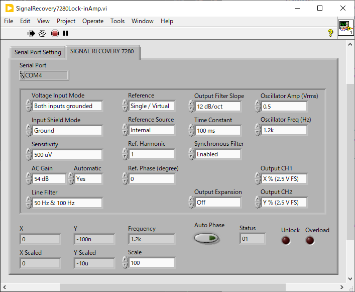
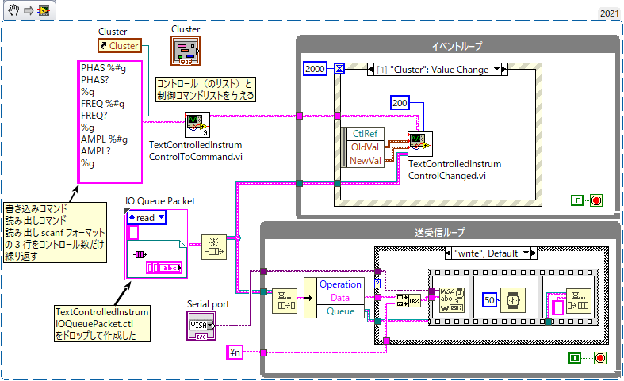
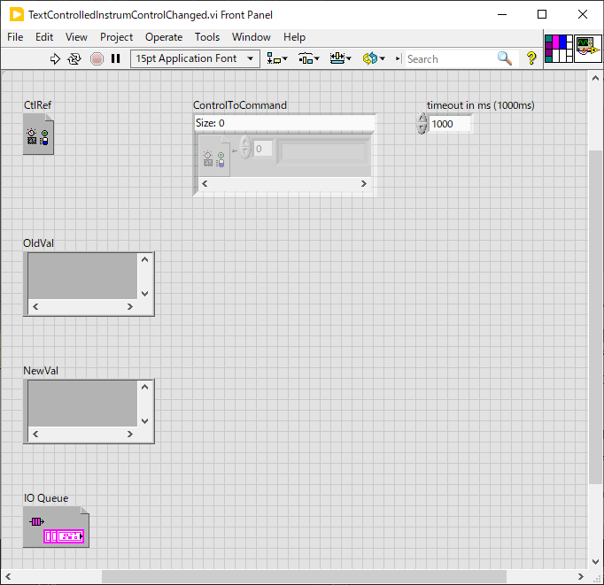

lib/Hardware/TextControlledInstrum
==

目次
--

- [lib/Hardware/TextControlledInstrum](#libhardwaretextcontrolledinstrum)
  - [目次](#目次)
  - [概要](#概要)
  - [使用例１：](#使用例１)
  - [TextControlledInstrumControlsToArray.vi](#textcontrolledinstrumcontrolstoarrayvi)
  - [TextControlledInstrumUpdateControls.vi](#textcontrolledinstrumupdatecontrolsvi)
  - [TextControlledInstrumControlChanged.vi](#textcontrolledinstrumcontrolchangedvi)
  - [TextControlledInstrumIOQueuePacket.ctl](#textcontrolledinstrumioqueuepacketctl)
  - [TextControlledInstrumWriteCommands.vi](#textcontrolledinstrumwritecommandsvi)
  - [TextControlledInstrumReadCommand.vi](#textcontrolledinstrumreadcommandvi)
  - [使用例２: `SignalRecovery7280Lock-inAmp.vi`](#使用例２-signalrecovery7280lock-inampvi)

概要
--

シリアル通信やGPIB通信のような行単位のテキストコマンドのやり取りで読取・設定可能なハードウェアを制御するプログラムを作成するのを助けるライブラリ

例えば下図の Signal Recovery 製のロックインアンプ 7280 をシリアル通信で制御するプログラムはこのライブラリを使って作成した

- 機器の設定項目に対応する多数のコントロールが VI 上に並ぶ
- 定期的に機器から最新の値を読み出してコントロールの値を更新する
- ユーザーがコントロールの値を変更すると機器に変更を反映する

本ライブラリを使うことでこのような制御プログラムの作成を楽に行える

使用例１：
--

実際の VI は [image4md/example-TextControlledInstrum.vi](image4md/example-TextControlledInstrum.vi) にある。

- この仮想のハードウェア制御プログラムはシリアルポートの `COM7`に接続されている装置を制御する
- 装置は設定可能なパラメータを３つ持つ
  - Phase
  - Frequency
  - Amplitude
- フロントパネルには、これらのパラメータが１つのクラスタにまとめられて配置されている
- このプログラムは以下の２つの動作を行う
  - 定期的に機器から最新の値を読み出してコントロールの値を更新する
  - ユーザーがコントロールの値を変更すると機器に変更を反映する

これを作るのに主に使用されるのは次の３つの VI と１つの構造体になります

- `CommandsToArray.vi` : (本名は `TextControlledInstrumCommandsToArray.vi`)
  - コントロールリファレンスとコマンドのリストを受け取って事前準備を行う
- `UpdateControls.vi` : (本名は `TextControlledInstrumUpdateControls.vi`)
  - 機器からパラメータを読みだしてすべてのコントロールの値を更新する
- `ControlChanged.vi` : (本名は `TextControlledInstrumControlChanged.vi`)
  - ユーザーにより変更されたコントロール値を機器に送る
- `IOQueuePacket.ctl` : (本名は `TextControlledInstrumIOQueuePacket.ctl`)
  - 通信要求をやり取りする `Queue` のパケットとなる構造体の型定義

これらを用いて作成した上記プログラムのブロックダイアグラム：

- 全体構造の説明
  - 定期的に機器からパラメータを読み取ってコントロールの値を更新するためにイベントループの `Timeout` イベントで `UpdateControls.vi` を読ぶ
  - ユーザーによりコントロールの値が変更されたら機器に値を送るためにイベントループの `Value Change` イベントで `ControlChanged.vi` を読ぶ
  - これらの VI はパラメータの読み書きに必要なコマンドの送受信要求を `IO Queue` へ送る
  - 送られた送受信要求に応えるため送受信ループ内で `IO Queue` からパケットが読みだされて処理される
  - `IO Queue` に送られる `IO Queue Packet` 構造体は次の要素を含む
    - `Operation` は読み出しなのか書き込みなのかを表す
    - `Data` は読み書きコマンドのいずれかが入る（`printf` プレースホルダへ代入済、改行なし）
    - `Queue` は文字列を入れて返信するための `Queue` リファレンス
      - `read` ではここに機器から読み取った文字情報を返す
      - `write` では設定完了を通知するため何でも良いので文字列を返す
- 始めにコントロールとコマンドのリストを渡して `CommandsToArray.vi` が呼び出される
  - 機器のパラメータに対応付するコントロールを、単体あるいは配列として入力する
  - コマンドリストは、それぞれのパラメータを設定・読取するためのテキストコマンドを列挙した文字列を入力する
    - 書き込みコマンド、読み出しコマンド、`scanf` テンプレート からなる３行を、設定項目の数だけ繰り返す
    - 設定項目の記述順はコントロールリストの順番に合わせる
      - コントロールにクラスターが含まれる場合には内部のコントロールの分も記述する
      - この例であれば始めの３行が `Phase` の書込、読出、`scanf`テンプレートであり、次の３行が `Freq` のそれらである
      - この例では全部で３行×３項目の９行ある
    - 書き込みコマンドの `%g, %f, %d, %x, %s` などの `printf` プレースホルダには設定値が入る
      - コントロールの型に合わせて適切なプレースホルダを置く必要がある
      - 整数型なら `%d` や `%x` など
      - 浮動小数点型なら `%f` や `%g` など
      - 文字列型なら `%s`
      - ブール型は特殊で、`false` と `true` それぞれで書き込むべきコマンドを `|` で区切って並べる
        - 例えば `SET FALSE|SET TRUE` なら値が `false` の時に `SET FALSE`、`true` の時に `SET TRUE` が送られる
    - 読み出しコマンドは置き換えなどなくそのまま用いられる
    - `scanf` テンプレートはハードウェアから送り返されたテキストに適用され、得られた値が対応するコントロールに代入される
      - コントロールの型に合わせて適切なプレースホルダを置く必要がある
      - 整数型なら `%d` や `%x` など
      - 浮動小数点型なら `%g`
      - 文字列型なら `%s`
      - ブール型は特殊で、`false` と `true` それぞれで期待される文字列を `|` で区切って並べる
        - 例えば `off|on` なら `off` が返ってきた時に `false`、`on` が返ってきた時に `true` と解釈される
        - これらの前に `%s` を含む `scanf` テンプレートを `|` で区切って記述すれば `%s` で得られた文字列に対して続く真偽文字列との比較が行われる
    - これらのコマンド文字列は直接シリアルポート等へ出力されるわけではなく後述する `IO Queue` へメッセージとして送られる
  - `CommandsToArray.vi` の出力として `Command Array` にコマンド配列が、`Control to Index` にコントロールリファレンスからコマンド配列の対応位置を求めるための Map が出力されるので、これらを `UpdateControls.vi` や `ControlChanged.vi` に接続する

（再掲)

- `Timeout` で呼ばれる `UpdateControls` の説明
  - 上の画面はイベントループで `Timeout` イベントが、送受信ループで `read` コマンドの処理がそれぞれ表示されている
  - `UpdateControls.vi` はコントロールリストに含まれるコントロールのすべてについて順番に読み出しコマンドを `IO Queue` へ送る
    - ただしキーフォーカスを持つコントロールについてはユーザーが入力中と判断して値の読み出しを行わない
  - `IO Queue` へは `Operation`, `Data`, `Queue` を含む構造体が送られる
    - ここでは `Operation` は `read` である
    - `Data` には読み出しコマンドが入っている
    - 読み出しコマンドの送信から戻り値の返信までの手順は機器によって細部が異なるが例示コードでは以下を行っている
      - 適切な改行文字（ここでは `\n`）を付けてシリアルポートへ読み出しコマンドを送信する
      - 戻り値を得るため１行分（100文字以下）をシリアルポートから読み取る
      - 読み取った値をパケットで指定された `Queue` へ送り返す
    - `UpdateControls.vi` は送り返された文字列に `scanf` テンプレートを適用して値を得てコントロールに代入する
  - ここではイベントループ内で直接 `UpdateControls.vi` を呼び出しているが、項目数が多いと処理に時間がかかるため別途コマンド処理用のループを作成してそちらで実行する方が良い場合も多い
  - この作りだと始めての `Timeout` が起きるまで起動後２秒間はコントロールに値が入らないので、本来であれば初期化時にも `UpdateControls.vi` が呼び出されるようにするとよい

- `Value Change` で呼び出される `ControlChanged.vi` の説明
  - 上の画面はイベントループで `Value Change` イベントが、送受信ループで `write` コマンドの処理がそれぞれ表示されている
  - `CtrRef`, `OldVal`, `NewVal` を与えて `ControlChanged.vi` を呼び出すことで、変更のあった項目のみについて書き込みコマンドの送信要求を `IO Queue` に発行する
  - `IO Queue` へは `Operation`, `Data`, `Queue` を含む構造体が送られる
    - ここでは `Operation` は `write` である
    - `Data` には書き込みコマンドが入っている
    - 書き込みコマンドの送信から書き込み完了を通知するまでの手順は機器によって細部が異なるが例示コードでは以下を行っている
      - `Data` に渡されたコマンドに適切な改行文字を付けてシリアルポートへ送信する
      - 処理完了を待つため 50 ms だけ経ってから与えられた `Queue` へ文字列を返信する
      - 書き込み完了時に `ok` などの文字列を１行返すハードウェアならば、書き込み後も１行読み取ってその値を返せばよいので、読み取りと書き込みとを `case` ストラクチャで分ける必要がなくなる
  - `ControlChanged.vi` はこの返信を待ってから次の動作へ進む

始めに `CommandsToArray.vi` へ渡す設定・読取コマンドリストはあくまで `UpdateControls.vi` や `ControlChanged.vi` が `IO Queue` へ入れる文字列を決めるためのものなので、`IO Queue` を処理する送受信ループで `Data` の内容をそのままハードウェアへ送る必要はない。

標準の機能では対応しきれないような特殊な処理が必要となるような項目については、それが分かるような文字列をコマンドリストに与えておき、`IO Queue` から読み出した文字列を見て特殊処理が必要な場合のみを別処理にするような使い方をしても構わない。

`UpdateControls.vi` と `ControlChanged.vi` では対応できないようなやり取りが必要な場合には、その処理も `IO Queue` を用いて行うべきである。逆に、`IO Queue` を使うだけでは実現できない処理（例えばハードウェア側から不定期にデータが届くような使い方？）とこの VI とは両立して使うことが難しい。

`IO Queue` を簡便に利用するため、`WriteCommands.vi` と `ReadCommand.vi` が用意されている。

TextControlledInstrumControlsToArray.vi
--

コントロールとコマンドのリストを与えて前処理を行う。

- `Control Array` : ハードウェア機器のパラメータに対応付けるコントロールのリファレンスの配列を与える
  - 配列ではなく単体を与えても動作する
- `SetGetCommand` : パラメータの書き込みコマンド・読み出しコマンド・読みだした値を解釈するための `scanf` テンプレートの３行をコントロールの数だけ繰り返した文字列を与える
  - クラスターコントロールについてはサブコントロールの分をすべて記述する
  - 書き込みコマンドにはコントロールの型に合わせた `printf` プレースホルダーを含める
    - `Boolean` 型だけは `(false時コマンド)|(true時コマンド)` のように `|` で区切って指定する
  - 読み出しコマンドは加工せずそのまま用いられる
  - `scanf` テンプレートにはコントロールの型に合わせたプレースホルダーを含める
    - `Boolean` 型だけは `(falseとする文字列)|(trueとする文字列)` のように `|` で区切って指定する
  - 書き込みのみ、読み出しのみ、のパラメータについては対応する行を空行にすればよい
    - コントロールが表示器なら書き込みコマンドは必要ない
    - ボタンコントロールの機械動作を「押してる間だけ `true`」にして `true` の書き込みコマンドだけ記述すればボタン押下でコマンドを送信できる
- `Command Array` : コマンド文字列がコントロール数×３列の２次元配列として出力される
- `Control to Index` : コントロールリファレンスからコマンド配列インデックスを求めるマップが出力される
- 出力値の意味は深く考えず、そのまま `UpdateControls.vi` や `ControlChanged.vi` に繋げばよい
- 詳しい使い方は使用例１、使用例２を参照のこと

TextControlledInstrumUpdateControls.vi
--

すべてのコントロールについて機器から値を読み出して更新する。

- `Control to Index` : `ControlsToArray.vi` からの出力を繋ぐ
- `Control Array` : `ControlsToArray.vi` からの出力を繋ぐ
- `timeout` : `IO Queue` へ送受信要求を送ってから返信までのタイムアウト
- `IO Queue` : 送受信要求を送る `Queue` を指定する

TextControlledInstrumControlChanged.vi
--

コントロールの値が変更されたらハードウェア機器へ書き込みを行う。

複数のコントロールの `Value Change` イベントをまとめて処理するイベントハンドラから呼び出されることを想定している。

イベントストラクチャからは
- イベント送信元のコントロールを表す `CtrRef`
- 変更前のコントロール値 `OldVal`
- 変更後のコントロール値 `NewVal`

が通知されるので、これらをそのまま入力端子に繋げばよい

値が変更された（サブ）コントロールについて適切な書き込みコマンドを構成して `IO Queue` へ送信する。

- `CtrRef` : イベントハンドラからの値をそのまま繋ぐ
- `OldVal` : イベントハンドラからの値をそのまま繋ぐ
- `NewVal` : イベントハンドラからの値をそのまま繋ぐ
- `Control to Index` : `ControlsToArray.vi` からの出力を繋ぐ
- `Control Array` : `ControlsToArray.vi` からの出力を繋ぐ
- `timeout` : `IO Queue` へ送受信要求を送ってから返信までのタイムアウト
- `IO Queue` : 送受信要求を送る `Queue` を指定する

TextControlledInstrumIOQueuePacket.ctl
--

`IO Queue` を作成するには子の構造体を与えて `Obtain Queue` を呼ぶことになる

- `IO Queue Packet` 構造体は次の要素を含む
  - `Operation` は読み出しなのか書き込みなのかを表す
  - `Data` は読み書きコマンドのいずれかが入る（`printf` プレースホルダへ代入済、改行なし）
  - `Queue` は文字列を入れて返信するための `Queue` リファレンス
    - `read` ではここに機器から読み取った文字情報を返す
    - `write` では設定完了を通知するため何でも良いので文字列を返す

- `Operation` には `read`, `write` の他に `reserved2`~`reserved7` が定義されている
- これはライブラリのユーザーが `Operation` を拡張して特殊な送受信プロトコルを実現することを想定したものである
- ライブラリのユーザーが `Operation` を拡張する場合には 8 以上の数値を使うことが望ましい
- これは将来ライブラリのアップデートで 3~7 の値のいくつかがライブラリ内で用いられる可能性があるためである

TextControlledInstrumWriteCommands.vi
--

`IO Queue` へ書き込みコマンド（複数可）を送信する

コマンド文字列が複数行であればそれぞれの行を書き込みコマンド `Operation="write"` として順に送信する

もちろん１行だけで１つのコマンドを送信するのに使っても良い

例えば機器の初期化コマンドを順に送るような時に便利に使える

- `IO Queue` : 送受信要求を行う `IO Queue` を指定する
- `Multi-line String` : 書き込みコマンドを１行に1つずつ記述する
- `timeout` : 送信要求から返信があるまでのタイムアウト
- `timed out?` : タイムアウトがあったかどうか
  - 途中でタイムアウトがあればそれ以降のコマンド送信はキャンセルされる

`TextControlledInstrumControlChangedSub.vi` の中でも使われている

TextControlledInstrumReadCommand.vi
--

`IO Queue` へ読み出しコマンドを１つ送信して結果を得る

- `IO Queue` : 送受信要求を行う `IO Queue` を指定する
- `Command` : 書き込みコマンドを１行に1つずつ記述する
- `timeout` : 送信要求から返信があるまでのタイムアウト
- `Received` : 読みだされた値が返る
- `timed out?` : タイムアウトがあったかどうか

`TextControlledInstrumUpdateControlsSub.vi` の中でも使われている

使用例２: `SignalRecovery7280Lock-inAmp.vi`
--

実用的な使用例がこちらにある。
[`hardware/SignalRecovery7280Lock-inAmp.vi`](../../hardware#signalrecovery7280lock-inampvi)

リンク先にこのプログラム実装の技術的ポイントを書いた。

