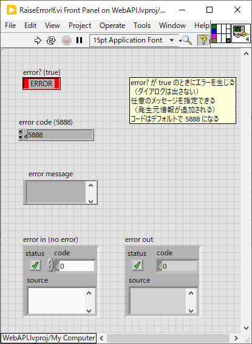
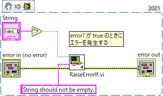

Lib/
==

汎用的に使いまわせそうな VI ライブラリー

- [Lib/](#lib)
  - [サブフォルダ](#サブフォルダ)
  - [RaiseErrorIf.vi = true が入力されたときのみエラーを発生する](#raiseerrorifvi--true-が入力されたときのみエラーを発生する)

サブフォルダ
--

- [`File/`](File/) ファイル関連
- [`Hardware/`](Hardware/) ハードウェア関連
- [`SetGetControlValue/`](SetGetControlValue/) コントロール値の読み書きを行う
- [`String/`](String/) 文字列関連、JSON 関連
- [`UI/`](UI/) UI関連
- [`Variant/`](Variant/) `Variant` 関連

RaiseErrorIf.vi = true が入力されたときのみエラーを発生する
--

- `error?` 入力が `true` のときに `error our` 端子にエラーを出力する
- エラー発生部をケースストラクチャで囲わなくて済むようになるのでとても便利
- ダイアログは表示しない
- ソース文字列を `error message` 端子から指定可能
  - 内部で呼び出しスタック情報を自動的に追加する
- デフォルトのエラーコードは `5888`

典型的な使い方：

