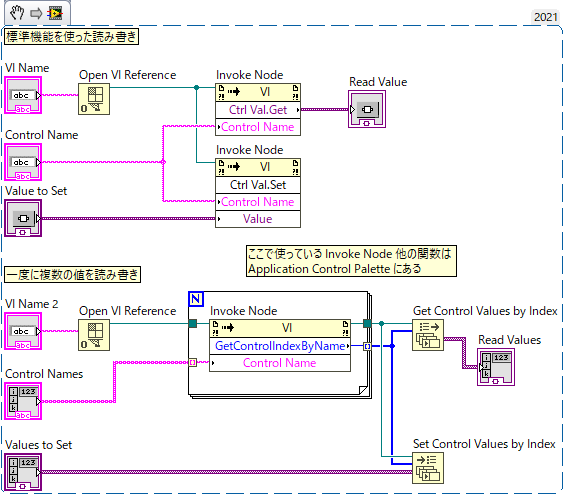
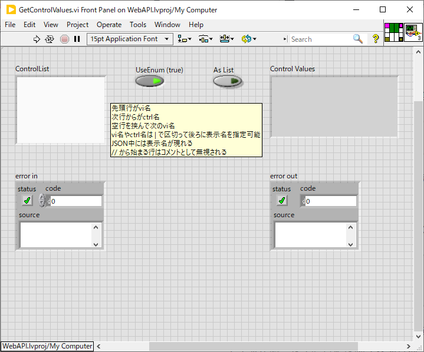

Lib/SetGetControlValue
==

目次
--
- [Lib/SetGetControlValue](#libsetgetcontrolvalue)
  - [目次](#目次)
  - [概要](#概要)
  - [VI名の指定](#vi名の指定)
    - [アプリケーションとVIの関係](#アプリケーションとviの関係)
    - [VIサーバー](#viサーバー)
    - [クローン VI について](#クローン-vi-について)
  - [コントロール名の指定](#コントロール名の指定)
    - [対応するコントロール種別](#対応するコントロール種別)
  - [JSON形式での値の指定](#json形式での値の指定)
    - [LabView データとの対応](#labview-データとの対応)
  - [提供される VI](#提供される-vi)
    - [SetControlValue.vi](#setcontrolvaluevi)
    - [GetControlValue.vi](#getcontrolvaluevi)
    - [SetControlValues.vi](#setcontrolvaluesvi)
    - [GetControlValues.vi](#getcontrolvaluesvi)
    - [ControlValueToJSON.vi](#controlvaluetojsonvi)
    - [VINameToVI.vi](#vinametovivi)
  - [技術的な話](#技術的な話)

概要
--

異なる VI 上の制御器や表示器の値を読み書きするためのライブラリ。

一連のライブラリの基本をなす [`SetControlValue.vi`](#setcontrolvaluevi) / [`GetControlValue.vi`](#getcontrolvaluevi) を使うと VI やコントロールを名前で指定してその値をテキストあるいはVariantで読み書きできる。

LabVIEW 標準で提供されている `Control Value Get/Set` を実行性能を犠牲にずっと使いやすくしたものと思っていい。

はっきり言って自作ライブラリの実行性能はものすごく低いのだけれど、事前の準備が全くいらず非常に気軽に使えるというだけでなく、任意の値を文字列として読み書きできること、配列要素の一部を書き換えられること、クラスタの一部を書き換えられること、などいろいろとできることが増えている。

これらのおかげでデータファイルと共にコントロール値を保存する、初期化ファイルから読みだした設定値をコントロールに入れる、などの用途には便利なはず。

ちょっと紛らわしいが [`SetControlValues.vi`](#setcontrolvaluesvi) / [`GetControlValues.vi`](#getcontrolvaluesvi) という、複数の IV にまたがって複数のコントロールの値を一度に読み書きするためのVIも提供されている。データファイルに全ての設定パラメータを保存する、多数のパラメータを実験内容に合わせて初期化する、といった用途にはこちらを使うと良い。

これら単機能の VI の他に、これらの VI を用いて作った [ユーティリティVI](../../utilities/) もあって、いろんな測定に汎用的に使えることを期待している。

- [ユーティリティVI](../../utilities/) のリスト
  - SettingsManager.vi : コントロール値のリストに名前を付けて「設定」として保存したり、復帰したりできる
  - ParameterSweeper.vi : 任意のコントロールの値を三角波状にゆっくりとスイープする
  - DataRecorder.vi : ParameterSweeper でゆっくりスイープしている間に ADC からのデータを連続して取り込む。データファイルには指定したコントロールの設定値を測定条件としてヘッダーに含めることができる。
  - WebAPI.lvproj : LabVIEW 上に http サーバーを建てて、そこへのアクセスで外部から VI 上のコントロールの値を読み取り・変更できる
    - LabView 以外のプログラムとの連携をするのに使える
    - 例：Igor で計算した補償波形を WebAPI 経由で LabView の配列コントロールにアップロードして計測に用いる
    - LabView プログラムから別 PC 上で動く LabView VI へアクセスしたいだけなら [VIサーバー](#viサーバー) の機能を使う方が手軽

VI名の指定
--
- 基本的には普通に文字列で `"somevi.vi"` のように指定すればよい
- 後ろの `.vi` は省略可能なので `"somevi"` だけでもよい
- クローン VI や、一度もディスクに保存していない `Untitled 2.vi` のような VI にはアクセスできない
- `viname@project.lvproj` の形で @ に続けてプロジェクト名を指定できる [詳細はこちらを参照](#アプリケーションとviの関係)
- `viname@192.168.0.31` の形で `192.168.0.31` で稼働中の VI サーバー上にある `viname.vi` という VI にアクセスできる [詳細はこちらを参照](#viサーバー)
- `viname@192.168.0.31:1234` の形で非標準の TCP/IP ポート 1234 で動作する VI サーバーを指定できる

### アプリケーションとVIの関係

すべての VI はいずれかのアプリケーションの配下にある。１つのアプリケーションが複数の VI を保有する親子関係がある、ということ。

プロジェクト(.lvproj)の機能を使っていなければすべての VI はデフォルトアプリケーション（LabVIEW.exe）の配下になるが、プロジェクトを使うと VI がその配下になることがある。VI を名前で探す際にはどのアプリケーションの元で探すかをしていしなければならないので、開かれている VI でも異なるアプリケーションに対して探すと見つからないということが起きる。

アプリケーションと VI との親子関係はメニューの `[View]-[VI Hierarchy]` で見ることができる。

SetControlValue などの VI には application リファレンスの入力端子があるので、現在実行中のアプリケーションではない場所にある VI を参照したければそのリファレンスをここに入力すればいい。あるいは VI 名の後ろに @ でアプリケーション名を続けることもできる。

例：`somevi.vi@someproject.lvproj` とすれば `someproject.lvproj` というプロジェクトの元にある `somevi.vi` を参照することができる。

VI 名に @ でアプリケーション（プロジェクト名）を指定した場合にはアプリケーションリファレンス端子は無視される。

### VIサーバー

LabVIEW には VI サーバー機能というのがあって、この機能を使うと異なる PC 上で動いている VI へネットワーク越しにアクセスできる。

メニューの `[Tools]-[Options]` の `VI Server` で `TCP/IP` にチェックを付けると起動する。

このライブラリでは VI サーバーにある VI へもアクセスできる。その際にはリモートアプリケーションのリファレンスを `Application Reference` 入力端子に入れても良いが、簡単には VI 名の後ろに @ を挟んで VI サーバーの IP アドレスを指定すればよい。

例：`somevi.vi@192.168.0.11` とすれば `192.168.0.11` で動作中の VI サーバー上にある `somevi.vi` へアクセスできる

例：`somevi.vi@192.168.0.11:3365` の形で標準以外のポート番号を指定することも可能

### クローン VI について

VI のクローンがメモリ中にあるとき、同じ名前で複数の VI が存在するため VI 名を文字列で指定する本ライブラリではどのクローンにアクセスするかを決められない。しかしそもそも `Application Control VIs and Functions` にある `Open VI Reference` のヘルプに次のようにある通り、クローン VI のリファレンスを得る手段を LabVIEW 自体が提供していないため、クローン VI のコントロールへアクセスすることは技術的に不可能だ。本ライブラリを使用してアクセス可能なのはクローンではないオリジナルの VI のみとなる。

> Note  LabVIEW does not support the ability to open a reference to a clone VI with the Open VI Reference function. Using this function to open a reference to a clone VI may cause LabVIEW to crash.

コントロール名の指定
--
クラスタのサブ要素や配列の特定要素の読み書きに対応している。

- `ArrayControl[3]` で `ArrayControl` という配列コントロールの3番目の要素
- `ArrayControl[1,3]` で `ArrayControl` という二次元配列コントロールの1行3列要素
- `Cluster/SubControl1` で `Cluster` というクラスタコントロールの `SubControl1` というサブ要素
- `Cluster/3` で `Cluster` というクラスタコントロールの3番目のサブ要素
- `ArrayControl[3]/SubControl2` で `ArrayControl` という配列コントロールの3番目のcluster要素の `SubControl2` というサブ要素
- `Sub Panel` に貼り込まれたサブVI上のコントロールも `Sub Panel/SubControl2` の形でアクセスできる
- `Tab Control` はコントロールの親子関係を作らない（わざと平坦化している）ので、`Tab Control` のページ上にあるコントロールにアクセスする場合に `/` で掘り下げる必要はない。

このため、コントロール名自体に `/`, `[`, `]` が含まれる場合にはそれぞれ `\/`, `\[`, `\]` のようにエスケープする。

例：`[Control]` は `\[Control\]` と指定する

例：`Amplitude / V` は `Amplitude \/ V` と指定する

### 対応するコントロール種別

- Numeric
  - 数値または数値として解釈可能な文字列を書き込める
  - Enum あるいは Ring 文字列
  - 複素数値は文字列で `"3.2 - 1.1i"` のように指定する
- Enum
- Ring
- Slide
- Knob
- Scrollbar
- Color Box
- Boolean
  - true, false (文字列ではない)
- Radio Buttons
- String
- Combo Box
- Path
- Cluster
  - メンバーを指定して書き換えることも可能
  - `Cluster1/SubControl2` など
- Sub Panel
  - 貼り込んだ子 VI 上のコントロールもアクセス可能
  - `Sub Panel1/SubControl3` など
- Array
  - 要素を指定して書き換えることも可能 `Array1D[3]`
  - 2次元以上も対応する `Array2D[2,3]` など
  - Cluster を含む配列も大丈夫
  - `Array1D[3]/SubControl2` など
  - Cluster 内の配列も大丈夫
  - `Cluster1/SubArray1D[3]/SubSubControl1` など
- Tab Control
  - ページ構成はフラット化されるのですべてのページのコントロールに透過的にアクセス可能
  - Page Control 自体の値は選択ページ名
    - 数値あるいはページ名を書き込める
- IOName
  - 文字列と同様に読み書き可能
- 表示器
  - 制御器と同様に読み書き可能

JSON形式での値の指定
--
JSON とは複雑なデータ構造をテキストデータとして表すための標準化された形式で、JavaScript をはじめとして多くの開発環境でサポートされている。

JSON には大雑把にプリミティブデータ、配列、オブジェクトの3種類の要素がある。

- 要素
  - プリミティブデータ
    - `"文字列"` のように " で囲まれたものは文字列データを表す
      - 中に `"`, `改行`, `タブ` を含めたければそれぞれ `\` でエスケープして `\"`, `\n`, `\t` などと表す
      - 中に `\` 自体を含めたければ `\\` のようにエスケープする
    - 0 や 0.3, -1.3e3 などは数値を表す（" で囲まない）
    - true, false は論理値を表す（" で囲まない）
    - null は null を表す（" で囲まない）
  - 配列
    - `[要素1, 要素2, 要素3, ...]` のように `[]` でカンマ区切りの要素を並べたものは配列を表す
  - オブジェクト
    - `{"Key1":要素1,"Key2":要素2,...}` のように `{}` でカンマ区切り `"キー":要素` のペアを並べたものはオブジェクトと呼ばれる
    - キーは必ず文字列である必要がある（" で囲む必要がある）

配列の要素として配列やオブジェクトを入れるなど、複雑なデータ構造を表せる。

### LabView データとの対応

- LabVIEW 文字列, LabView Path の値として指定できるのは
  - JSON 文字列
  - 本来 JSON 文字列は必ず `"` で括られていなければならないが、このライブラリでは紛れがなければ囲っていなくても許す場合もある
  - 例えば Path 指定で `C:\` と書きたければ `\` をエスケープして `"C:\\"` とする、複数行文字列の改行は `\n` で表す、など特殊文字のエスケープに気を配る必要がある
- LabVIEW 数値（整数、浮動小数点数、複素数）の値として指定できるのは
  - JSON 数値
  - LabVIEW 数値に変換可能な JSON 文字列 `"3.4e-3"`
    - 複素数値は `"1.0+2.1i"` のような文字列で与える
  - Enum や Ring に設定された文字列
- LabVIEW 1次元配列 の値として指定できるのは
  - JSON 配列
- LabVIEW 多次元配列 の値として指定できるのは
  - JSON 配列ただし `[[各次元のサイズの配列],[一次元化された要素の並び]]` の形で表す
  - 例えば 2 行 x 3 列の $\begin{pmatrix}1&2&3\\4&5&6\end{pmatrix}$ なら `[[2,3],[1,2,3,4,5,6]]` と指定する
- LabVIEW クラスタ の値として指定できるのは
  - JSON オブジェクト
  - キーはサブコントロールのラベル名かコントロールインデックス数値
    - キーに `/` や `[]` が含まれればそれらはコントロールラベル名の一部と見なされる
    - サブコントロールの下位コントロールや配列要素をキーに指定することはできない
  - すべてのキーを含んでいない場合には指定されたキーのみが代入される
  - キーに数値を指定してサブコントロールのインデックスでアクセスすることも可能 `{3:12}` は3番目のサブコントロールに `12` を代入することになる
    - 本来 JSON オブジェクトのキーは文字列でなければならないのでこれは非標準の機能
- LabVIEW Tab Control の値として指定できるのは
  - JSON 数値
  - Page 名文字列
- LabVIEW Radio Buttons の値として指定できるのは
- LabVIEW Boolean の値として指定できるのは
  - JSON 論理値（true/false）
  - 0 または 1 の数値
- LabVIEW Radio Buttons の値として指定できるのは
  - ボタン名文字列
  - 数値
- LabVIEW Ring / Enum の値として指定できるのは
  - 数値
  - Ring 文字列 / Enum 文字列
  - 非標準の値を指定する際は `"<33>"` のように数値を `<>` で囲んだ文字列でも指定可能
- LabVIEW Variant の値として指定できるのは
  - JSON 文字列
  - JSON Boolean
  - JSON 数値は EXT 型になる
  - JSON 配列や JSON オブジェクトは指定できない(TODO: Variant の中身が配列、オブジェクトであればその中身を書き換えるという形で書き込みを許せるのかもしれない？)

提供される VI
--

- [SetControlValue.vi](#setcontrolvaluevi) コントロールの値を設定する
- [GetControlValue.vi](#getcontrolvaluevi) コントロールの値を読み取る
- [SetControlValues.vi](#setcontrolvaluesvi) 複数のコントロールの値を設定する
- [GetControlValues.vi](#getcontrolvaluesvi) 複数のコントロールの値を読み取る
- [VINameToVI.vi](#vinametovivi) VI名からVIリファレンスを得る

### SetControlValue.vi

- JSON 文字列で表した値をコントロールに代入するための VI。
- どのコントロールに代入するかを指定するにはアプリケーション、VI、コントロールを文字列で指定するか、あるいはそれぞれ対応するリファレンスを指定する
- 値の代入時に `Value Change` イベントを発生させるかどうかを `Signaling` で選べる

- `vi`: VI 名を文字列で与える　[詳細についてはこちらを参照](#vi名の指定)
- `ctrl` : コントロール名を文字列で与える　[詳細についてはこちらを参照](#コントロール名の指定)
  - [対応するコントロール種別](#対応するコントロール種別)
- `Value (JSON)` : コントロールに設定する値を JSON 形式の文字列で与える　[詳細についてはこちらを参照](#json形式での値の指定)
- `Value` : コントロールに設定する値を Variant 形式で与える
  - ほぼどんな型のワイヤーでも自動的に Variant に変換されるので数値や文字列、クラスタなどをそのまま接続できる
  - こちらの端子に値が与えられると `Value (JSON)` 端子は無視される
- `application reference (local)` : 与えられた名前の VI を探すアプリケーションを指定する
  - VI 名にアプリケーション名（プロジェクト名）を含めることができ、その場合にはこの端子は無視される
  - [アプリケーションとVIの関係についてはこちらを参照](#アプリケーションとviの関係)
- `vi ref` : VI 名を文字列で与えるのではなく直接 VI のリファレンスを指定するときにここに接続する
  - ここに接続されると `vi` 端子や `application reference (local)` 端子は無視される
  - １つの VI に対して多くのコントロールを書き換えるのであれば何度も VI 名を検索するのは無駄になるのでこの端子を使うと良い
  - VI 名から `VI ref` を得るには [VINameToVI.vi](#vinametovivi) を使うと良い
  - 自分自身の `VI ref` を得るには `Application Control` パレットの `VI Server Reference` をドロップすればよい。`This VI` のリファレンスが得られる（下図参照）。
- `control ref` : 値を設定するコントロールのリファレンスを入れる
  - ここに値が接続されると `vi`, `ctrl`, `application reference`, `vi ref` は無視される
- `Signaling` : 通常コントロールの値が変更されると「値変更イベント」が発生するが、この端子に `false` を指定するとイベントを発生しないで値を書き換えられる

 → 

### GetControlValue.vi

- 指定したコントロールの値を JSON 文字列として得るための VI。
- どのコントロールの値を得るかを指定するにはアプリケーション、VI、コントロールを文字列で指定するか、あるいはそれぞれ対応するリファレンスを指定する
- `Enum` や `Ring` の値を数値として得るか、対応する文字列として得るかを `UseEnum` で選べる

- `vi`: VI 名を文字列で与える　[詳細についてはこちらを参照](#vi名の指定)
- `ctrl` : コントロール名を文字列で与える　[詳細についてはこちらを参照](#コントロール名の指定)
  - [対応するコントロール種別](#対応するコントロール種別)
- `application reference (local)` : 与えられた名前の VI を探すアプリケーションを指定する
  - VI 名にアプリケーション名（プロジェクト名）を含めることができ、その場合にはこの端子は無視される
  - [アプリケーションとVIの関係についてはこちらを参照](#アプリケーションとviの関係)
- `vi ref` : VI 名を文字列で与えるのではなく直接 VI のリファレンスを指定するときにここに接続する
  - ここに接続されると `vi` 端子や `application reference (local)` 端子は無視される
  - １つの VI に対して多くのコントロールを書き換えるのであれば何度も VI 名を検索するのは無駄になるのでこの端子を使うと良い
  - VI 名から VI ref を得るには [VINameToVI.vi](#vinametovivi) を使うと良い
  - 自分自身の `VI ref` を得るには `Application Control` パレットの `VI Server Reference` をドロップすればよい。`This VI` のリファレンスが得られる（上図参照）。
- `control ref` : 値を得たいコントロールのリファレンスを入れる
  - ここに値が入力されれば `app`, `ctrl`, `application reference`, `vi ref` は無視される
- `UseEnum (true)` : `Enum` や `Ring` コントロールの値を文字列ではなく数値として得たい場合には `false` を指定する
- `String out` : コントロールの値を JSON 形式の文字列で得る　[詳細についてはこちらを参照](#json形式での値の指定)
- `Value` : コントロールの値を Variant 形式で得る
  - `Variant` からデータを取り出すには　`Variant To Data` 関数などを使うのだけれど結構大変

### SetControlValues.vi

複数の VI にまたがって複数のコントロールの値を文字列により設定する。

測定前のパラメータ初期化に使うことを想定している。

- `ControlValueList` : 設定するコントロール名と対応する値を列挙する
  - 1行目に VI 名を書き、それに続けて「コントロール名=値」を複数並べる。
  - 異なる VI へも書き込みたければ空行を入れて、再び VI 名の後に「コントロール名=値」を複数並べる
  - `//` から始まる行はコメントと見なされ完全に無視される
  - コントロール名に `=[]/` が含まれる場合には `\=` などの形でエスケープする
  - 改行文字は `\n` や `\r` に、タブ文字は `\t` にエスケープする
- `application reference (local)` : 与えられた名前の VI を探すアプリケーションを指定する
  - VI 名にアプリケーション名（プロジェクト名）を含めることができ、その場合にはこの端子は無視される
  - [アプリケーションとVIの関係についてはこちらを参照](#アプリケーションとviの関係)
- `Signaling` : 通常コントロールの値が変更されると「値変更イベント」が発生するが、この端子に `false` を指定するとイベントを発生しないで値を書き換えられる
- コントロール名の代わりに以下の疑似コントロールを記述することで VI の表示や実行状態を変更できる
  - `/load` : `VI` を読み込みフロントパネルを開く
  - `/front` : `VI` を読み込み最前面に表示
  - `/run` : `VI` を読み込み実行する
  - `/call` : `VI` を読み込み実行し終了を待つ
  - `/stop` : `VI` を読み込み実行中であれば停止
  - `/state` : `Standard`, `Maximize`, `Minimize`, `Close` を代入して表示状態を変更
  - `/position` : `[12,34]` の形でフロントパネル位置を指定
  - `/size` : `[12,34]` の形でフロントパネルサイズを指定
  - `/wait` : ミリ秒で待機時間を代入するとその時間だけ待つ

### GetControlValues.vi

複数の VI にまたがって複数のコントロールの値を読み取り文字列として返す。

測定パラメータをデータファイルに保存する際などに使うことを想定している。

- `ControlList` : 値を読み取るコントロール名を列挙する
  - 1行目に VI 名を書き、それに続けてコントロール名を複数並べる。
  - 異なる VI からも読みたければ空行を入れて、再び VI 名の後にコントロール名を複数並べる
  - VI 名やコントロール名の後ろに `|` を書いて、その後ろの表示名を指定可能
    - 結果として得られる JSON には VI 名、コントロール名の代わりに表示名が現れるようになる
  - `//` から始まる行はコメントと見なされ完全に無視される
  - コントロール名、VI 名に `|` が含まれる場合には `\|` の形でエスケープする
  - 改行文字は `\n` や `\r` に、タブ文字は `\t` にエスケープする
- `application reference (local)` : 与えられた名前の VI を探すアプリケーションを指定する
  - VI 名にアプリケーション名（プロジェクト名）を含めることができ、その場合にはこの端子は無視される
  - [アプリケーションとVIの関係についてはこちらを参照](#アプリケーションとviの関係)
- `UseEnum (true)` : `Enum` や `Ring` コントロールの値を文字列ではなく数値として得たい場合には `false` を指定する
- `As List` : 読みだされた値を JSON として返すか(false)、そのまま `SetControlValues.vi` に渡せる文字列として返すか(true)、を選択する
- `Control Value` : 読み出された値
  - `As List` が `false` ならコントロール値がネストした JSON オブジェクトとして得られる
  - オブジェクトのキーは VI 名あるいはその表示名
    - 要素はやはりオブジェクト
      - キーはコントロール名あるいはその表示名
      - 要素はコントロール値
  - `As List` が `true` ならそのまま `SetControlValues.vi` に渡せる文字列として得られる
    - 後にコントロールへ書き戻すのであればこちらが便利
    - `As List` が `true` のとき、指定された「表示名」は無視される

### ControlValueToJSON.vi

このライブラリ内ではコントロール値を `JSON` 文字列に直すのに使われているが、どんな値でも `JSON` に直せる汎用の `JSON` エンコーダーとして単体でも使える。数値の配列を突っ込んで全体を文字列化したり、クラスターの値を突っ込んで全体を文字列化したり。

- `Value` : 変換したい値を入れる（`Variant` 端子なので大抵の値を直接繋げられる）
- `Control in` : 汎用 `JSON` エンコーダーとして使うなら何も繋がなくていい
  - `Ring` 値を文字列表現できなくなるけれで目をつぶって
- `UseEnum` : `Enum` 値を文字列ではなく数値でエンコードしたければ `false` を入力する
- `String` : `JSON` 化された値が出力される

### VINameToVI.vi

VI 名から `VI reference` を得る。

毎回 VI 名を文字列で与えていると多数のコントロールの値を変更する際に無駄になるため、これで得たリファレンスを `Set/GetControlValue` に与えることで実行効率を高められる。

- `Application in` : 与えられた名前の VI を探すアプリケーションを指定する
  - VI 名にアプリケーション名（プロジェクト名）を含めることができ、その場合にはこの端子は無視される
  - [アプリケーションとVIの関係についてはこちらを参照](#アプリケーションとviの関係)
- `vi` : VI 名を文字列で指定する
- `VI out` : VI リファレンスが得られる
  - クローン VI の VI リファレンスを得る手段はない
  - 一度も保存されていない `Untitled 1.vi` のような VI のリファレンスも取れない

使用例：

技術的な話
--

かなりシンプルな機能にも関わらず `SetControlValue.vi` / `GetControlValue.vi` の実装は非常に大変だった。

外から分かりづらい、技術的に困難だった点を以下に書いておく。

- 実は配列コントロールは要素を指定して読み書きする機能を持っていないため、配列要素へのアクセスを実現するのに対応が必要だった
  - 読み出し時には配列全体を読んでから目的の項目を切り出して（必要ならその子要素の指定部分をさらに切り出して）値を返している
  - 書き込み時には配列全体を読んでから目的の項目に相当する部分だけ書き換えてから配列全体を書き戻している
  - これらの動作を行うには Variant として得た配列やオブジェクトの個々の要素を読み書きできなければならないのだが・・・
- Variant に入れられた配列やオブジェクトの個々の要素を読み書きするための標準的な手段は与えられていない
  - 非常に非効率なのだけれど一旦バイナリ形式に書き出して、それを切り分けて読んだり、一部を書き換えてから Variant に戻したりといった手順が必要になる
  - 書き換え時には値がバイナリ互換となっていなければならず、例えば同じ浮動小数点数でも `Double` 要素が期待されているところに `Single` の値を書いたりすると壊れてしまう
  - これらに対応するため [Variant 関連ライブラリ](../Variant/) を作成する必要があった
- `Enum` 値は `Variant` に変換しても数値と文字列との対応が失われないのに対して、`Ring` 値は `Variant` にしてしまうとただの数値と見分けがつかなくなり、数値と文字列との対応がまるっきり失われてしまうため、`Variant` 化されたコントロール値だけから文字列表記を求めることができない。そこで `Variant` 化されたコントロール値を文字列に直すためにはどのコントロールから読んだ値かという情報を抱き合わせに管理しなければならず大変だった
  - VI の `GetControlIndexByName` という関数を使えばコントロール名からインデックスを得られて、それを `Control Value:Get` / `Control Value:Set` に与えるとコントロールの値を得られるのだけれど、コントロールインデックスからコントロールのリファレンスを得る手段がないために `Variant` 値と JSON 値との変換ができない
  - コントロールのリファレンスは恐らく VI の `FrontPanel` の `Controls[]` プロパティなどから得るしかないのではないか？？？
  - ということで `Controls[]` を for で回して名前とのマッチを取る、というかなり非効率な方法を取っている
  - 驚くべきことに(?)、`GetControlIndexByName` で得られるコントロールインデックスは `Controls[]` 内のインデックスじゃないので役に立たない
- アプリケーション名や VI 名、コントロール名をメモ化して、二度目からは検索の必要をなくすと効率アップを図れるのだけれど、VI を開きなおしたり、コントロールを追加・削除したときにメモを初期化する手段を用意するなど考えるとちょっと面倒？
  - あまり効率が問題になる使い方はしないと割り切ってこのまま行こう
