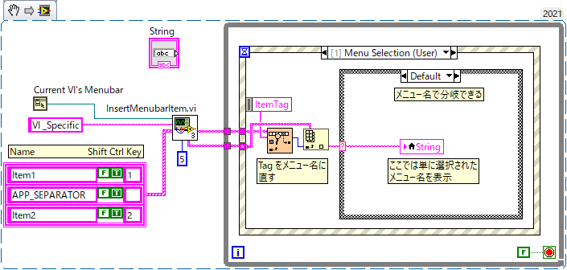
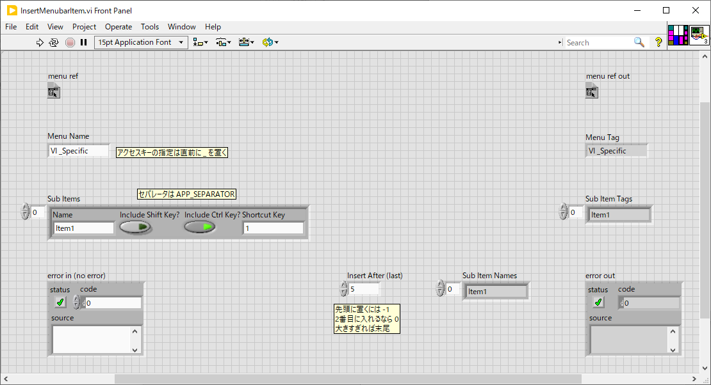

Lib/UI
==

UI 関連のライブラリ。

- [Lib/UI](#libui)
  - [提供される VI](#提供される-vi)
    - [DeferPanelUpdate.vi](#deferpanelupdatevi)
    - [InsertMenubarItem.vi](#insertmenubaritemvi)

提供される VI
--

### DeferPanelUpdate.vi

コントロールの値を変更する間 VI の表示更新を止めることで画面のちらつきを抑え、処理速度を向上する。

- 面更新遅延機能は VI 単位なので、与えられたコントロールの載っている VI のパネルすべてで更新が停止する
- 元の設定値が出てくるので、後でこの値を指定してもう一度呼ぶことで復帰できる
- その間で本来なら画面更新を伴う値の更新を行う

### InsertMenubarItem.vi

VI のメニューバーに新しい項目を追加する。

使用例： `Tools` と `Window` の間に `VI Specific` というメニューを追加した

そのためのコードはこんな感じ。

- メニューテキストに `_` を含めると直後の文字がアクセスキーになる
- `APP_SEPARATOR` という名前を指定するとセパレータになる
- `Tools` メニューが先頭を `0` として `5` 番のメニューになるのでその直後に挿入するよう位置を指定している
- メニューが選択されると `<This VI>` の `Menu Selection (User)` というイベントが発火する
- `ItemTag` にメニューのタグが渡される
- メニューのタグは他と重複しない限りはメニューテキストと同一だが、重複があると数字が追加される
- ここでは念のためタグをメニュー名に直してからメニュー名で分岐するようにしている

VI の端子構成：

- `menu ref` : `Current VI's Menubar` からのリファレンスを繋ぐ
- `Menu Name` : Menubar に追加するトップ項目の名前を指定する
  - `_` を含めると直後の文字がアクセスキーとなる（下線が追加されて、Alt + そのキーでメニュー項目にアクセス可能）
- `Sub Items` : サブ項目の一覧を与える
  - 名前の他、ショートカットキーを指定できる
  - ショートカットキーが必要なければ空白にしておけばよい
  - セパレータを追加するには名前として `APP_SEPARATOR` という文字を指定する
- `Insert After (last)` : 先頭をゼロとして既存のメニュー項目番号を指定すると、新規の項目はその次に挿入される。先頭に入れたければ `-1` を指定する。項目数より大きい数字を入れれば末尾に追加される（デフォルト）。
- `menu ref out` : メニューのリファレンスがそのまま出る
- `Menu Tag` : トップメニューのタグ
  - メニューのタグは基本的にはメニューの名前と同じ文字列だが、他のメニューと重複があった場合にはユニークな文字列にするため末尾に数値が追加される
- `Sub Item Tags` : サブ項目のタグのリスト
- `Sub Item Names` : サブ項目の名前のリスト
  - 上の例のようにメニューのタグを名前に直すのに使えるよう出力されている
