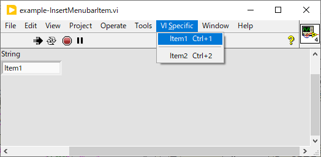
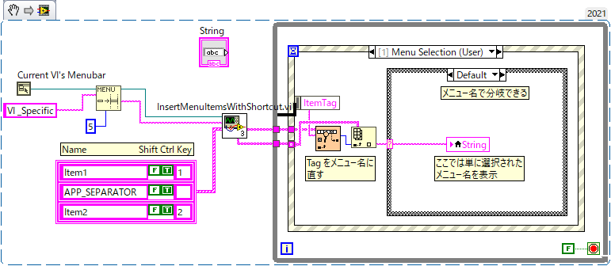
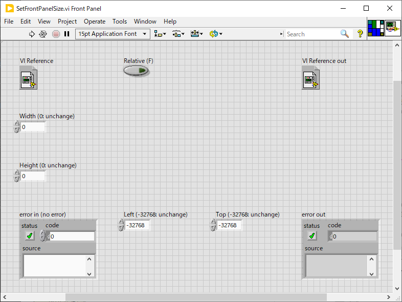
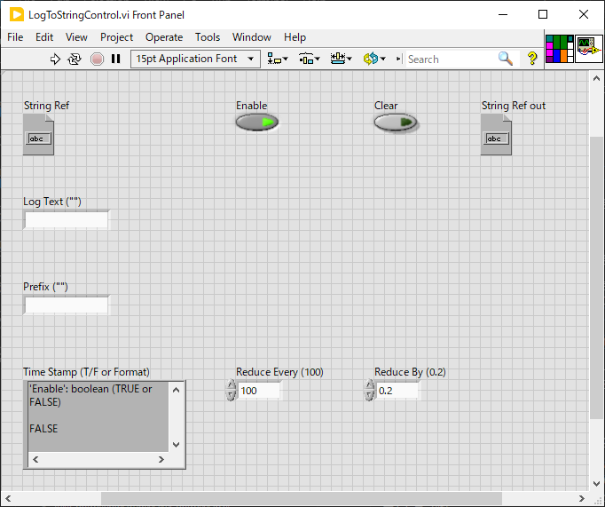
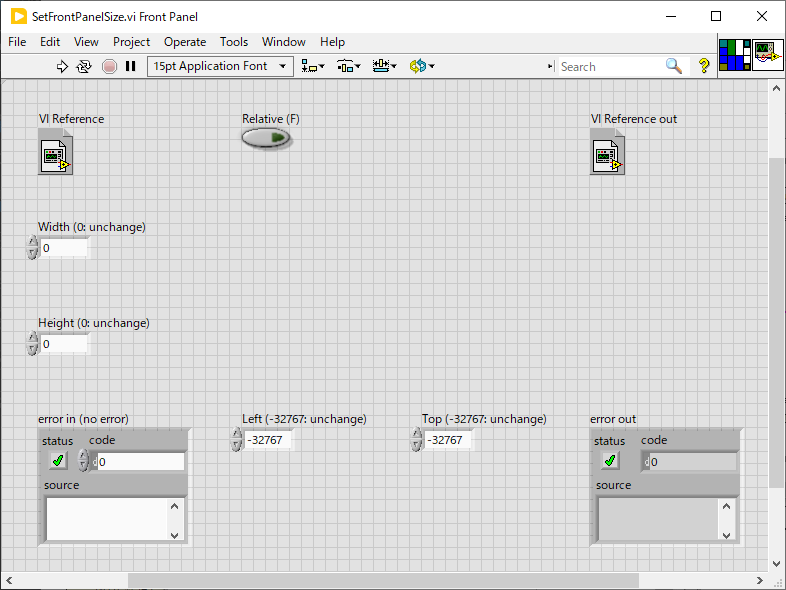
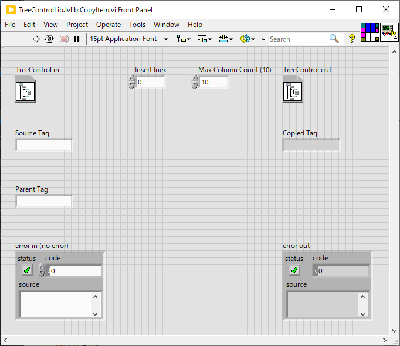
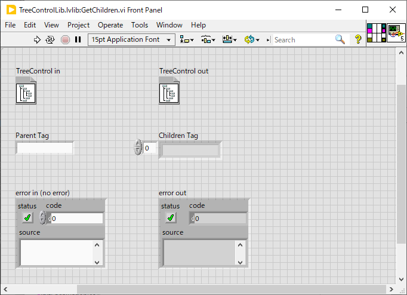
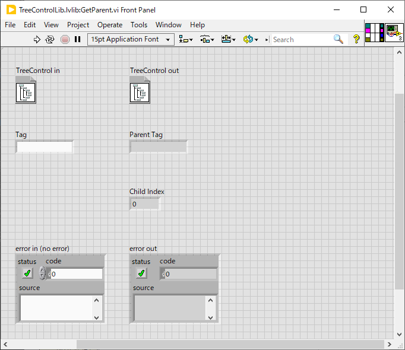

Lib/UI
==

UI 関連のライブラリ。

- [Lib/UI](#libui)
  - [DeferPanelUpdate.vi](#deferpanelupdatevi)
  - [InsertMenuItemsWithShortcut.vi](#insertmenuitemswithshortcutvi)
  - [LogToStringControl.vi](#logtostringcontrolvi)
  - [SetFrontPanelSize.vi](#setfrontpanelsizevi)
  - [TreeView](#treeview)
    - [CopyItem.vi](#copyitemvi)
    - [DragDropCustomize.vi](#dragdropcustomizevi)
    - [DragDropMoveCopy.vi](#dragdropmovecopyvi)
    - [GetChildren.vi](#getchildrenvi)
    - [GetParent.vi](#getparentvi)

DeferPanelUpdate.vi
--

コントロールの値を変更する間 VI の表示更新を止めることで画面のちらつきを抑え、処理速度を向上する。

- 面更新遅延機能は VI 単位なので、与えられたコントロールの載っている VI のパネルすべてで更新が停止する
- 元の設定値が出てくるので、後でこの値を指定してもう一度呼ぶことで復帰できる
- その間で本来なら画面更新を伴う値の更新を行う

InsertMenuItemsWithShortcut.vi
--

VI のメニューバーに新しい項目を追加する。

使用例： `Tools` と `Window` の間に `VI Specific` というメニューを追加した

そのためのコードはこんな感じ。

- まず通常の `Insert Menu Items` でメニューバーのルートに `VI Specific` という項目を作成する
  - `Tools` メニューが先頭を `0` として `5` 番のメニューになるのでその直後に挿入するよう位置を指定している
  - メニューテキストに `_` を含めると直後の文字がアクセスキーになる
  - 挿入されたメニュー項目のタグが出力される
  - メニューのタグは他と重複しない限りはメニューテキストと同一だが、重複があると数字が追加される
- このタグを与えて `InsertMenuItemsWithShortcut.vi` を呼び出してサブ項目を追加している
  - 名前とショートカットキーの配列は指定するためのテンプレートが `InsertMenuItemsWithShortcut.vi` のブロックダイアグラム上にあるのでそれを利用すると良い
  - `APP_SEPARATOR` という名前を指定するとセパレータになる
  - `Sub Item Tags` に挿入されたサブアイテムのタグが出力される
  - メニューが選択されると `<This VI>` の `Menu Selection (User)` というイベントが発火する
  - ここでは念のためタグをメニュー名に直してからメニュー名で分岐するようにしている

VI の端子構成：

- `menu ref` : メニューのリファレンスを繋ぐ
- `Target Tag` : 挿入する先の項目を指定する
- `Sub Items` : サブ項目の一覧を与える
  - 名前の他、ショートカットキーを指定できる
  - 名前に `_` を含めるとアクセスキーを指定できる
  - ショートカットキーが必要なければ空白にしておけばよい
  - セパレータを追加するには名前として `APP_SEPARATOR` という文字を指定する
- `Insert After (last)` : 先頭をゼロとして既存のメニュー項目番号を指定すると、新規の項目はその次に挿入される。先頭に入れたければ `-1` を指定する。項目数より大きい数字を入れれば末尾に追加される（デフォルト）。
- `menu ref out` : メニューのリファレンスがそのまま出る
- `Sub Item Tags` : サブ項目のタグのリスト
- `Sub Item Names` : サブ項目の名前のリスト
  - 上の例のようにメニューのタグを名前に直すのに使えるよう出力されている

LogToStringControl.vi
--

ログテキストを文字列コントロールに追加する。

基本的な使い方としては `String Ref` と `Log Text` に値を入れるだけでよい。

文字列コントロールの末尾に文字列が追加され、それが見えるようスクロールされる。

ログが大きくなりすぎないよう定期的に古いログが削除される。

- `String Ref` : `String` コントロールのリファレンスを入れる
- `Log Text` : ログとして記録したい文字列を入れる
- `Prefix` : ログ文字列の前に追加したい文字を入れる（入れなければ無視される）
- `Time Stamp` : `true` を入れると各行にタイムスタンプが入る。文字列を繋ぐと `Format Date/Time String` の `Time format` として解釈され、その形式でタイムスタンプが入る。
- `Enable` : `false` を入れるとログ追加は行われない
- `Clear` : `String` コントロールの内容を消去する。このとき `Log Text` に指定した文字列は無視される。
- `String Ref out` : `String` コントロールのリファレンスがそのまま出力される
- `Reduce Every` : ここに指定された回数だけログを追加したら `Reduce By` で指定された割合だけ古いログを削除する
- `Reduce By` : `Reduce Every` 回のログ追加ごとに `Reduce By` で指定された割合だけ古いログを削除する
  - デフォルトでは 100 回の追加ごとに古い方から２割のログを削除する

SetFrontPanelSize.vi
--

VI のフロントパネルサイズを変更する

幅のみ、高さのみを変更することもできる

位置を指定することもできる

相対値で指定することもできる

- `VI Reference` : 変更したい VI を指定
- `Width` : 幅を指定する
  - 何も繋がない、あるいは 0 を指定すると変更しない
- `Height` : 幅を指定する
  - 何も繋がない、あるいは 0 を指定すると変更しない
- `Left` : X 座標を指定する
  - 何も繋がない、あるいは -32768 を指定すると変更しない
- `Top` : Y 座標を指定する
  - 何も繋がない、あるいは -32768 を指定すると変更しない
- `Relative (F)` : 相対値での指定にする
  - 正の値なら増やす、負の値なら減らす
- `VI Reference out` : VI のリファレンスがそのまま出る

TreeView
--

`TreeView` を扱うためのユーティリティ VI を提供する

### CopyItem.vi

`SourceTag` で指定されたアイテムを `ParentTag` の `Insert Index` へ複製する

子アイテムも同時に複製される

カラム番号の最大値はデフォルトで 10 になっているが、これよりも多い場合があるなら増やす必要がある

複製されたアイテムの Tag が出力される

### DragDropCustomize.vi
### DragDropMoveCopy.vi

`TreeView` 内のアイテムのドラッグドロップを詳細にせぎょできるようにする

- シンボルごとに親子関係を作成可能かどうかを指定できる

[`utilities/ScriptManager.vi`](../../utilities/ScriptManager.vi) が使用例になっている

### GetChildren.vi

`ParentTag` で指定した要素の子要素のタグを配列にして返す

### GetParent.vi

`Tag` で指定した要素の親要素のタグと兄弟要素中でのインデックスを返す

親がいなければ空文字列が返る

