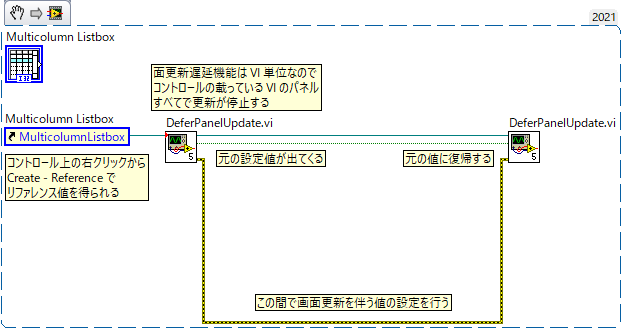

Lib/UI
==

UI 関連のライブラリ。

提供される VI
--

### DeferPanelUpdate.vi

コントロールの値を変更する間 VI の表示更新を止めることで画面のちらつきを抑え、処理速度を向上する。

- 面更新遅延機能は VI 単位なので、与えられたコントロールの載っている VI のパネルすべてで更新が停止する
- 元の設定値が出てくるので、後でこの値を指定してもう一度呼ぶことで復帰できる
- その間で本来なら画面更新を伴う値の更新を行う

