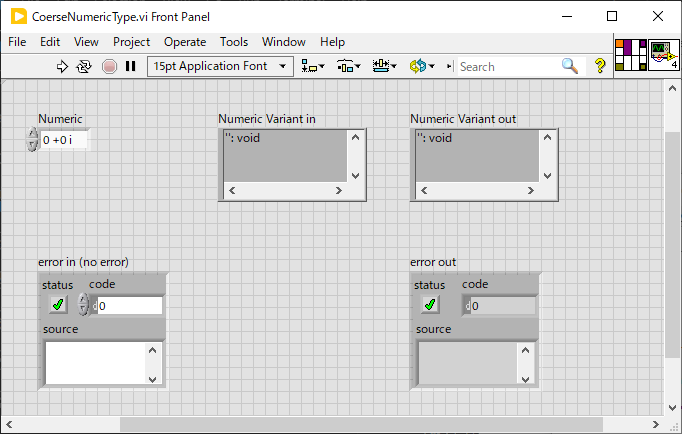
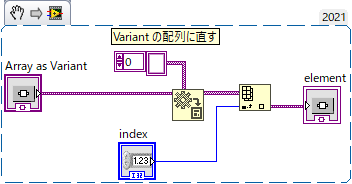
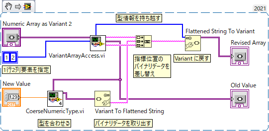
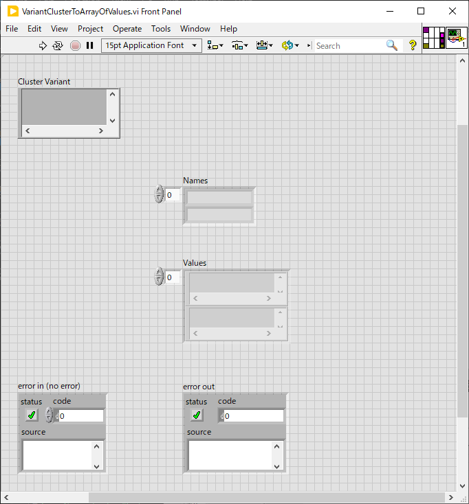

Lib/Variant
==
Variant 関連のライブラリ

- [Lib/Variant](#libvariant)
  - [CoerseNumericType.vi](#coersenumerictypevi)
    - [`Fixed Point` 型についてのメモ](#fixed-point-型についてのメモ)
  - [VariantArrayAccess.vi](#variantarrayaccessvi)
  - [VariantClusterAccess.vi, VariantClusterAccessMulti.vi](#variantclusteraccessvi-variantclusteraccessmultivi)
  - [VariantClusterToArrayOfValues.vi](#variantclustertoarrayofvaluesvi)

CoerseNumericType.vi
--

与えられた数値を、Variant で指定された型に変換した上で Variant として出力する。

複素数値にも対応している。

Variant を使っていると細かい数値型を気にする必要のないことがほとんどだが、配列やクラスターの一部を書き換えたりする時に必要になる。

使用例は `VariantArrayAccess.vi` の例示コードなどを参照のこと。

- `Numeric` : 変換したい数値を入れる
  - 入力端子は複素数型になっているが実数や整数を繋げば自動的に拡張されるので気にせず繋いで構わない
- `Numeric Variant in` : 変換先となる型を指定するため `Variant` 値を入れる
  - `Variant` の中に入っている数値型を見てその型に合わせて型変換が行われる
  - 下記のすべての数値型に対応する（はず）
  - すべて一旦 `Extended` 浮動小数点数に直されるので、誤差やオーバーフローが生じる可能性は捨てきれない
  - また、`Fixed point` 型の `Overflow` フラグは確実に失われる
  - 標準関数で作成した `Overflow` フラグ付きの `Fixed point` 型のバイナリ値にゴミが現れることがあるがこの関数ではゴミは生まずゼロでフィルされる（下記ノート参照）
- `Numeric Variant out` : 変換された数値が出力される

サポートされる変換先：

|Type|Sign|1 byte|2 byte|4 byte*|8 byte*|10 byte*|
|:----:|:----:|:----:|:----:|:----:|:---:|:---:|
|整数 |あり|`I8`|`I16`|`I32`|`I64`|-|
|整数 |なし|`U8`|`U16`|`U32`|`U64`|-|
|浮動小数点数|あり|-|-|`Single`|`Double`|`Extended`|
|複素数|あり|-|-|`CSG`|`CDB`|`CXT`|
|固定小数点数|あり/なし|1 byte~|~|~|~9 bytes|-|

*) 複素数ではこの倍の長さになる

### `Fixed Point` 型についてのメモ

他の数値型は良いのだけれど、`Fixed Point` 型に合わせるのはかなり面倒だった。
いくつかテストした結果、以下の観測結果が得られたためそれに合わせたコードになっている。
ヘルプの記述が足りないのでこれで合っているかちょっと不安。

- 文字列化してバイナリ値を取り出すと必ず `64 bit` あるいは `128 bit` 値になるようだ
  - `Overflow` フラグなしなら `64 bit` になる
  - `Overflow` フラグ付きなら `128 bit` になる
- どちらも前半の `64 bit` が数値を格納している
  - 下位の `Word Length` ビットが有効だが、符号付の場合は `64 bit` まで符号拡張される
- `Overflow` フラグ付きなら `64 bit` 数値の次の `8 bit` がフラグを表す
  - `00` なら `Overflow` していない
  - `01` なら `Overflow` した
  - 残りの `56 bit` に意味は無いと思われるのだけれど、標準関数で作成した `Fixed Point` 値の場合ここが必ずしもゼロで埋められておらず、ゴミデータ(?)が入ることがある
  - ヘルプによれば `Fixed Point` 数のメモリ上の表現長は最大で `72 bit` つまり `64 bit` + `8 bit` とのことなので、この「ゴミ」に見えるものは恐らく意味のないデータだと思うのだけれど・・・

VariantArrayAccess.vi
--

Variant に格納された配列の要素を読み書きするための VI。

読むだけなら Variant の配列に変換すれば簡単に行えるのだけれど、次元数で分岐しなければならないのがちょっと面倒なのと、書き込みではこの配列の一部を書き換えて Variant に戻すとバイナリ互換が失われてしまう問題が発生する。

標準的な読み方：

本 VI を使えば多次元配列にも簡単にアクセスでき、またバイナリ互換を保ったまま要素を書き換えることができる（「バイナリ互換性」は配列を構造体に入れたりする時に重要になる）。

- この VI は1次元を扱う VariantArrayAccess1D.vi と多次元を扱う VariantArrayAccessMulti.vi とからなる Polymorphic な VI になっている。
  - 1次元なら `index` には配列指標を数値で指定する
  - 多次元なら配列指標を配列で指定する　１行２列要素なら `[1,2]` のように
  - `index` あるいは `indices` を指定する端子に数値が入るか数値の配列が入るかで機能が変化する。
- 配列指標を入れれば `value` 端子に対応する値が `Variant` 型として得られる
- 配列要素の書き換えにはアクロバティックな操作が必要になる（次図参照）

Variant 配列をバイナリ互換性を保ったまま書き換えるための標準的な方法は提供されていないので、非常に非効率ではあるが、一旦配列をバイナリに直し、指定指標位置のデータを差し替えたのち、再び Variant に戻すという手順を踏む必要がある。`VariantArrayAccess.vi` はこのための機能として、元配列のバイナリデータのうち配列指標で指定する位置より前の部分と後の部分を `prepend` と `rest` に出力する。

新しく入れたい値を `Variant To Flattened String` でバイナリに直してこれらの値で挟み、元の配列の型情報を与えて `Flattened String To Variant` で `Variant` に戻せば、指定要素を書き換えた配列を `Variant` として得られる。

このとき、`New Value` として与える `Variant` 値の「中身」が元の配列の要素と正確に同じ型を持つ必要がある。そうでないとバイナリ互換が失われ、再構成された配列を正しく読み取れなくなる。[`CoerseNumericType.vi`](#coersenumerictypevi) は数値の型を元の値と合わせる機能を持っており、この手の作業に役立つ。新しい値を `Numeric` 端子に、元の値を `Variant value in` に入れると、元の値と同じ型に型変換された値が `Variant value out` 端子に出る。

非常にアクロバティックでなおかつ非効率だが、たぶんこれしかバイナリ互換を保ったまま配列要素を書き換える方法は無いのだと思う。

VariantClusterAccess.vi, VariantClusterAccessMulti.vi
--

`VariantArrayAccess.vi` が配列の一部を読み書きするものであったのに対して、これはクラスターの一部を読み書きするもの。

Variant として与えられたクラスターの特定要素のみを読み書きできる。`Multi` 付きの方は一度に複数の要素へアクセスできる。

`VariantArrayAccess.vi` とは異なり Polymorphic というわけではなくまったく別の VI だ。

使い方は以下の通り：

- `value in` に `Variant` 化されたクラスター値を入れる
- `indices` または `labels` にアクセスしたい要素番号あるいは要素名を指定する
  - 両方指定すると `indices` が使われる
- `values` に読み取られた値が出る
- 値を書き換えたければ、それぞれの値をバイナリ化した後、前に `prepends` を追加して繋ぎ合わせ、最後に `rest` を付けたバイナリ値を、`type string` を使って `Variant` に戻す

VariantClusterToArrayOfValues.vi
--

`Variant` 化されたクラスター値からサブ要素名の配列とその値の配列とを得る。

- `Cluster Variant` に値を入れる
- `Names` にサブ項目の名前の一覧が出る
- `Values` にそれらの値の一覧が出る

