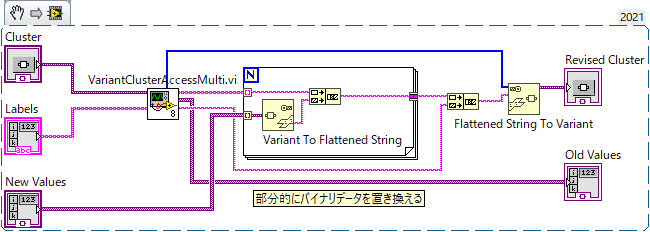

Lib/Variant
==
Variant 関連のライブラリ

- [Lib/Variant](#libvariant)
  - [提供されるVI](#提供されるvi)
    - [CoerseNumericType.vi](#coersenumerictypevi)
    - [VariantArrayAccess.vi](#variantarrayaccessvi)
    - [VariantClusterAccess.vi, VariantClusterAccessMulti.vi](#variantclusteraccessvi-variantclusteraccessmultivi)
    - [VariantClusterToArrayOfValues.vi](#variantclustertoarrayofvaluesvi)

提供されるVI
--
### CoerseNumericType.vi

与えられた数値を、Variant で指定された型に変換した上で Variant として出力する。

複素数値にも対応している。

Variant を使っていると細かい数値型を気にする必要のないことがほとんどだが、配列やクラスターの一部を書き換えたりする時に必要になる。

### VariantArrayAccess.vi

Variant に格納された配列の要素を読み書きするための VI。

読むだけなら Variant の配列に変換すれば簡単に行えるのだけれど、次元数で分岐しなければならないのがちょっと面倒なのと、書き込みではこの配列の一部を書き換えて Variant に戻すとバイナリ互換が失われてしまう問題が発生する。

標準的な読み方：

本 VI を使えば多次元配列にも簡単にアクセスでき、またバイナリ互換を保ったまま要素を書き換えることができる（「バイナリ互換性」は配列自体を構造体に入れたりする時に重要になる）。

- この VI は1次元を扱う VariantArrayAccess1D.vi と多次元を扱う VariantArrayAccessMulti.vi とからなる Polymorphic な VI になっている。
  - 1次元なら `index` には配列指標を数値で指定する
  - 多次元なら配列指標を配列で指定する　１行２列要素なら `[1,2]` のように
  - `index` あるいは `indices` を指定する端子に数値が入るか数値の配列が入るかで機能が変化する。
- 配列指標を入れれば `value` 端子に対応する値が `Variant` 型として得られる
- 配列要素の書き換えにはアクロバティックな操作が必要になる

Variant 配列をバイナリ互換性を保ったまま書き換えるための標準的な方法は提供されていないので、非常に非効率ではあるが、一旦配列をバイナリに直し、指定指標位置のデータを差し替えたのち、再び Variant に戻すという手順を踏む必要がある。`VariantArrayAccess.vi` はこのための機能として、元配列のバイナリデータのうち指定位置の前と後の部分を `prepend` と `rest` に出力する。

新しく入れたい値を `Variant To Flattened String` でバイナリに直してこれらの値で挟み、元の配列の型情報を与えて `Flattened String To Variant` で `Variant` に戻せば、指定要素を書き換えたバイナリ互換正のある配列が Variant として得られる。

このとき、`New Value` として与える `Variant` 値の「中身」が元の配列の要素と正確に同じ型を持つ必要がある。そうでないとバイナリ互換が失われ、再構成された配列を正しく読み取れなくなる。[`CoerseNumericType.vi`](#coersenumerictypevi) は数値の型を元の値と合わせる機能を持っており、この手の作業に役立つ。

非常にアクロバティックでなおかつ非効率だが、たぶんこれしかバイナリ互換を保ったまま配列要素を書き換える方法は無いのだと思う。

### VariantClusterAccess.vi, VariantClusterAccessMulti.vi

`VariantArrayAccess.vi` が配列の一部を読み書きするものであったのに対して、これはクラスターの一部を読み書きするもの。

Variant として与えられたクラスターの特定要素のみを読み書きできる。`Multi` 付きの方は一度に複数の要素へアクセスできる。

`VariantArrayAccess.vi` とは異なり Polymorphic というわけではなくまったく別の VI だ。

使い方は以下の通り：

- `value in` に `Variant` 化されたクラスター値を入れる
- `indices` または `labels` にアクセスしたい要素番号あるいは要素名を指定する
  - 両方指定すると `indices` が使われる
- `values` に読み取られた値が出る
- 値を書き換えたければ、それぞれの値をバイナリ化した後、前に `prepends` を追加して繋ぎ合わせ、最後に `rest` を付けたバイナリ値を、`type string` を使って `Variant` に戻す

### VariantClusterToArrayOfValues.vi

`Variant` 化されたクラスター値からサブ要素名の配列とその値の配列とを得る。
