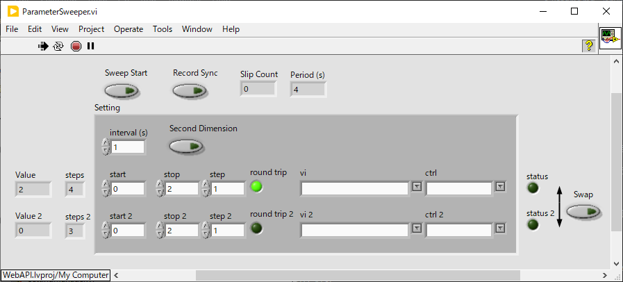
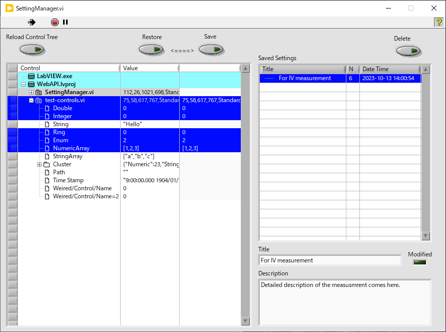

utilities/
==

ここには単独で利用可能なVIアプリが含まれます。

- [utilities/](#utilities)
  - [ParameterSweeper.vi](#parametersweepervi)
  - [SettingManager.vi](#settingmanagervi)
    - [TODO](#todo)
  - [WebAPI/](#webapi)

ParameterSweeper.vi
--

- 任意の VI の任意のコントロールの値を１秒おきとかで徐々に変えるための VI
- ゆっくりパラメータを振りながら [`ADCDaraRecorder.vi`](../hardware/#adcdatarecordervi--adc-の電圧値を記録するアプリ) でデータを保存する使い方を想定している

- `vi` と `ctrl` で指定した数値コントロールの値を `start` から `stop` まで `step` ずつ `interval (s)` 間隔で掃引する
  - `Period (s)` に一周期あたりにかかる時間が表示される
  - `vi` や `ctrl` の横のボタンを押すと選択肢が表示される
  - 数値の指定できないコントロールも含まれるのはあしからず
  - クラスターのサブ要素は選択肢に含まれるけれど配列の個々の要素などは選択肢には出ないので、そういうのは手で書く必要がある
  - コントロール名自体に `/[]` が含まれるときは、コントロール名の親子関係や配列指標と区別するために `\` でエスケープする必要がある
- `Sweep Start` を押すと掃引が始まり、もう一度押すまで繰り返し掃引する
- `round trip` はクリックでトグルする `on` だと掃引が往復になる
- `Second Dimension` が `on` だと、上の行で指定された掃引が終わるたびに下の行で指定された値が `step 2` ずつ変更され、二次元的な掃引が行われるようになる
- `Swap` を押すと1行目と2行目の値が入れ替わる
- `Record Sync` を `on` にしておくと、`Sweep Start` を押すと同時に [`ADCDataRecorder.vi`](../hardware/#adcdatarecordervi--adc-の電圧値を記録するアプリ) の `Measure` ボタンが押され、値の掃引と同期してデータの測定を開始できる
- `Interval (s)` をあまり小さくすると処理が間に合わなかったり設定タイミングの誤差が問題になったりするけれど、時定数が `100 ms` 以上のロックインアンプを使った測定を念頭に置くと、この VI と [`ADCDataRecorder.vi`](../hardware/#adcdatarecordervi--adc-の電圧値を記録するアプリ) を使うだけでどんなパラメータでも掃引測定が行えてとても便利
- `Interval (s)` は 0.5 秒くらいで使うことを想定している

SettingManager.vi
--

この VI を使うと複数の VI にわたる多数のコントロール値を「設定」として保存しておき、後からダブルクリックで簡単に復元できる。必要な VI を開いたり、VI 位置の保存・復元もできるので、複数の VI を協調させて行うような測定において開始時の手間を大幅に減らせる。

- 種々の VI の設定値を保存しておき必要に応じて書き戻せる
- あの測定をするときとこの測定をするときとでたくさんパラメータを書き換えなきゃいけなくて大変！　というときに使うことを想定している
- 測定に必要な複数の VI を一気に開き、表示位置を整えることもできて便利！

- VI を立ち上げると左側に現在開かれている VI とコントロールの一覧が、保持する値と共に表示されるので、値を保存しておきたいコントロールをすべて選択して `Save` ボタンを押すと右のリストに設定項目を作成できる
  - クローン VI や、一度も保存していない `Untitled 2.vi` のような VI はサポートされない
  - VI やコントロールの行をクリックあるいは Ctrl+クリック することで選択・選択解除を行える
  - コントロールではなく VI を選択した場合には VI の表示位置が保存される
  - 新しい VI を開いた後など、`Reload Control Tree` (F5キー) を押すとこの表示を更新できる
  - `Save` ボタンを押して設定項目を作成する際には自動的にコントロールの一覧が更新されるため、画面上の設定値を更新するためだけに `Reload Control Tree` (F5キー) を押す必要はない
- 設定項目のタイトルは右下の欄で変更可能なので、何の測定に使う設定かを分かりやすく書いておくと良い
- 詳細説明も追加しておける
- 設定リストの `N` の欄は保存項目数を表す
- 設定リストの項目をダブルクリックするか、選択しておいて `Restore` を押すと、保存されていたコントロール値、VI 位置を復元できる
  - 設定に含まれる VI がロードされていなければ自動的にロードするかどうかを聞いてくる
- 設定項目を選択すると、保存されているコントロール値が左のコントロール一覧に表示されるので、慣れるまではこれを確認してから `Restore` した方が間違いない
- 設定項目を選択しておいて `Delete` を押すと消せる キーボードの `Delete` ボタンでも消える
- 設定項目はドラッグで並べ替えたり、親子関係を作ったりできる
  - ダミーの設定をフォルダーのように使ったりしながら探しやすい形に整頓すると良い
- 左のコントロールツリーで VI 名の横のアイコンをクリックするとその VI を前面に持ってこれる
  - VI が開かれていなければ開いてから前面に出す
- ドキュメントフォルダーの LabVIEW Data というフォルダに SettingManager.ini というファイルができていて、ここにすべての設定が保存される
  - Windows なら `C:\Users\(ユーザー名)\Documents\LabVIEW Data\SettingManager.ini`
  - 誤って消してしまったり上書きしてしまったりした場合に備えて常に１０個ほど履歴を残しているが、長期的に保存したければこのファイルを定期的にバックアップしておくと良い

### TODO

- 設定を入れ子にした際に、親設定のダブルクリックで個設定を順に実行する機能があると便利かもしれない
  - アイコンで見分けられるようにする
- メモリ上にない VI をロードする際に確認を求めないオプションを設定ごとに持たせたい

WebAPI/
--

LabVIEW 上に http サーバーを建てて、http 経由でコントロールの値を読み書きできるようにするためのプロジェクト。

これを使うと LabVIEW 以外のプログラムから VI 上のコントロールにアクセスできるようになる。

詳細は [./WebAPI/](WebAPI/) を参照のこと
