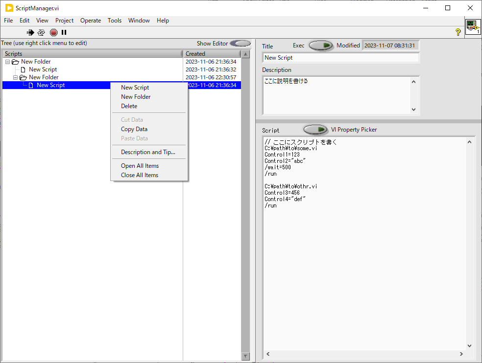
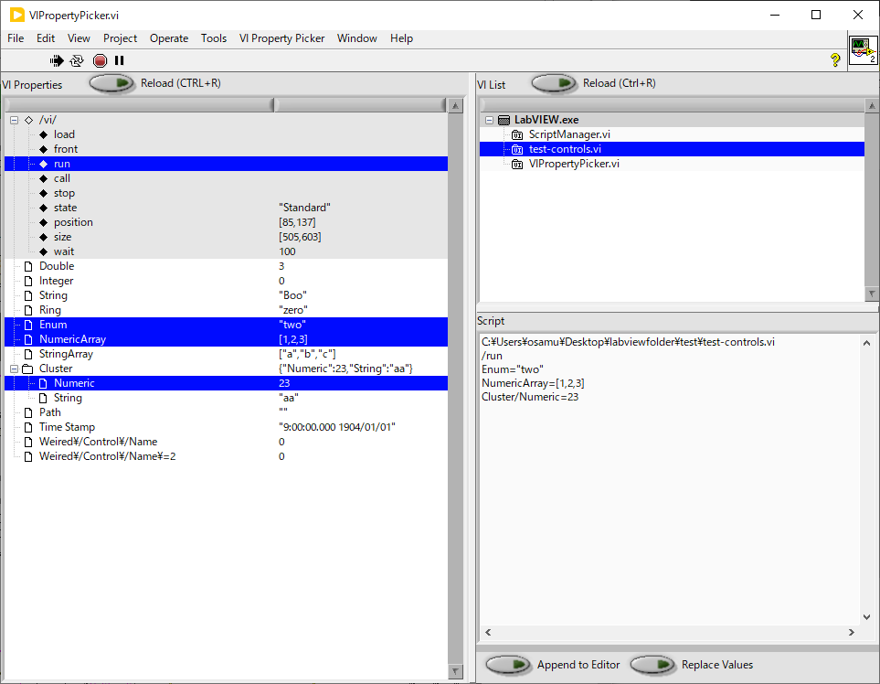

utilities/
==

ここには単独で利用可能なVIアプリが含まれます。

- [utilities/](#utilities)
  - [ParameterSweeper.vi](#parametersweepervi)
  - [ScriptManager.vi](#scriptmanagervi)
  - [VIPropertyPicker.vi](#vipropertypickervi)
  - [WebAPI/](#webapi)

ParameterSweeper.vi
--

- 任意の VI の任意のコントロールの値を１秒おきとかで徐々に変えるための VI
- ゆっくりパラメータを振りながら [`ADCDaraRecorder.vi`](../hardware/#adcdatarecordervi--adc-の電圧値を記録するアプリ) でデータを保存する使い方を想定している

- `vi` と `ctrl` で指定した数値コントロールの値を `start` から `stop` まで `step` ずつ `interval (s)` 間隔で掃引する
  - `Period (s)` に一周期あたりにかかる時間が表示される
  - `vi` や `ctrl` の横のボタンを押すと選択肢が表示される
  - 数値の指定できないコントロールも含まれるのはあしからず
  - クラスターのサブ要素は選択肢に含まれるけれど配列の個々の要素などは選択肢には出ないので、そういうのは手で書く必要がある
  - コントロール名自体に `/[]` が含まれるときは、コントロール名の親子関係や配列指標と区別するために `\` でエスケープする必要がある
- `Sweep Start` を押すと掃引が始まり、もう一度押すまで繰り返し掃引する
- `round trip` はクリックでトグルする `on` だと掃引が往復になる
- `Second Dimension` が `on` だと、上の行で指定された掃引が終わるたびに下の行で指定された値が `step 2` ずつ変更され、二次元的な掃引が行われるようになる
- `Swap` を押すと1行目と2行目の値が入れ替わる
- `Record Sync` を `on` にしておくと、`Sweep Start` を押すと同時に [`ADCDataRecorder.vi`](../hardware/#adcdatarecordervi--adc-の電圧値を記録するアプリ) の `Measure` ボタンが押され、値の掃引と同期してデータの測定を開始できる
- `Interval (s)` をあまり小さくすると処理が間に合わなかったり設定タイミングの誤差が問題になったりするけれど、時定数が `100 ms` 以上のロックインアンプを使った測定を念頭に置くと、この VI と [`ADCDataRecorder.vi`](../hardware/#adcdatarecordervi--adc-の電圧値を記録するアプリ) を使うだけでどんなパラメータでも掃引測定が行えてとても便利
- `Interval (s)` は 0.5 秒くらいで使うことを想定している

ScriptManager.vi
--

複数の VI の位置や実行状態、コントロール値を設定するスクリプト（マクロ）に名前や説明を付け、ツリー構造に構造化して管理する。実行はスクリプト名のダブルクリックで行える。スクリプトの作成は `VIPropertyPicker.vi` との連携動作を利用して VI のコントロール一覧から設定したいものを選択するだけで簡単に行える。これを使うことで複数の VI を協調させて行うような測定において開始時の手間を大幅に減らせる。

- 種々の VI の設定値をスクリプトの形で保存しておき、任意の順番で書き戻せる
- あの測定をするときとこの測定をするときとでたくさんパラメータを書き換えなきゃいけなくて大変！　というときに使うことを想定している
- 測定に必要な複数の VI を一気に開き、実行し、表示位置を整えることもできて便利！

- 画面左の `Tree` がスクリプトの管理画面
  - 右クリックして現れる `New Script`, `New Folder` のメニューから新しいスクリプトやスクリプトをまとめるためのフォルダーを作成する
  - スクリプトやフォルダーはドラッグドロップで並べ替えられる
  - 右クリックから `Duplicate` あるいは `Ctrl` を押しながらのドラッグドロップで項目を複製できる
  - 右クリックから `Delete` あるいはキーボードの `Delete` キーで削除できる
  - ダブルクリックでスクリプト（下で詳述）を実行できる
- 画面右がスクリプトの編集画面
  - `Title` は `Tree` 上での名前
  - `Description` は任意の説明
  - `Script` が複数の VI の位置や実行状態、コントロール値を設定するスクリプト
    - 図の例なら `C:\path\to\some.vi` の `Control1` というラベルを持つコントロールに `123` を `Control2` というラベルを持つコントロールに `"abc"` を設定した後 `500 ms` 待ってから実行、`C:\path\to\other.vi` の `Control3` というラベルを持つコントロールに `456` を `Control4` というラベルを持つコントロールに `"def"` を設定した後で実行、という一連の動作を行う
    - 値の設定順やタイミングも自由に決められるため複雑な手順を実現可能
    - 文法の詳細は [`SetControlValues.vi`](../lib/SetGetControlValue/#setcontrolvaluesvi) を参照
- `Script` エディター右の `VI Property Picker` ボタンで `VIPropertyPicker.vi` が起動する
  - 現在開かれている `VI` の一覧から `VI` を選択すれば `VI` 上のコントロールの一覧が現れるので、設定対象としたいものを選択すればスクリプトが作成される
  - `Append To Editor in ScriptManager` ボタンを押すと `Script` エディタの末尾にスクリプトが追加される
  - 詳しい使い方は下記参照
- ドキュメントフォルダーの LabVIEW Data というフォルダに `ScriptManager.ini` というファイルができていて、ここにすべての設定が保存される
  - Windows なら `C:\Users\(ユーザー名)\Documents\LabVIEW Data\ScriptManager.ini`
  - 誤って消してしまったり上書きしてしまったりした場合に備えて常に２０個ほど履歴を残しているが、長期的に保存したければこのファイルを定期的にバックアップしておくと良い
- 管理画面や編集画面での変更は `Edit` メニューの `Undo`, `Redo` あるいはキーボードの `Ctrl+Z`, `Ctrl+Shift+Z` でやり直し可能

VIPropertyPicker.vi
--

上記の `ScriptManager.vi` や [`SetControlValues.vi`](../lib/SetGetControlValue/#setcontrolvaluesvi) で使うスクリプトの作成を容易にするためのプログラム。VI とコントロールを選択するだけで、それらを設定するためのスクリプトが出来上がる。

- 起動すると右上の `VI List` に現在開かれている `VI` の一覧が表示される
  - リロードするには `Ctrl+R`
- いずれかを選択すると左側の `VI Properties` に `VI` 上のコントロールの一覧が表示される
  - リロードするには `Ctrl+R`
  - 上部の ◆ 付きのものは `VI` の表示位置や実行状態を変更するためのコマンド
- コントロールやコマンドを `Ctrl+Click` で選択すると右下にそれらを設定するためのスクリプトが表示される
- このスクリプトをコピー＆ペーストするか、`Append to Editor in ScriptManger` ボタンで `ScriptManger` に送ることで利用する
- コマンド一覧
  - `/load` : `VI` を読み込みフロントパネルを開く
  - `/front` : `VI` を読み込み最前面に表示
  - `/run` : `VI` を読み込み実行する
  - `/call` : `VI` を読み込み実行し終了を待つ
  - `/stop` : `VI` を読み込み実行中であれば停止
  - `/state` : `Standard`, `Maximize`, `Minimize`, `Close` を代入して表示状態を変更
  - `/position` : `[12,34]` の形でフロントパネル位置を指定
  - `/size` : `[12,34]` の形でフロントパネルサイズを指定
  - `/wait` : ミリ秒で待機時間を代入するとその時間だけ待つ
- 配列の要素へ代入することも可能
  - `VI Property Picker` で配列コントロールを選択すると `Array1=[1,2,3]` のように全ての要素を一度に代入するコマンドが生成される
  - スクリプトを手で編集して `Array1[0]=4` のようにすれば特定要素だけを変更することも可能

WebAPI/
--

LabVIEW 上に http サーバーを建てて、http 経由でコントロールの値を読み書きできるようにするためのプロジェクト。

これを使うと LabVIEW 以外のプログラムから VI 上のコントロールにアクセスできるようになる。

詳細は [./WebAPI/](WebAPI/) を参照のこと
