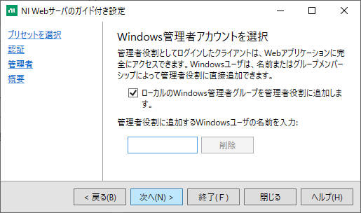
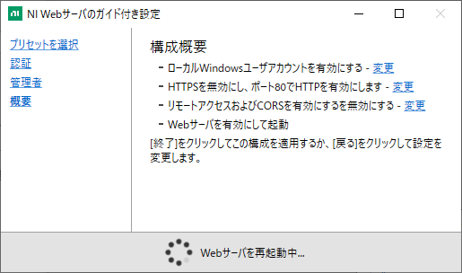

utilities/WebAPI
==

LabView プロジェクト `WebAPI.lvproj` を使うと `http` アクセスにより VI 上のコントロールの値を読み書きできるようにする `https` サーバーを建てられる。

これを使うと LabVIEW 以外のプログラムから VI 上のコントロールの値を読み書きできるようになる。

この Web サーバーへアクセスしてコントロールの値を読み書きするための VI として `SetControlValueHTTP.vi`, `GetControlValueHTTP.vi` も一応提供されているが、LabVIEW プログラムからコントロールの読み書きをするなら `SetControlValue.vi`, `GetControlValue.vi` を直接呼ぶ方が良いのでこれらはあまり使い道が無い。

- [utilities/WebAPI](#utilitieswebapi)
  - [WebAPI.lvproj](#webapilvproj)
    - [get API](#get-api)
    - [set API](#set-api)
    - [サーバーの起動](#サーバーの起動)
  - [SetControlValueHTTP.vi](#setcontrolvaluehttpvi)
  - [GetControlValueHTTP.vi](#getcontrolvaluehttpvi)

WebAPI.lvproj
--
このプロジェクトには `labview` という名前の `Web Service` コンポーネントが含まれており、ウェブリソースとして `set.vi`, `get.vi` が定義されている。

これらにより、

- `http://127.0.0.1/labview/get` コントロールの値を読みだす API のアドレス
- `http://127.0.0.1/labview/set` コントロールの値を設定する API のアドレス

というアドレスにそれぞれ Web API が提供されることになる。

例えばブラウザから `http://127.0.0.1:8080/labview/get?vi=viname&ctrl=Control1` へアクセスすれば `viname.vi` という VI 上にある `Control1` というコントロールの値が返ることになる。

同じく、`http://127.0.0.1:8080/labview/set?vi=viname&ctrl=Control1&value=3` へアクセスすれば `viname.vi` という VI 上にある `Control1` というコントロールの値として 3 が設定される。

ブラウザではなく何らかの他のプログラムからこのアドレスへアクセスすれば、そのプログラムから LabVIEW のコントロール値を読み書きできることになる。

### get API

基本形： `http://127.0.0.1/labview/get?vi=viname&ctrl=controlename`

- 与えたパラメータはそのまま [GetControlValue.vi](../../lib/SetGetControlValue/Readme.md#getcontrolvaluevi) へ渡される
  - `vi` には VI 名を指定する
    - 末尾の `.vi` は省略可能
  - `ctrl` にはコントロール名（label）を指定する
    - `ArrayControl[3]` のように配列要素も指定できる
    - `Cluster1/SubControl1` のようにクラスタ内の特定要素も指定できる
    - `Cluster1/1` のようにクラスタ内のコントロールインデックスを数値で指定もできる
    - `ArrayControl[2]/SubControl2` のように組み合わせも大丈夫
    - このように `/[]` は特殊文字になるため、コントロール名自体が例えば `/` を含むときは `\/` のようにエスケープする必要がある
  - `num` を指定すると GetControlValue の `use enum` が `false` になる
    - `?vi=viname&ctrl=controlename` なら `Enum` や `Ring` は文字列で値を返す
    - `?vi=viname&ctrl=controlename&num` なら `Enum` や `Ring` は数値で値を返す
  - コントロールから読み出された値は JSON 形式で返される
    - 数値はそのまま
    - Boolean 値も true か false でそのまま
    - 文字列は `" "` で囲まれ、必要に応じて特殊文字がエスケープされる
    - 1次元配列は `[要素,要素,要素,...]`　の形になる
    - 多次元配列は `[[次元サイズ,次元サイズ,...],[要素,要素,...]]` のように、配列サイズの配列と、一次元化された値配列の２つの配列を含む配列になる
    - クラスターは `{"ラベル":値,"ラベル":値,...}` の形になる
  - 与えるパラメータに URL としての特殊文字が含まれる場合には 「URL エンコード」 を施す必要がある。

### set API

基本形： `http://127.0.0.1/labview/set?vi=viname&ctrl=controlename&value=newvalue`

本来書き込み用の Web API は GET ではなく POST で実装すべきなのだけれど、他のプログラムからの利用が容易になるようあえて GET にした。

- 与えたパラメータはそのまま [SetControlValue.vi](../../lib/SetGetControlValue/Readme.md#setcontrolvaluevi) へ渡される
  - `vi` には VI 名を指定する
    - 末尾の `.vi` は省略可能
  - `ctrl` にはコントロール名（label）を指定する
    - `ArrayControl[3]` のように配列要素も指定できる
    - `Cluster1/SubControl1` のようにクラスタ内の特定要素も指定できる
    - `Cluster1/1` のようにクラスタ内のコントロールインデックスを数値で指定もできる
    - `ArrayControl[2]/SubControl2` のように組み合わせも大丈夫
    - このように `/[]` は特殊文字になるため、コントロール名自体が例えば `/` を含むときは `\/` のようにエスケープする必要がある
  - `value` には設定する値を JSON 形式で与える
    - 数値はそのまま
    - Boolean 値も true か false でそのまま
    - 文字列は `" "` で囲まみ、必要に応じて特殊文字をエスケープする
    - 1次元配列は `[要素,要素,要素,...]`　の形にする
    - 多次元配列は `[[次元サイズ,次元サイズ,...],[要素,要素,...]]` のように、配列サイズの配列と、一次元化された値配列の２つの配列を含む配列にする
    - クラスターは `{"ラベル":値,"ラベル":値,...}` の形にする
  - `silent` を指定すると GetControlValue の `signaling` が `false` になる
    - `?vi=viname&ctrl=controlename&value=3` なら書き込み時に値変更イベントが発生する
    - `?vi=viname&ctrl=controlename&value=3&silent` なら書き込み時に値変更イベントが発生しない
  - 与えるパラメータに URL としての特殊文字が含まれる場合には 「URL エンコード」 を施す必要がある。

### サーバーの起動

Web Service を開始するには `labview` という項目の上で右クリックして `開始` を選択する。

Web Service は NI Web Server にサービスを追加するという形で実現されるらしく、
初回はまだ NI Web Server 自体が動いていないためいろいろ設定が必要になる。

`Configure NI Web Server` を選択すると `NI Web Server Configuration Launcher` というのが立ち上がる。

同じマシン上で動作するプログラムからのみ Web API にアクセスするなら（例えば数値計算プログラムで生成したパラメータを LabView の数値配列コントロールへ書き込むなど） `単純なローカルアクセス` を選べばよい。

他のマシンからのアクセスを許す場合にはセキュリティに注意が必要。LAN 内にある信頼のおける機器からしか接続できないことが確信できるなら `非セキュアリモートアクセス` は楽だけれど、悪意を持った第三者に何らかの形で接続を許せば、この API へアクセスし放題になってしまうため、設定は慎重に行うべき。

ここでは `単純なローカルアクセス` を選び、認証は Windows アカウントを利用することにした。

これで `NI Web Server` が立ち上がったので `Web Service` を追加すべくもう一度 `labview` という名の Web Service 上で右クリックから `開始` を選択。

Web Server へ Web Service を Deploy するために権限が必要と言われる。

Continue を選択して勧めると、

これが表示されれば正しく Web Service が立ち上がったことになる。

ただしここでは Debug モードで 80 番ポートでサービスが提供されているとのこと。（実はこのダイアログを閉じないと開始されないような？）

試しに `http://127.0.0.1/labview/get?vi=nosuchvi&ctrl=nosuchcontrol` へアクセスするとちゃんと 404 が返ってきて、正しくサービスが提供されていることが分かる。

SetControlValueHTTP.vi
--

上記の `Web API` へアクセスして値を設定するためのサブVI

- `Service` には `http://127.0.0.1/labview` の形でサービスの URL を指定する
- `vi`, `ctrl`, `value`, `silent` は必要に応じて URL エンコードされて上記の API へのアクセスに用いられる
- 返ってきた値が `value` に出る

LabView からアクセスするなら [`SetControlValue.vi`](../../lib/SetGetControlValue/Readme.md#setcontrolvaluevi) を直接使えばサーバーを建てる必要がなくなる。VI サーバー（Web API サーバーとは別）を利用すれば別の PC 上の VI にも [`SetControlValue.vi`](../../lib/SetGetControlValue/Readme.md#setcontrolvaluevi) を用いてアクセスできる。

GetControlValueHTTP.vi
--

上記の `Web API` へアクセスして値を読み取るためのサブVI

- `Service` には `http://127.0.0.1/labview` の形でサービスの URL を指定する
- `vi`, `ctrl`, `num` は必要に応じて URL エンコードされて上記の API へのアクセスに用いられる
- 返ってきた値が `value` に出る

LabView からアクセスするなら [`GetControlValue.vi`](../../lib/SetGetControlValue/Readme.md#getcontrolvaluevi) を直接使えばサーバーを建てる必要がなくなる。VI サーバー（Web API サーバーとは別）を利用すれば別の PC 上の VI にも [`GetControlValue.vi`](../../lib/SetGetControlValue/Readme.md#getcontrolvaluevi) を用いてアクセスできる。
